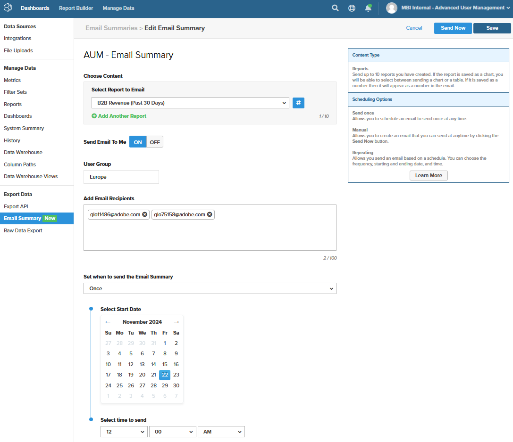

# Administración de usuarios avanzada

La característica [!DNL Advanced User Management] proporciona controles mejorados de visibilidad de datos y habilita el filtrado lógico de datos en función de grupos de usuarios (regiones organizativas). Permite adaptar la visibilidad de los datos en función de los grupos de usuarios y elimina la necesidad de crear una réplica de los paneles existentes para satisfacer los requisitos de informes específicos de la región cada vez que la empresa se expande a una nueva región.

[!DNL Advanced User Management] simplifica el uso compartido de tableros y la visibilidad de los datos a la vez que garantiza la seguridad y la escalabilidad para las organizaciones grandes. La flexibilidad para configurar grupos de usuarios, funciones y permisos hace de Commerce Intelligence una potente herramienta para los requisitos de nivel empresarial.

Con [!DNL Advanced User Management] habilitado, solamente los usuarios administradores tienen acceso para configurar lo siguiente:

- Métricas
- Visual Report Builder
- Informes basados en SQL
- Resumen de correo electrónico
- Exportaciones sin procesar

## Matriz de características

[!DNL Advanced User Management] afecta varias funciones de Commerce Intelligence. En la tabla siguiente se describen las funciones, los permisos y su disponibilidad para varias funciones en función de la función que se está habilitando o deshabilitando.

<table><thead>
  <tr>
    <th colspan="3" rowspan="2">Funciones de Commerce Intelligence</th>
    <th colspan="6">Funciones avanzadas de administración de usuarios (AUM)</th>
  </tr>
  <tr>
    <th colspan="3">Desactivado</th>
    <th colspan="3">Habilitado</th>
  </tr></thead>
<tbody>
  <tr>
    <td>Grupo de funciones</td>
    <td>Función</td>
    <td>Permisos</td>
    <td>Administrador</td>
    <td>Standard</td>
    <td>Solo lectura</td>
    <td>Administrador</td>
    <td>Standard</td>
    <td>Solo lectura</td>
  </tr>
  <tr>
    <td rowspan="7">Administrar usuarios (accesible para todos los administradores e influye en todos los roles)</td>
    <td>Configurar grupos de usuarios</td>
    <td></td>
    <td></td>
    <td></td>
    <td></td>
    <td>✓</td>
    <td></td>
    <td></td>
  </tr>
  <tr>
    <td>Invitar al usuario</td>
    <td></td>
    <td>✓</td>
    <td></td>
    <td></td>
    <td>✓</td>
    <td></td>
    <td></td>
  </tr>
  <tr>
    <td>Pestaña Permisos: asignación de funciones</td>
    <td></td>
    <td>✓</td>
    <td></td>
    <td></td>
    <td>✓</td>
    <td></td>
    <td></td>
  </tr>
  <tr>
    <td>Pestaña Permisos: asignación de grupos de usuarios (AUM)</td>
    <td></td>
    <td></td>
    <td></td>
    <td></td>
    <td>✓</td>
    <td></td>
    <td></td>
  </tr>
  <tr>
    <td>Pestaña Permisos: Almacena la asignación de subconjuntos (AUM)</td>
    <td></td>
    <td></td>
    <td></td>
    <td></td>
    <td>✓</td>
    <td></td>
    <td></td>
  </tr>
  <tr>
    <td>Pestaña Métricas</td>
    <td></td>
    <td>✓</td>
    <td></td>
    <td></td>
    <td>✓</td>
    <td></td>
    <td></td>
  </tr>
  <tr>
    <td>Pestaña Tableros compartidos</td>
    <td></td>
    <td>✓</td>
    <td></td>
    <td></td>
    <td>✓</td>
    <td></td>
    <td></td>
  </tr>
  <tr>
    <td rowspan="2">Report Builder</td>
    <td>Visual Report Builder</td>
    <td></td>
    <td>✓</td>
    <td>✓</td>
    <td></td>
    <td>✓</td>
    <td></td>
    <td></td>
  </tr>
  <tr>
    <td>SQL REPORT BUILDER</td>
    <td></td>
    <td>✓</td>
    <td></td>
    <td></td>
    <td>✓</td>
    <td></td>
    <td></td>
  </tr>
  <tr>
    <td rowspan="2">Resumen de correo electrónico</td>
    <td>Creación de resúmenes de correo electrónico sin partición de datos</td>
    <td></td>
    <td>✓</td>
    <td>✓</td>
    <td></td>
    <td>✓</td>
    <td></td>
    <td></td>
  </tr>
  <tr>
    <td>Creación de resúmenes de correo electrónico con partición de datos (AUM)</td>
    <td></td>
    <td></td>
    <td></td>
    <td></td>
    <td>✓</td>
    <td></td>
    <td></td>
  </tr>
  <tr>
    <td rowspan="4">Paneles  - Compartir</td>
    <td>Compartir tablero con usuarios de diferentes funciones</td>
    <td></td>
    <td>✓</td>
    <td>✓</td>
    <td></td>
    <td></td>
    <td></td>
    <td></td>
  </tr>
  <tr>
    <td>Compartir tablero con grupos de usuarios y administradores (AUM)</td>
    <td></td>
    <td></td>
    <td></td>
    <td></td>
    <td>✓</td>
    <td></td>
    <td></td>
  </tr>
  <tr>
    <td rowspan="2">Compartir tablero: permisos</td>
    <td>Editar</td>
    <td>✓</td>
    <td>✓</td>
    <td></td>
    <td></td>
    <td></td>
    <td></td>
  </tr>
  <tr>
    <td>Ver</td>
    <td>✓</td>
    <td>✓</td>
    <td></td>
    <td>✓</td>
    <td></td>
    <td></td>
  </tr>
  <tr>
    <td rowspan="18">Paneles: Ver (abra el panel compartido con los permisos dados)</td>
    <td rowspan="2">Volver a compartir un tablero compartido</td>
    <td>Editar</td>
    <td>✓</td>
    <td>✓</td>
    <td></td>
    <td></td>
    <td></td>
    <td></td>
  </tr>
  <tr>
    <td>Ver</td>
    <td></td>
    <td></td>
    <td></td>
    <td></td>
    <td></td>
    <td></td>
  </tr>
  <tr>
    <td rowspan="2">Filtro de fecha (sin indicador de función Opciones de EDICIÓN DE HORA)</td>
    <td>Editar</td>
    <td>✓</td>
    <td>✓</td>
    <td>✓</td>
    <td></td>
    <td></td>
    <td></td>
  </tr>
  <tr>
    <td>Ver</td>
    <td></td>
    <td></td>
    <td></td>
    <td>✓</td>
    <td></td>
    <td></td>
  </tr>
  <tr>
    <td rowspan="2">Filtro de fecha (con el indicador de función Opciones de EDICIÓN DE HORA)</td>
    <td>Editar</td>
    <td>✓</td>
    <td>✓</td>
    <td>✓</td>
    <td></td>
    <td></td>
    <td></td>
  </tr>
  <tr>
    <td>Ver</td>
    <td>✓</td>
    <td>✓</td>
    <td></td>
    <td>✓</td>
    <td>✓</td>
    <td>✓</td>
  </tr>
  <tr>
    <td rowspan="2">Filtro de tienda (sin indicador de función Opciones de EDIT TIME)</td>
    <td>Editar</td>
    <td>✓</td>
    <td>✓</td>
    <td>✓</td>
    <td></td>
    <td></td>
    <td></td>
  </tr>
  <tr>
    <td>Ver</td>
    <td>✓</td>
    <td>✓</td>
    <td></td>
    <td>✓</td>
    <td>✓</td>
    <td></td>
  </tr>
  <tr>
    <td rowspan="2">Filtro de tienda (con el indicador de función Opciones de EDICIÓN DE TIEMPO)</td>
    <td>Editar</td>
    <td>✓</td>
    <td>✓</td>
    <td>✓</td>
    <td></td>
    <td></td>
    <td></td>
  </tr>
  <tr>
    <td>Ver</td>
    <td>✓</td>
    <td>✓</td>
    <td></td>
    <td>✓</td>
    <td>✓</td>
    <td></td>
  </tr>
  <tr>
    <td rowspan="2">Datos del panel: el filtro informa de los datos en función de la asignación de grupos de usuarios (AUM)</td>
    <td>Editar</td>
    <td></td>
    <td></td>
    <td></td>
    <td></td>
    <td></td>
    <td></td>
  </tr>
  <tr>
    <td>Ver</td>
    <td></td>
    <td></td>
    <td></td>
    <td>✓</td>
    <td>✓</td>
    <td>✓</td>
  </tr>
  <tr>
    <td rowspan="2">Informe - Editar</td>
    <td>Editar</td>
    <td>✓</td>
    <td>✓</td>
    <td></td>
    <td>✓</td>
    <td></td>
    <td></td>
  </tr>
  <tr>
    <td>Ver</td>
    <td></td>
    <td></td>
    <td></td>
    <td>✓</td>
    <td></td>
    <td></td>
  </tr>
  <tr>
    <td rowspan="2">Exportación de informes (CSV, XLSX)</td>
    <td>Editar</td>
    <td>✓</td>
    <td>✓</td>
    <td>✓</td>
    <td>✓</td>
    <td></td>
    <td></td>
  </tr>
  <tr>
    <td>Ver</td>
    <td>✓</td>
    <td>✓</td>
    <td>✓</td>
    <td>✓</td>
    <td>✓</td>
    <td>✓</td>
  </tr>
  <tr>
    <td rowspan="2">Informe: Exportación sin procesar</td>
    <td>Editar</td>
    <td>✓</td>
    <td>✓</td>
    <td></td>
    <td>✓</td>
    <td></td>
    <td></td>
  </tr>
  <tr>
    <td>Ver</td>
    <td>✓</td>
    <td>✓</td>
    <td></td>
    <td></td>
    <td></td>
    <td></td>
  </tr>
</tbody></table>

## Control de administración

Los usuarios administradores pueden administrar las siguientes tareas:

- Configuración de grupos de usuarios
- Asignar función y grupo de usuarios a usuarios individuales
- Compartir tableros con grupos de usuarios u otros administradores con permisos de nivel de tablero
- Programar resúmenes de correo electrónico con filtrado de datos de nivel de grupo de usuarios

### Configuración de grupos de usuarios

Los grupos de usuarios son agrupaciones lógicas de regiones asignadas a filtros de almacén específicos (por ejemplo, grupos de usuarios creados en función de nombres de continentes, países y regiones).

Para configurar grupos de usuarios:

1. Vaya a [!UICONTROL **Administrar usuarios**] > [!UICONTROL **User Groups]** para ver los grupos de usuarios existentes.

   

1. [!UICONTROL **Agregar grupo**] permite a los administradores crear un nuevo grupo de usuarios:

   - Introduzca un nombre para el grupo (por ejemplo, &quot;América&quot;).

   - Seleccione los almacenes o filtros relevantes para el grupo de usuarios.

   - Guarde la configuración.

     

1. Los administradores pueden:

   - Edite grupos de usuarios para actualizar las asignaciones de tiendas o cambiarles el nombre para mayor claridad.

   - Elimine los grupos de usuarios cuando ya no sean necesarios. Los administradores deben reasignar manualmente los usuarios existentes asignados al grupo de usuarios eliminado.

1. Grupos predeterminados:

   - [!UICONTROL **None]**: un grupo de reserva para los usuarios que aún no están asignados a un grupo específico. Estos usuarios no verán ningún dato hasta que se les asigne a un grupo apropiado.

   - [!UICONTROL **Todos**]: proporciona acceso sin restricciones a todos los datos (normalmente reservado para los usuarios administradores).

### Asignar usuarios a grupos de usuarios

Los administradores pueden asignar nuevos usuarios a grupos relevantes durante su incorporación con [!UICONTROL **Invitar a un usuario**]. Los usuarios existentes se pueden reasignar a grupos de usuarios según los requisitos empresariales.

>[!TIP]
>
>- Hasta que se asigne un usuario de [!UICONTROL **Estándar**] o [!UICONTROL **Solo lectura**] a un grupo de usuarios relevante, es seguro asignarlo a [!UICONTROL **Ninguno**] para asegurarse de que no tiene acceso por error a ningún dato del panel.
>
>- Durante la asignación de permisos a un usuario, según los requisitos empresariales, existe la posibilidad de restringir tiendas específicas dentro de un grupo para un control mejorado.

Los usuarios administradores siempre están asignados a [!UICONTROL **Todas**] las tiendas de forma predeterminada, lo que les permite ver los paneles con la vista completa de la tienda.

### Compartir tableros

[!DNL Advanced User Management] proporciona potentes opciones para compartir paneles mientras se mantiene la seguridad de los datos.

- Los administradores pueden compartir tableros con los grupos de usuarios, así como con otros usuarios administradores para colaborar. Esto permite una administración centralizada de los paneles y simplifica la administración para las organizaciones grandes.

  

- Los permisos de uso compartido del panel incluyen:

   - [!UICONTROL **Editar**]: disponible solo para usuarios administradores para modificar tableros, filtrar datos, modificar informes o exportar datos.

   - [!UICONTROL **Vista**]: disponible para usuarios de todos los roles con (ciertas restricciones).

   - [!UICONTROL **Ninguno**]: Revoca el acceso al panel de ciertos grupos de usuarios o administradores.

  >[!NOTE]
  >
  >Consulte la [matriz de características](#feature-matrix) para ver la facilidad de uso de varias características de Commerce Intelligence basadas en los permisos de reglas y paneles para comprender diversas combinaciones.

#### Vistas del panel

Los usuarios administradores pueden ver los datos del tablero con acceso a todas las tiendas.

Sin embargo, los usuarios pueden ver los datos del panel filtrados según los almacenes asignados a ellos durante la configuración del usuario.

>[!TIP]
>
>Los administradores pueden habilitar filtros de fecha para los paneles compartidos, lo que permite a los usuarios ver los datos en diferentes intervalos de fechas en lugar del lapso de tiempo predeterminado establecido durante la creación del informe. Esta función se puede activar o desactivar según las necesidades de la empresa.

### Programar resúmenes de correo electrónico

[!DNL Advanced User Management] amplía las capacidades de filtrado de datos a los resúmenes de correo electrónico. Según la audiencia, los usuarios administradores pueden especificar grupos de usuarios para los que se deben filtrar los informes seleccionados.

