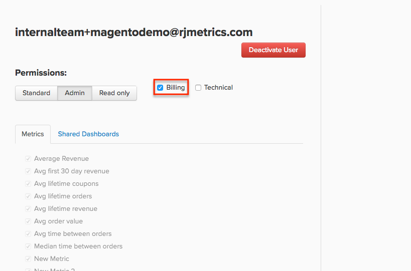

# Administrar permisos de usuario

[!DNL Adobe Commerce Intelligence] pretende ser una única fuente fiable en toda la organización. Cada usuario tiene su propio conjunto de paneles que [puede compartir con otros usuarios](../../data-user/dashboards/share-dashboard-with-users.md).

## Niveles de permisos de usuario

En [!DNL Commerce Intelligence], hay tres niveles de permisos generales que se aplican a los usuarios y que se seleccionan cuando se crea una cuenta:

* `Admin`
* `Standard`
* `Read-Only`

Estos permisos permiten a los usuarios realizar determinadas acciones o acceder a partes específicas de [!DNL Commerce Intelligence]. Esta es una tabla de lo que puede hacer cada nivel de permiso en [!DNL Commerce Intelligence]:

|   | `Admin` | `Standard` | `Read Only` |
| -----|-----|-----|----|
| **Crear/administrar usuarios** | ✔ |   |   |
| **Crear resúmenes de correo electrónico** | ✔ | ✔ |   |
| **Crear/editar/compartir tableros** | ✔ | ✔ |   |
| **Ver paneles** | ✔ | ✔ | ✔ |
| **Crear/editar/eliminar informes visuales** | ✔ | ✔* |   |
| **Crear/editar/eliminar informes SQL** | ✔ |  |   |
| **Clonar tableros** | ✔ |   |   |
| **Agregar/administrar integraciones** | ✔ |   |   |
| **Acceder al Administrador de Data Warehouse** | ✔ |   |   |
| **Sincronizar/no sincronizar tablas y columnas** | ✔ |   |   |
| **Crear/editar métricas** | ✔ |   |   |
| **Crear/editar conjuntos de filtros** | ✔ |   |   |
| **Crear/editar columnas calculadas** | ✔ |   |   |
| **Crear lista de informes dependientes** | ✔ |   |   |
| **Resumen del sistema de acceso** | ✔ |   |   |
| **Acceder a la configuración de zona horaria** | ✔ |   |   |
| **Facturación de acceso** | ✔ | ✔** |   |
| **Póngase en contacto con el servicio de asistencia** | ✔ | ✔ | ✔ |

{style="table-layout:auto"}

>[!NOTE]
>
>_Puede limitar el acceso de **[!UICONTROL Standard]**&#x200B;un usuario de [&#x200B; a métricas específicas](../../administrator/user-management/restrict-metric-access.md)._
>
>**[!UICONTROL Standard] _los usuarios pueden acceder a Facturación con una configuración de permiso adicional._
>
>Los usuarios de **[!UICONTROL Read-Only]** solo pueden _ver_ paneles que se hayan compartido con ellos; no pueden crear ni editar nada en [!DNL Commerce Intelligence], ni pueden buscar y agregar nuevos paneles a su cuenta. Adobe recomienda compartir un conjunto específico de paneles con **[!UICONTROL Read-Only]** usuarios que usted u otro miembro de su equipo mantiene. No clone un conjunto de paneles para ellos.

## Permisos adicionales: Facturación y asistencia técnica {#billingtech}

Además de los niveles generales de permisos, existen otras dos designaciones de usuarios: `Billing` y `Technical`. Estas designaciones deben utilizarse con los niveles generales de permisos.

### Factura

`Billing` usuarios tienen acceso a la página de facturación y pueden cambiar la información de pago. Además, Adobe también puede ponerse en contacto con ellos si tienen preguntas sobre facturación.

Los usuarios de `Admin` tienen acceso a la ficha `Billing` de manera predeterminada, pero los usuarios de `Standard` también pueden obtener acceso si tienen seleccionada la casilla de verificación `Billing` en su perfil.

<!--{: width="550" height="363"}-->

### Técnico

`Technical` usuarios no tienen permisos específicos para ellos. Esta configuración solo marca un contacto técnico dentro de su organización. Adobe puede ponerse en contacto con estos usuarios si tienen preguntas técnicas.

Los usuarios de `Admin` pueden agregar nuevos usuarios a su cuenta al hacer clic en **[!UICONTROL Account Settings]** > **[!UICONTROL Create Users]** y seguir las indicaciones. Una vez creado el usuario en [!DNL Commerce Intelligence], la persona afortunada a la que está invitando recibirá instrucciones por correo electrónico sobre cómo completar el proceso de configuración de la cuenta.

En cualquier momento, `Admins` puede ver todos los usuarios de su cuenta al hacer clic en **[!UICONTROL Account Settings]** > **[!UICONTROL Manage Users]**. Esta página muestra los permisos del usuario y a qué métricas y paneles pueden acceder.
