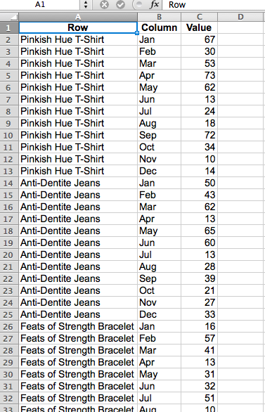

# Dar formato e importar datos financieros

En este tema se describe la mejor manera de importar datos financieros para su análisis en [!DNL MBI].

Una tabla de datos bidimensional entre pestañas suele ser el formato utilizado para los datos financieros. Con valores clasificados por etiquetas tanto en columnas como en filas, este tipo de diseño puede ser fácil de ver con ojos humanos y herramientas de hoja de cálculo, pero no es sencillo para las bases de datos.

Para importar y analizar estos datos en [!DNL MBI], la tabla debe acoplarse en una lista unidimensional. Cuando se acopla, cada valor de datos se clasifica por varias etiquetas que se encuentran todas en una sola fila, donde cada fila es única o tendría un identificador único, por ejemplo una columna de clave principal.

## Formato de archivos de Excel para importar

Para acoplar una tabla bidimensional con una tabla dinámica de Excel:

1. Abra el archivo con la tabla de datos bidimensional.
1. Abra el Asistente para tablas dinámicas. En Windows, el método abreviado es `Alt-D`. En Mac OS, introduzca `Command-Option-P`.
1. Seleccionar **[!UICONTROL Multiple consolidated ranges]** y haga clic en **[!UICONTROL Next]**.
1. Seleccionar **[!UICONTROL I will create the page fields]** y haga clic en **[!UICONTROL Next]**.
1. Seleccione todo el conjunto de datos en la tabla bidimensional, incluidas las etiquetas. Asegúrese de que `0` está seleccionado para el número de campos de página deseados y haga clic en **[!UICONTROL Next]**.
1. Cree la tabla dinámica en una hoja nueva y haga clic en **[!UICONTROL Finish]**.
1. Anule la selección de los campos de columna y fila de la lista de campos.
1. Haga doble clic en el valor numérico resultante para mostrar los datos de origen aplanados en una hoja nueva.
   
1. Guardar como `CSV` archivo.

¡Eso es todo! La tabla de datos se ha convertido a un formato de lista, conservando toda su información original, y ahora se puede [importado a [!DNL MBI]](../data-analyst/importing-data/connecting-data/using-file-uploader.md) para su análisis.
