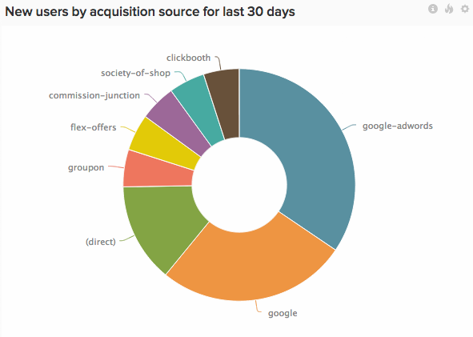

# Segmentación y filtrado

Una buena segmentación es lo que convierte una estadística superficial en una métrica del negocio que impulsa las decisiones.

¿Quiere saber cuáles son sus clientes más valiosos? ¿Cuáles son sus canales de marketing más valiosos? ¿Cuál de sus productos se está moviendo más rápido y por qué? Para obtener cualquiera de estas respuestas, debe empezar por segmentar los datos.

En este artículo, compartimos algunos segmentos críticos que a menudo recomendamos a nuestros clientes. También detallamos qué preguntas pueden ayudarle estos segmentos a responder. Técnicamente, los segmentos son columnas de datos de la base de datos. En [!DNL MBI], nos referimos a ellas como dimensiones.

## Segmentos de usuario

Los segmentos de usuario le ayudan a comprender quiénes son sus usuarios y cómo se comportan.

* **Edad / Año de nacimiento**: ¿Cuántos años tienen sus usuarios? ¿Cuántos años tienen sus usuarios más activos? Normalmente tiene sentido agrupar los valores en intervalos para un análisis más eficaz.
* **Sexo**: ¿Los hombres y las mujeres interactúan con su sitio web de forma diferente?
* **Dirección**: ¿De dónde vienen sus usuarios? ¿Debe centrar sus esfuerzos de marketing en una región en particular? ¿Las campañas publicitarias recientes han tenido el rendimiento esperado en las regiones objetivo?
* **Fuente de adquisición de cliente**\: ¿Sabe de qué canal de marketing provienen los usuarios? ¿Hicieron clic en un anuncio o lo encontraron a través de una búsqueda? [Segmentación de datos por fuente de adquisición de usuario](../data-analyst/analysis/google-track-user-acq.md) es el primer paso para optimizar la nueva adquisición de clientes. El segundo paso es gastar más dinero en lo que está funcionando y matar lo que no lo está.
* **Dispositivo de registro**: ¿Los usuarios se registraron a través de su aplicación móvil o sitio web? ¿iOS o Android? ¿Su base de usuarios móviles es lo suficientemente grande como para asignar más recursos para desarrollar su producto móvil? (Si todavía no realiza el seguimiento de este tema, consulte este tema [acerca del seguimiento del dispositivo de usuario](../data-analyst/analysis/track-usr-dev-browser.md).
* **Conducido por**: ¿Quiénes son sus principales influyentes? ¿Cuántos usuarios fueron directamente mencionados por otros?
* **Industria**: Si usted es un negocio B2B, ¿en qué industrias trabajan sus usuarios? ¿A qué organizaciones comerciales vale la pena unirse?
* **Respuestas al estudio**: Si realiza encuestas a los clientes, utilice las respuestas como segmentos para obtener un nivel de creación de perfiles más profundo. Puede hacer preguntas que complementen lo que ya sabe sobre sus usuarios o confirmar sus suposiciones.
* **Importe del primer pedido y categoría del producto**: ¿Existe una correlación entre el primer pedido de un usuario y los patrones de compra futuros?

## Segmentos de pedidos/eventos

Los segmentos de pedidos y eventos ayudan a analizar el comportamiento y la participación del usuario a lo largo del tiempo.

* **[!UICONTROL Billing / Shipping Address]**: ¿De dónde vienen la mayoría de tus pedidos? ¿Hay alguna diferencia entre las direcciones de facturación y envío?
* **[!UICONTROL Status]**: ¿Cuántos de sus pedidos no se completaron? ¿Cuál es la proporción de órdenes pendientes en los últimos siete días?
* **[!UICONTROL Customer acquisition source]**: Además de rastrear los datos de adquisición de usuarios a nivel de usuario, también puede [realizar un seguimiento en un nivel de pedido o evento](../data-analyst/analysis/google-track-user-acq.md). Un usuario registrado a través de una fuente puede muy bien seguir accediendo a su sitio a través de otras fuentes.
* **[!UICONTROL Device]**: ¿Aumenta el número de pedidos móviles? ¿Cuántos de sus ingresos se generan actualmente a través de compras móviles? (Si todavía no realiza el seguimiento de este tema, consulte este tema [acerca de los datos del dispositivo de orden de seguimiento](../data-analyst/analysis/track-usr-dev-browser.md).
* **[!UICONTROL Fulfillment Center]**: ¿Cuál de sus centros de satisfacción está generando la mayor cantidad de ingresos? Si está analizando la diferencia entre el tiempo de pedido y el tiempo de envío, ¿qué centro de satisfacción es el más receptivo?
* **[!UICONTROL Delivery Carrier]**: ¿Cuál es el operador más popular? ¿Qué operador tiene el menor número de artículos devueltos?
* **[!UICONTROL Discount / Coupon Codes]**: ¿Las promociones realmente generan negocios adicionales? ¿Cuántos artículos adicionales compraron sus clientes además del artículo en venta? ¿Cómo afectan los cupones al valor de pedido promedio? ¿Cuál es el margen promedio de los artículos con descuento frente a los artículos sin descuento?
* **[!UICONTROL Satisfaction / Rating]**: ¿Cuán satisfechos están sus clientes con sus pedidos? ¿Es probable que sus clientes le remitan negocios?

## Segmentos de producto

Los segmentos de producto le ayudan a tomar decisiones de comercialización.

* **[!UICONTROL Merchant / Brand]**: ¿Una marca específica vende más rápido que el resto? ¿Qué marcas tienen un bajo rendimiento?
* **[!UICONTROL Type / Category]**: ¿Los distintos segmentos de usuarios disfrutan de diferentes tipos de productos? ¿Qué categorías de productos generan el negocio más repetido?
* **[!UICONTROL Discount / Coupon Codes]**: ¿Las promociones están dañando las ventas de productos sin descuento? ¿Cómo afectan los cupones al valor percibido de sus productos?
* **[!UICONTROL Social Activity]**: ¿Existe una correlación entre el alboroto generado en los medios sociales y la cantidad vendida para un producto?
* **[!UICONTROL Size / Variant]**: ¿Cuál es la proporción de inventario que necesita de cada variante? ¿Qué variantes se pueden vender a precios de descuento?

Si está interesado en la comercialización, consulte una entrada de blog donde exploramos [cómo usar segmentos de producto para impulsar la empresa repetida](../data-analyst/analysis/most-value-source-channel.md).

## Establecimiento de perfiles del cliente

Es posible que los expertos en segmentación deseen ir más allá de las divisiones unidimensionales y comenzar a establecer perfiles de clientes reales. Por ejemplo, personas de entre 13 y 24 años que se registraron mediante un dispositivo móvil pusieron un grupo &quot;Joven y móvil&quot;. ¿En qué se diferencia el comportamiento de este grupo del resto de su base de usuarios?

Este tipo de análisis es lo que hacen los especialistas en marketing de las empresas Fortune 1000 todo el día. Antes de la llegada de plataformas de inteligencia empresarial basadas en la nube, como [!DNL MBI], estaba fuera de alcance para el resto de nosotros. Afortunadamente, ya no es así.

## Seguimiento de nuevos segmentos

El primer paso para segmentar las métricas según las dimensiones anteriores es asegurarse de que está realizando un seguimiento de estos datos en la base de datos. Si no se realiza un seguimiento, póngase en contacto con el equipo técnico y busque una forma de empezar a rastrear estos datos.

Una vez que confirmamos que los datos se rastrean en la base de datos, [póngase en contacto con nuestro equipo de asistencia](https://experienceleague.adobe.com/docs/commerce-knowledge-base/kb/troubleshooting/miscellaneous/mbi-service-policies.html?lang=en) para insertar las dimensiones en el [!DNL MBI] métricas y gráficos, o simplemente use nuestra herramienta de Administración de campos para rastrear estos campos en [!DNL MBI].

## Relacionado

* [Optimización de la base de datos para análisis](../best-practices/opt-db-analysis.md)
