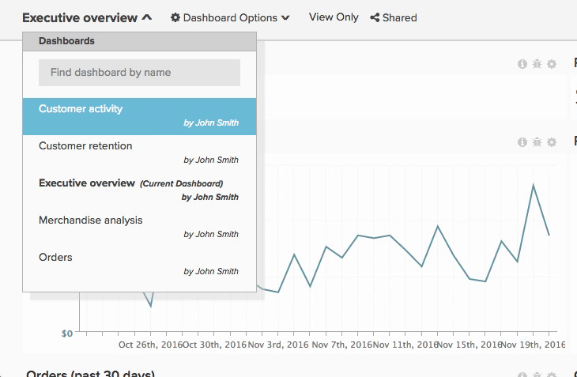

# Compartir un tablero

Compartir paneles significa que usted y su equipo poseen la misma información en cualquier momento dado, lo que permite la colaboración y el debate. Estas son algunas recomendaciones para compartir paneles y mantener la cuenta de [!DNL Adobe Commerce Intelligence] despejada.

## Evitar paneles duplicados

A veces, es posible que encuentre varios paneles con el mismo nombre; esto suele deberse a que otros usuarios han creado y compartido paneles similares con usted. Estos paneles podrían ser duplicados de una copia principal. En este caso, Adobe recomienda que un usuario comparta la copia principal del tablero y luego elimine todos los tableros duplicados.

Para ver a quién pertenece un panel, haga clic en el menú desplegable del panel situado en la esquina superior izquierda. Los tableros que no tengan un nombre debajo le pertenecen.

Para quitar todos los paneles duplicados:

1. Sincronícese con su equipo e identifique a la persona que debe mantener el panel.
1. [Deje de compartirse](../data-user/dashboards/leave-dashboard.md) de todos los tableros similares, excepto el que compartió el usuario principal.
1. Si tiene una copia del tablero, [elimínelo](../data-user/dashboards/deleting-dashboard.md).
1. Pida a otras personas que eliminen su versión del tablero.

## Creación de un conjunto básico de paneles

Cuando se crean nuevos usuarios, no son propietarios de paneles ni gráficos. Sin embargo, verán una lista de los paneles más populares de su organización (con derechos de visualización o edición para todo el equipo) al iniciar sesión por primera vez. Asegúrese de que los paneles siempre estén en esta lista para que se puedan incluir nuevos usuarios.

## Uso compartido de paneles con nuevos usuarios

Los nuevos usuarios también pueden beneficiarse del acceso a algunos paneles que no se comparten en toda la organización. En estos casos, Adobe recomienda que los propietarios de tableros [compartan los tableros relevantes](../data-user/dashboards/share-dashboard-with-users.md) con nuevos usuarios cuando se creen sus cuentas.

## Ser selectivo con permisos de edición

Los permisos de `Edit` otorgan a los usuarios mucho poder. Pero con gran poder viene gran responsabilidad. Para evitar cambios accidentales en los gráficos y paneles, Adobe recomienda que sea selectivo con respecto a a quién otorga permisos de `Edit`.

## Anotar los gráficos

Compartir un tablero simplemente proporciona a los usuarios acceso a la misma información. Para garantizar que se entiende la información, Adobe recomienda utilizar la función de notas de gráficos para compartir conocimientos y matices sobre un punto de datos específico o para transmitir el propósito de un análisis.
