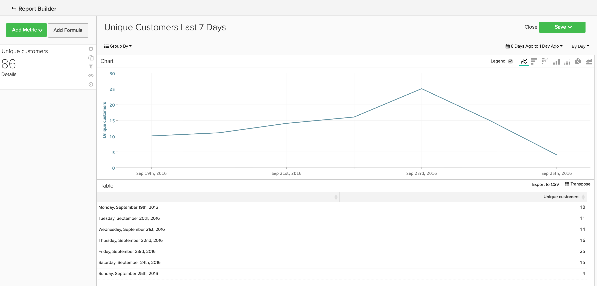
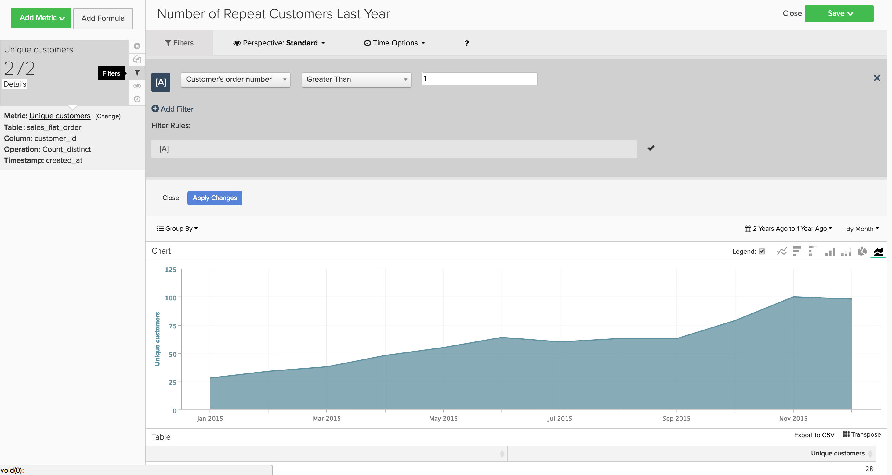

# Análisis básico

Una vez que esté familiarizado con la plataforma [!DNL Adobe Commerce Intelligence] y tenga una comprensión básica de la herramienta, querrá empezar a crear informes. Una de las preguntas más comunes que puede hacerse es &quot;¿Qué debería estar mirando?&quot;

La siguiente información describe algunas de las métricas e informes comunes que pueden ser útiles. Algunos de estos informes existen en su cuenta, por lo que asegúrese de revisar las métricas y los informes que existen dentro de su cuenta para evitar la creación de duplicados.

## Tablas y columnas que desea comprender

Al crear una métrica, debe conocer cuatro datos:

1. La tabla en la que se encuentran los datos,
1. La acción específica que desea realizar,
1. La columna en la que desea realizar esa acción y
1. La marca de tiempo que desee utilizar para realizar el seguimiento de esos datos.

Lo más probable es que los nombres de las tablas utilizadas en estos ejemplos sean ligeramente diferentes de los nombres de las columnas y tablas de la base de datos, ya que cada base de datos es única. Consulte las definiciones siguientes si necesita ayuda para identificar una tabla o columna correspondiente en la base de datos.

## Tabla Customers

Esta tabla contiene la información clave sobre cada cliente, como un ID de cliente único, una dirección de correo electrónico, etc. Los ejemplos siguientes utilizan **[!UICONTROL customer_entity]** como nombre de una tabla cliente de ejemplo.

Si algunos de estos cálculos no existen actualmente en la base de datos, cualquier usuario administrador de la cuenta puede crearlos. Además, debe asegurarse de que estas dimensiones se puedan agrupar para todas las métricas aplicables.

**Dimension**

* **[!UICONTROL Entity_id]**: un identificador único para cada cliente. También puede ser un número de cliente único o una dirección de correo electrónico de cliente, y debe actuar como una clave de referencia para la tabla del pedido.
* **[!UICONTROL Created_at]**: la fecha en la que se creó la cuenta del cliente y se agregó a la base de datos.
* **[!UICONTROL Customer's lifetime revenue]**: ingresos totales generados por un cliente.
* **[!UICONTROL Customer's first 30-day revenue]**: cantidad total de ingresos generados por un cliente en sus primeros 30 días.
* **[!UICONTROL Customer's lifetime number of orders]**: número de pedidos realizados por un cliente durante su vida útil.
* **[!UICONTROL Customer's lifetime number of coupons]**: número total de cupones que un cliente ha utilizado durante su vida útil.
* **[!UICONTROL Customer's first order date]**: la fecha del primer pedido de un cliente. Puede ser diferente a la fecha created_at si un cliente no realizó un pedido en el momento de su creación.

**¿Aceptas pedidos de invitado?**

*Si es así, es posible que esta tabla no contenga a todos sus clientes. Póngase en contacto con el [equipo de soporte](https://experienceleague.adobe.com/docs/commerce-knowledge-base/kb/troubleshooting/miscellaneous/mbi-service-policies.html?lang=es) para asegurarse de que los análisis de clientes incluyan a todos los clientes.*

*¿No está seguro de si acepta pedidos de invitado? Consulte [este tema](../data-warehouse-mgr/guest-orders.md) para obtener más información!*

## Tabla de pedidos

En esta tabla, cada fila representa un orden. Las columnas de esta tabla contienen información básica sobre cada pedido, como el ID del pedido, la fecha de creación, el estado, el ID del cliente que realizó el pedido, etc. Los ejemplos siguientes utilizan **[!UICONTROL sales_flat_order]** como nombre de una tabla de pedidos de ejemplo.

**Dimension**

* **[!UICONTROL Customer_id]**: Un identificador único del cliente que realizó el pedido. Esto se utiliza a menudo para mover información entre las tablas cliente y pedidos. En estos ejemplos, se espera que customer_id de la tabla **[!UICONTROL sales_flat_order]** se alinee con **[!UICONTROL entitiy_id]** de la tabla **[!UICONTROL customer_entity]**.
* **[!UICONTROL Created_at]**: la fecha en que se creó o colocó el pedido.
* **[!UICONTROL Customer_email]**: la dirección de correo electrónico del cliente que realizó el pedido. También puede ser el identificador único del cliente.
* **[!UICONTROL Customer's lifetime number of orders]**: una copia de la columna con el mismo nombre en la tabla `Customers`.
* **[!UICONTROL Customer's order number]**: número de pedido secuencial del cliente asociado con el pedido. Por ejemplo, si la fila que está viendo es el primer pedido de un cliente, esta columna es &quot;1&quot;; pero, si era el 15º pedido del cliente, en esta columna se muestra &quot;15&quot; para este pedido. Si esta dimensión no existe en su tabla `Customers`, pídale al [equipo de soporte](https://experienceleague.adobe.com/docs/commerce-knowledge-base/kb/troubleshooting/miscellaneous/mbi-service-policies.html?lang=es) que le ayude a crearla.
* **[!UICONTROL Customer's order number (previous-current)]**: una concatenación de dos valores en la columna **[!UICONTROL Customer's order number]**. Se utiliza en un informe de ejemplo a continuación para mostrar el tiempo transcurrido entre dos pedidos cualesquiera. Por ejemplo, el tiempo entre la primera fecha de pedido de un cliente y su segunda fecha de pedido se representa como &quot;1-2&quot; con este cálculo.
* **[!UICONTROL Coupon_code]**: Muestra qué cupones se utilizaron en cada pedido.
* **[!UICONTROL Seconds since previous order]**: tiempo (en segundos) entre los pedidos de un cliente.

## Tabla de elementos de pedidos

En esta tabla, cada fila representa un artículo que se vendió. Esta tabla contiene información sobre los artículos vendidos en cada pedido, como el número de referencia del pedido, el número de producto, la cantidad, etc. Los ejemplos siguientes utilizan `sales_flat_order_item` como nombre de una tabla de elementos de pedidos de ejemplo.

**Dimension**

* **[!UICONTROL Item_id]**: el identificador único de cada fila de la tabla.
* **[!UICONTROL Order_id]**: la clave de referencia de la tabla `Orders` que indica qué artículos se compraron en el mismo pedido. Si un pedido contiene varios elementos, este valor se repite.
* **[!UICONTROL Product_id]**: si desea información sobre el producto específico que se compró (como el color, el tamaño, etc.), debe utilizar esta columna para extraer esa información de la tabla de productos.
* **[!UICONTROL Order's created_at]**: marca de tiempo en la que se realizó el pedido, que generalmente se copia en la tabla `order line items` desde la tabla `Orders`.
* **[!UICONTROL Order's coupon_code]**: similar a la dimensión `Order's created_at`, esta columna se copia de la tabla pedidos.

## Tabla de suscripciones

Esta tabla se utiliza para administrar la información de suscripción, como el ID de suscripción, la dirección de correo electrónico del suscriptor, la fecha de inicio de la suscripción, etc.

**Dimension**

* **[!UICONTROL Customer_id]**: Un identificador único del cliente que realizó el pedido. Esta es una forma común de crear una ruta entre la tabla Customers y la tabla Orders. En estos ejemplos, espera que customer_id de la tabla **sales_flat_order** se alinee con `entitiy_id` de la tabla `customer_entity`.
* **[!UICONTROL Start date]**: la fecha en la que comenzó la suscripción de un cliente.

## Tabla de gasto de marketing

Al analizar el gasto en marketing, puede incluir [!DNL Facebook], [!DNL Google AdWords] u otras fuentes en los análisis. Si tiene varias fuentes de gasto de marketing, póngase en contacto con el [equipo de Managed Services](https://business.adobe.com/products/magento/fully-managed-service.html) para que le ayuden a configurar una tabla consolidada para sus campañas de marketing.

**Dimension**

* **[!UICONTROL Spend]**: el gasto total en publicidad. En [!DNL Facebook], esta sería la columna de gasto en la tabla `facebook_ads_insights_####`. Para [!DNL Google AdWords], esta sería la columna `adCost` de la tabla `campaigns####`.
* El `####` que se anexa a cada una de estas tablas se relaciona con el identificador de cuenta específico de su cuenta de [!DNL Facebook] o [!DNL Google AdWords].
* **[!UICONTROL Clicks]**: número total de clics. En [!DNL Facebook], esta sería la columna clicks en la tabla `facebook_ads_insights_####`. En [!DNL Google AdWords], esta sería la columna adClicks en la tabla `campaigns####`.
* **[!UICONTROL Impressions]**: el número total de impresiones. En [!DNL Facebook], estas serían las impresiones de la tabla `facebook_ads_insights_####`. En [!DNL Google AdWords], estas serían las impresiones de la tabla `campaigns####`.
* **[!UICONTROL Campaign]**: número total de clics. En [!DNL Facebook], sería la columna campaign_name de la tabla `facebook_ads_insights_####`. En [!DNL Google AdWords], esta sería la columna de campaña en la tabla `campaigns####`.
* **[!UICONTROL Date]**: la hora y la fecha en que se produjo la actividad (gasto, clics o impresiones) para una campaña en particular. En [!DNL Facebook], esta sería la columna `date_start` de la tabla `facebook_ads_insights_####`. En [!DNL Google AdWords], esta sería la columna de fecha en la tabla `campaigns####`.
* **[!UICONTROL Customer's first order's source]**: el origen del pedido del primer pedido de un cliente. En primer lugar, compruebe si tiene una columna denominada `customer's first order's source` en su cuenta. Si no ve esta columna, puede crear la columna que desee siguiendo estas instrucciones.
* **[!UICONTROL Customer's first order's medium]**: el medio del pedido del primer pedido de un cliente. En primer lugar, compruebe si tiene una columna denominada `customer's first order's source` en su cuenta. Si no ve esta columna, puede crear la columna que desee siguiendo estas instrucciones.
* **[!UICONTROL Customer's first order's campaign]**: la campaña del pedido a partir del primer pedido de un cliente. En primer lugar, compruebe si tiene una columna denominada `customer's first order's source` en su cuenta. Si no ve esta columna, puede crear la columna que desee siguiendo estas instrucciones.

## Informes y métricas comunes

Estos son algunos ejemplos comunes de informes y métricas que pueden resultar útiles:

* [Customer Analytics](#customeranalytics)
* [Análisis de pedidos](#orderanalytics)
* [Marketing Spend Analytics](#mktgspendanalytics)

## Análisis de clientes {#customeranalytics}

### Nuevos usuarios

* **Descripción**: un recuento del número total de usuarios recién adquiridos durante un período determinado. `New Users` es diferente de `Unique Customers`, porque `New Users` tiene la marca de tiempo de que se creó una cuenta con su servicio (esto no significa que necesariamente hayan realizado un pedido) mientras que `Unique Customers` ha realizado al menos un pedido.
* **Definición de métrica**: Esta métrica realiza un **Recuento** de `entity_id` de `customer_entity` tabla ordenada por `created_at`.
* **Ejemplo de informe**: Número de usuarios nuevos creados el mes pasado
   * **[!UICONTROL Metric]**: `New Users`
   * **[!UICONTROL Time Range]**: `Last Month`
   * **[!UICONTROL Time Interval]**: `By Day`

<!--{: width="929"}-->

### Clientes únicos

* **Descripción**: un recuento de la cantidad total de clientes distintos durante un período determinado. Esto es diferente de `New Users`, ya que solo realiza el seguimiento de los clientes que han realizado al menos un pedido. Un informe de cliente distinto solo realiza el seguimiento de un cliente una vez en un intervalo de tiempo determinado. Si establece el intervalo de tiempo en `By Day` y un cliente realiza más de una compra en ese día, el cliente solo se contará una vez. Si desea ver un número total de compras en general, observe `Number of Orders`.
* **Definición de métrica**: Esta métrica realiza un **Recuento distinto** de `customer_id` de `sales_flat_order` tabla ordenada por `created_at`.
* **Ejemplo de informe**: Clientes distintos por semana durante los últimos 90 días
   * **[!UICONTROL Metric]**: `Distinct Customers`
   * **[!UICONTROL Time Range]**: `Moving range > Last 90 Days`
   * **[!UICONTROL Time Interval]**: `By Day`

<!--{: width="929"}-->

### Nuevos suscriptores

* **Descripción**: Un recuento del número total de nuevos suscriptores adquiridos durante un período determinado.
* **Definición de métrica**: Esta métrica realiza un **Recuento distinto** de `customer_id` de `subscriptions` tabla ordenada por `start_date`.
* **Ejemplo de informe**: Nuevos suscriptores este año por mes
   * **[!UICONTROL Metric]**: `New Subscribers`
   * **[!UICONTROL Time Range]**: `1 Year Ago to 0 Days Ago`
   * **[!UICONTROL Time Interval]**: `By Month`

<!--{: width="929"}-->

### Clientes repetidos

* **Descripción**: El número total de clientes que realizaron más de un pedido durante un período. En un informe de clientes repetidos, puede usar la métrica `Distinct Customers` y la dimensión `Customer's Order Number` de la tabla `orders`.
* **Métrica usada**: `Distinct Customers`
* **Ejemplo de informe**: número de compras segunda y tercera realizadas el año pasado
   * **[!UICONTROL Metric]**: `Distinct Customers`
   * **[!UICONTROL Time Range]**: `Moving Range > Last Year`
   * **[!UICONTROL Time Interval]**: `By Month`
   * **[!UICONTROL Group By]**: `Customer's Order Number`, luego seleccione `2` y `3`

  

* **Ejemplo de informe 2**: El número de clientes repetidos los últimos años
   * **[!UICONTROL Metric]**: `Distinct Customers`
   * **[!UICONTROL Filters]**: `Customer's Order Number Greater Than 1`
   * **[!UICONTROL Time Range]**: `Moving range > Last Year`
   * **[!UICONTROL Time Interval]**: `By Month`

  <!--{: width="929"}-->

### Clientes principales por número de pedidos de duración

* **Descripción**: Una lista de los clientes principales basada en su número total de pedidos. Esto le proporciona una lista directa de sus compradores más frecuentes.
* **Métrica usada**: `Orders`
* **Ejemplo de informe**: 25 clientes principales por número de pedidos de duración
   * **[!UICONTROL Metric]**: `Orders`
   * **[!UICONTROL Time Range]**: `All Time`
   * **[!UICONTROL Time Interval]**: `None`
   * **[!UICONTROL Group By]**: `customer_email`
   * **[!UICONTROL Show Top/Bottom]**: los 25 principales ordenados por pedidos

  <!--{: width="929"}-->

### Principales clientes por ingresos por duración

* **Descripción**: Una lista de los clientes principales basada en los ingresos de duración.
* **Métrica usada**: `Average Lifetime Revenue`
* **Ejemplo de informe**: 25 clientes principales por ingresos de por vida
   * **[!UICONTROL Metric]**: `Average Lifetime Revenue`
   * **[!UICONTROL Time Range]**: `All time`
   * **[!UICONTROL Time Interval]**: `None`
   * **[!UICONTROL Group By]**: `customer_email`
   * **[!UICONTROL Show Top Bottom]**: los 25 principales clasificados por ingresos por duración

  <!--{: width="929"}-->

### Ingresos promedio por duración por cohorte

* **Descripción**: haga un seguimiento de [ingresos promedio de por vida de distintas cohortes](../dev-reports/lifetime-rev-cohort-analysis.md) de usuarios a lo largo del tiempo para identificar las cohortes de mayor rendimiento. Las cohortes se agrupan por una fecha común, como la fecha de primer orden o la fecha de creación.
* **Métrica usada**: `Revenue`
* **Ejemplo de informe**: Ingresos promedio por duración de cliente por cohorte
   * **[!UICONTROL Metric]**: `Revenue`
   * **[!UICONTROL Cohort Date]**: `Customer's first order date`
   * **[!UICONTROL Time Interval]**: `Month`
   * **[!UICONTROL Time Period]**: conjunto móvil de cohortes de las ocho cohortes más recientes con al menos cuatro meses de datos
   * **[!UICONTROL Duration]**: `12 Month(s)`
   * **[!UICONTROL Table]**: `Customer_entity`
   * **[!UICONTROL Perspective]**: Valor Promedio Acumulado Por Miembro De Cohorte

  <!--{: width="929"}-->

### Clientes por uso de cupones

* **Descripción**: Un recuento del número de clientes adquiridos que han utilizado un código de cupón/descuento. Esto puede ayudarle a obtener una visión clara de los solicitantes de descuentos frente a los compradores a precio completo.
* **Métrica usada**: `New Users`
* **Ejemplo de informe**: Clientes con cupones y sin cupones por mes
   * **[!UICONTROL Metric A]**: `Non coupon customers`
   * **[!UICONTROL Metric]**: `New Users`
   * **[!UICONTROL Filters]**: Número de pedidos superiores a 0 de por vida del cliente y Número de cupones de por vida del cliente igual a 0
   * **[!UICONTROL Metric B]**: `Coupon customers`
   * **[!UICONTROL Metric]**: `New Users`
   * **[!UICONTROL Filters]**: Número de pedidos superiores a 0 de por vida de clientes y número de cupones superiores a 0 de por vida de clientes
   * **[!UICONTROL Time range]**: `All Time`
   * **[!UICONTROL Time interval]**: `By Month`

  <!--{: width="929"}-->

* **Ejemplo de informe 2**: Porcentaje de clientes con y sin cupones por mes
   * **[!UICONTROL Metric A]**: `Non coupon customers` (ocultar métrica)
      * **[!UICONTROL Metric]**: `New Users`
      * **[!UICONTROL Filters]**: `Customer's Lifetime Number of Orders Greater Than 0` y `Customer's Lifetime Number of Coupons Equal to 0`
   * **[!UICONTROL Metric B]**: `Coupon customers`
      * **[!UICONTROL Metric]**: `New Users`
      * **[!UICONTROL Filters]**: `Customers Lifetime Number of Orders Greater Than 0` y `Customer's Lifetime Number of Coupons Greater Than 0`
   * **[!UICONTROL Time Range]**: `All Time`
   * **[!UICONTROL Time Interval]**: `By Month`
   * **[!UICONTROL Formula]**: `B/(A+B)`

>[!NOTE]
>
> **Ocultar todas las métricas**

<!--{: width="929"}-->

### Ingresos medios de los primeros 30 días

* **Descripción**: El promedio de la cantidad de ingresos generados por los clientes en sus primeros 30 días como clientes.
* **Descripción de métrica**: Esta métrica realiza un **Promedio** de `Customer's First 30 Day Revenue` de `customer_entity` tabla ordenada por `created_at`.
* **Descripción del informe**: Promedio histórico de los ingresos de los primeros 30 días del cliente
* **[!UICONTROL Metric]**: `Average First 30 Day Revenue`
* **[!UICONTROL Time Range]**: `All Time`
* **[!UICONTROL Time Interval]**: `None`

<!--{: width="929"}-->

### Ingresos medios por duración de clientes

* **Descripción**: Cantidad promedio de ingresos generados por sus clientes durante su vida útil.
* **Descripción de métrica**: Esta métrica realiza un **Promedio** de la columna `Customer's Lifetime Revenue` en la tabla `customer_entity` en función de `created_at`.
* **Descripción del informe**: Promedio de todo el tiempo de los ingresos del cliente durante toda la vida útil
   * **[!UICONTROL Metric]**: `Average Customer Lifetime Revenue`
   * **[!UICONTROL Time Range]**: `All Time`
   * **[!UICONTROL Time Interval]**: `None`

<!--{: width="929"}-->

## Análisis de pedidos {#orderanalytics}

### Ingresos

* **Descripción**: la métrica de ingresos muestra los ingresos totales obtenidos en un período de tiempo seleccionado.
* Esta métrica realiza una **suma** de `grand_total` de `sales_flat_order` tabla ordenada por `created_at`.
* **Ejemplo de informe**: Ingresos por mes, hasta la fecha
   * **[!UICONTROL Metric]**: `Revenue`
   * **[!UICONTROL Time Range]**: `1 Year Ago to 1 Month Ago`
   * **Intervalo de tiempo**: `By Month`

>[!TIP]
>
>Asegúrese de que el cálculo de la métrica de ingresos sea coherente con la definición que analiza internamente. Por ejemplo, es posible que desee contar los ingresos de pedidos que se han enviado, convertir divisas de diferentes regiones o excluir impuestos. Además, puede usar [Conjuntos de filtros](../../data-user/reports/ess-manage-data-filters.md) para garantizar la coherencia en todas las métricas creadas en la misma tabla.

<!--{: width="929"}-->

### Pedidos

* **Descripción**: un recuento del número total de pedidos durante un período determinado. Un informe Pedidos realiza un seguimiento de los cambios en el volumen de pedidos causados por nuevas ofertas de productos, promociones o cualquier otra cosa que pueda aumentar (o disminuir) el volumen de transacciones. Es posible que a menudo quiera segmentar esta métrica según algunas variables para responder a sus preguntas.
* **Definición de métrica**: Esta métrica realiza un **Recuento** de `entity_id` de `sales_flat_order` tabla ordenada por `created_at`.
* **Ejemplo de informe**: pedidos por mes, hasta la fecha
   * **[!UICONTROL Metric]**: `number of orders`
   * **[!UICONTROL Time Range]**: `1 Year Ago to 1 Month Ago`
   * **[!UICONTROL Time Interval]**: `By Month`

>[!TIP]
>
>Al igual que la métrica de ingresos, debería tener [Conjuntos de filtros](../../data-user/reports/ess-manage-data-filters.md) para excluir los pedidos incompletos, de prueba o devueltos.

<!--{: width="929"}-->

### Productos solicitados

* **Descripción**: la métrica de productos pedidos indica la cantidad de artículos vendidos durante un período de tiempo específico.
* **Definición de métrica**: Esta métrica realiza una **suma** de `qty_ordered` de `sales_flat_order_item` tabla ordenada por `created_at`.
* **Ejemplo de informe**: Artículos vendidos por mes, hasta la fecha
   * **[!UICONTROL Metric]**: `Products ordered`
   * **[!UICONTROL Time Range]**: `1 Year Ago to 1 Month Ago`
   * **[!UICONTROL Time Interval]**: `By Month`

  <!--{: width="929"}-->

* Combine esta métrica con la métrica número de pedidos para calcular el número de artículos por pedido. A continuación, añada códigos de cupones al informe para determinar cómo afectan las promociones al tamaño del carro de compras o segmente los pedidos nuevos frente a los repetidos para comprender mejor el comportamiento de sus clientes.
* **Ejemplo de informe**: Productos por pedido: primer pedido frente a pedidos repetidos
   * **[!UICONTROL Metric A]**: productos pedidos: primer pedido
      * **[!UICONTROL Metric]**: `Products ordered`
      * **[!UICONTROL Filter]**: `Customer's order number = 1`
   * **[!UICONTROL Metric B]**: pedidos: primer pedido
      * **[!UICONTROL Metric]**: `Orders`
      * **[!UICONTROL Filter]**: `Customer's order number = 1`
   * **[!UICONTROL Metric C]**: productos pedidos: repetir pedidos
      * **[!UICONTROL Metric]**: `Products ordered`
      * **[!UICONTROL Filter]**: `Customer's order number > 1`
   * **[!UICONTROL Metric D]**: Pedidos: Repetir pedidos
      * **[!UICONTROL Metric]**: `Orders`
      * **[!UICONTROL Filter]**: `Customer's order number > 1`
   * **[!UICONTROL Time Range]**: `1 Year Ago to 1 Month Ago`
   * **[!UICONTROL Time Interval]**: `By Week`
   * **[!UICONTROL Formula 1]**: `A/B`
   * **[!UICONTROL Formula 2]**: `C/D`

>[!NOTE]
>
>Desmarque las métricas `Multiple Y-Axes box` y `Hide` todas

<!--{: width="929"}-->

### Valor de pedido promedio

* **Descripción**: rastrea el valor promedio de los pedidos realizados durante un período. Utilice esta métrica para determinar rápidamente cómo ha fluctuado el valor de pedido promedio (AOV) como resultado de sus esfuerzos de marketing, oferta de productos y otros cambios en su negocio.
* **Definición de métrica**: Esta métrica realiza un **promedio** de `grand_total` de `sales_flat_order` tabla ordenada por `created_at`.
* **Ejemplo de informe**: AOV frente al año anterior, hasta la fecha
   * **[!UICONTROL Metric]**: `Average order value`
   * **[!UICONTROL Time Range]**: `1 Year Ago to 1 Month Ago`
   * **[!UICONTROL Time Interval]**: `By Month`
   * **[!UICONTROL Perspective]**: `Amount Change vs Previous Year`

  <!--{: width="929"}-->

### Productos más comprados con cupones

* **Descripción**: Este informe proporciona una perspectiva de los productos que se venden cuando ofrece promociones o cupones.
* **Métrica utilizada**: productos pedidos
* **Ejemplo de informe**: Productos más comprados con cupones
   * **[!UICONTROL Metric]**: `Products ordered`
   * **[!UICONTROL Filter]**: `Order's coupon_code Is Not \[NULL\]`
   * **[!UICONTROL Time Range]**: `All-Time`
   * **[!UICONTROL Time Interval]**: `None`
   * **[!UICONTROL Group By**]: `name` (o `SKU`, o cualquier otro identificador de producto)
   * **[!UICONTROL Show top/bottom]**: los 25 principales ordenados por productos

  <!--{: width="929"}-->

### Tiempo entre pedidos

* **Descripción**: Pruebe sus suposiciones y expectativas sobre los ciclos de compra de sus clientes con un análisis de **tiempo entre pedidos** que observa el promedio (¡o la mediana!) cantidad de tiempo entre compras. En la tabla siguiente, puede ver que sus mejores clientes (aquellos que realizan más de tres pedidos) realizan su segunda compra en menos de seis meses. Los clientes que no hayan realizado un cuarto pedido esperan 14 meses antes de realizar una segunda compra.
* **Definición de métrica**: Esta métrica realiza un **promedio** de `Time since previous order` de `sales_flat_order` ordenado por `created_at`.
* **Ejemplo de informe**:
   * **Métrica 1**: ≤ 3 pedidos
      * **[!UICONTROL Metric]**: `Average time between orders`
      * **[!UICONTROL Filter]**: `Customer's lifetime number of orders ≤ 3`
   * **Métrica 2**: > 3 pedidos
      * **[!UICONTROL Metric]**: `Average time between orders`
      * **[!UICONTROL Filter]**: `Customer's lifetime number of orders > 3`
   * **[!UICONTROL Time Range]**: `All-Time`
   * **[!UICONTROL Time Interval]**: `None`
   * **[!UICONTROL Group By]**:` Customer's order number (previous-current)`

>[!NOTE]
>
>Desmarque la casilla `Multiple Y-Axes`.

<!--{: width="929"}-->

## Análisis de gasto de marketing {#mktgspendanalytics}

### Gasto en publicidad

* **Descripción**: puedes analizar tu gasto en mercadotecnia en varios periodos de tiempo e intervalos, por campañas o conjuntos de anuncios u otras segmentaciones.
* **Definición de métrica**: Esta métrica realiza una Suma en la columna de gasto de la tabla `Marketing Spend` ordenada por la columna `date`.
* **Ejemplo de informe**: Gasto en publicidad por campaña
   * **[!UICONTROL Metric]**: `Ad spend`
   * **[!UICONTROL Time Range]**: `All-Time`
   * **[!UICONTROL Time Interval]**: `None`
   * **[!UICONTROL Group By]**: `campaign`

<!--{: width="929"}-->

### Impresiones de publicidad y clics en publicidad

* **Descripción**: además de analizar la inversión en publicidad, puede analizar las impresiones de anuncios y los clics en anuncios.
* **Definición de métrica**: Esta métrica realiza una Suma en la columna de impresiones (o clics) de la tabla `Marketing Spend` ordenada por la columna de fecha.
* **Ejemplo de informe**: Agregue impresiones y clics de publicidad por día
   * **[!UICONTROL Metric A]**: `Ad impressions`
   * **[!UICONTROL Metric B]**: `Ad clicks`
   * **[!UICONTROL Time Range]**: `1 Year Ago to 3 Months Ago`
   * **[!UICONTROL Time Interval]**: `By Day`

  <!--{: width="929"}-->

### Tasa de pulsaciones (CTR)

* **Descripción**: con las métricas de impresiones de anuncios y clics en anuncios que creaste anteriormente, puedes analizar la tasa de clics según las diferentes campañas a lo largo del tiempo.
* **Ejemplo de informe**: CTR por campaña
   * **[!UICONTROL Metric A]**: `Ad impressions`
   * **[!UICONTROL Metric B]**: `Ad clicks`
   * **[!UICONTROL Time Range]**:`All-Time`
   * **[!UICONTROL Time Interval]**: `None`
   * **[!UICONTROL Formula]**: `B/A`
   * Seleccione la opción `%`.
   * **[!UICONTROL Group By]**: `campaign`

>[!NOTE]
>
>Puede **titular** la fórmula como `CTR` y **ocultar** todas las métricas.

<!--{: width="929"}-->

### Costo por clic (CPC)

* **Descripción**: con las métricas de gasto por anuncio y clics en publicidad que creó anteriormente, puede analizar el costo por clic en diferentes campañas a lo largo del tiempo.
* **Ejemplo de informe**: CPC por campaña
   * **[!UICONTROL Metric A]**: `Ad spend`
   * **[!UICONTROL Metric B]**: `Ad clicks`
   * **[!UICONTROL Time Range]**: `All-Time`
   * **[!UICONTROL Time Interval]**: `None`
   * **[!UICONTROL Formula]**: `A/B`
   * Seleccione la opción `currency`
   * **[!UICONTROL Group By]**: `campaign`

>[!NOTE]
>
>Puede **titular** la fórmula como `CPC` y **ocultar** todas las métricas.

<!--{: width="929"}-->

### Clientes por fuente de adquisición

* **Descripción**: si realiza el seguimiento del origen, el medio y la campaña de un pedido con [!DNL Google eCommerce], puede analizar a los clientes por su origen de adquisición. Esto le ayuda a identificar qué fuentes de marketing están adquiriendo clientes y a responder preguntas como &quot;¿la mayoría de sus clientes están realizando sus primeros pedidos a través de [!DNL Google], [!DNL Facebook] o alguna otra fuente?&quot;
* **Ejemplo de informe**: Clientes por origen de adquisición
   * **[!UICONTROL Metric Used]**: `New Customers`
   * **[!UICONTROL Time Range]**: `All-Time`
   * **[!UICONTROL Time Interval]**: `By Month`
   * **[!UICONTROL Group By]**: `Customer's first order's source`

>[!NOTE]
>
>Consulte [este artículo](../analysis/most-value-source-channel.md) para ver más ejemplos de informes que usan el origen de adquisición.

<!--{: width="929"}-->

### Clientes por medio de adquisición y campaña de adquisición

* **Descripción**: de manera similar a analizar los clientes por origen de adquisición, también puede analizar a los clientes por medio y campaña de su primer pedido. Esto puede ayudarle a responder preguntas como &quot;¿qué campañas están atrayendo nuevos clientes?&quot;
* **Ejemplo de informe**: Clientes por campaña de adquisición con medio de pago
   * **[!UICONTROL Metric Used]**: `New customers`
   * **[!UICONTROL Filter]**: `Customer's first order's medium IN ppc`
   * **[!UICONTROL Time Range]**: `All-Time`
   * **[!UICONTROL Time Interval]**: `None`
   * **[!UICONTROL Group By]**: `Customer's first order's campaign`

>[!NOTE]
>
>Para el filtro en su métrica `New Customers`, puede agregar otros medios que se consideren medios &quot;de pago&quot; para su negocio, como cpc o búsqueda de pago.

<!--{: width="929"}-->

### Coste de adquisición de cliente (CAC) o coste por adquisición (CPA)

* **Descripción**: una manera de analizar el costo de una campaña es atribuir todos los costos únicamente a los clientes que adquirió a través de la campaña.
* **Ejemplo de informe**: CAC por campaña
   * **[!UICONTROL Metric A]**: `New customers`
   * **[!UICONTROL Filter]**: `Customer's first order's medium IN ppc`
   * **[!UICONTROL Metric B]**: `Ad Spend`
   * **[!UICONTROL Time Range]**: `All-Time`
   * **[!UICONTROL Time Interval]**: `None`
   * **[!UICONTROL Formula]**: `B/A`
   * Seleccione la opción `currency`
   * **[!UICONTROL Group By]**:
      * Para la métrica `A`, seleccione `Customer's first order's campaign`
      * Para la métrica `B`, seleccione `campaign`

  

>[!NOTE]
>
>Puede **titular** la fórmula como `CTR` y **ocultar** todas las métricas. Además, consulta [este artículo](../analysis/roi-ad-camp.md) para obtener más información.

### Valor de duración por fuente de adquisición, medio y campaña

* **Descripción**: Además de analizar el número de clientes adquiridos por cada campaña, puede analizar los ingresos promedio de duración de estos clientes. Esto le ayuda a identificar:
   * Si determinadas campañas atraen a un gran volumen de clientes, pero estos tienen un valor bajo a largo plazo.
   * Si determinadas campañas atraen un volumen bajo de clientes, pero esos clientes tienen un valor alto a largo plazo.
* **Ejemplo de informe**: Primero agregue la métrica `New customers`. A continuación, agregue la métrica `Average lifetime revenue`. Seleccione el lapso de tiempo deseado y elija `interval` como `None`. Finalmente, seleccione la opción `group by` como `Customer's first order's campaign`.
   * **[!UICONTROL Metric A]**: `New Customers`
   * **[!UICONTROL Filter A]**: `Customer's first order's source` COMO &#39;%google%&#39;
   * **[!UICONTROL Filter B]**: `Customer's first order's medium IN ppc`
   * **[!UICONTROL Metric B]**: `Average lifetime revenue`
   * **[!UICONTROL Filter A]**: `Customer's first order's source` COMO &#39;%google%&#39;
   * **[!UICONTROL Filter B]**: `Customer's first order's medium IN ppc`
   * **[!UICONTROL Time Range]**: `All-Time`
   * **[!UICONTROL Time Interval]**: `None`
   * **[!UICONTROL Group By]**: `Customer's first order's campaign`

>[!NOTE]
>
>Para los dos filtros, puede agregar cualquier otro medio que se considere medio &quot;de pago&quot; para su negocio (como cpc o búsqueda de pago). También puede añadir otras fuentes que desee analizar, como Facebook. Consulte [este artículo](../analysis/roi-ad-camp.md) para obtener más información sobre CAC, LTV y ROI.

<!--{: width="929"}-->

### Retorno de la inversión (ROI)

* **Descripción**: una forma de calcular el retorno de la inversión por campaña es analizar todos los pedidos realizados a través de la campaña. Sin embargo, hay un método alternativo que analiza el valor de duración de los clientes adquiridos a través de una campaña. Para analizar el retorno de la inversión, es importante que los nombres de las campañas sean coherentes en los datos de gasto y en los datos transaccionales. Si crea el siguiente informe y no existen valores de ROI debido a que los nombres de campaña no coinciden, es posible que tenga que buscar en el [etiquetado UTM](../../best-practices/utm-tagging-google.md) que ha implementado.
* **Ejemplo de informe**: ROI por campaña
   * **[!UICONTROL Metric A]**: `New Customers`
   * **[!UICONTROL Filter A]**: `Customer's first order's source` COMO &#39;%google%&#39;
   * **[!UICONTROL Filter B]**: `Customer's first order's medium IN ppc`
   * **[!UICONTROL Metric B]**: `Average lifetime revenue`
   * **[!UICONTROL Filter A]**: `Customer's first order's source` COMO &#39;%google%&#39;
   * **[!UICONTROL Filter B]**: `Customer's first order's medium IN ppc`
   * **[!UICONTROL Metric C]**: `Ad spend`
   * **[!UICONTROL Time Range]**: `All-Time`
   * **[!UICONTROL Time Interval]**: `None`
   * **[!UICONTROL Formula]**: `(B-(C/A))/(C/A)`
   * Seleccione la opción `% `
   * **[!UICONTROL Group By]**:
      * Para la métrica `A` y `B`, seleccione `Customer's first order's campaign`
      * Para la métrica `C`, seleccione `campaign`

>[!NOTE]
>
>Puede asignar a la fórmula el título &quot;ROI&quot; (retorno de la inversión) y Ocultar todas las métricas. Además, puede ajustar los filtros de las métricas para analizar fuentes y medios alternativos. Además, consulta [este tema](../analysis/roi-ad-camp.md) para obtener más detalles sobre CAC, LTV y ROI.

<!--{: width="929"}-->

<!--{: width="929"}-->
