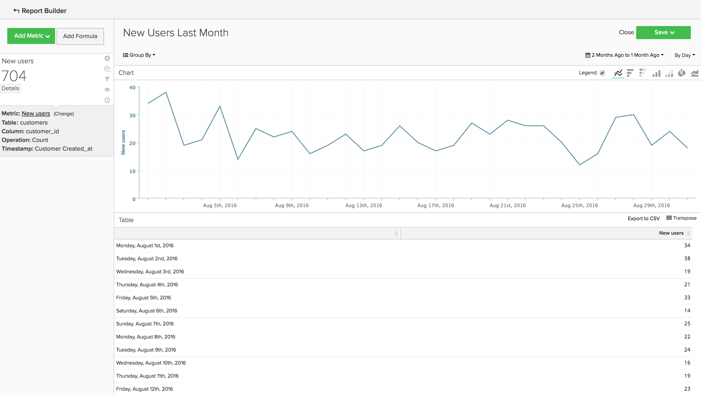

# Análisis básico

Una vez que esté familiarizado con el [!DNL MBI] y tengan una comprensión básica de la herramienta, querrá empezar a crear informes. Una de las preguntas más comunes que puede tener es &quot;¿Qué debería estar mirando?&quot;

La siguiente información describe algunas de las métricas e informes comunes que puede encontrar útiles. Algunos de estos informes ya existen en la cuenta, por lo que debe revisar las métricas y los informes que existen en la cuenta para evitar la creación de duplicados.

## Tablas y columnas que desea comprender

Al crear una métrica, debe conocer cuatro fragmentos de información:

1. La tabla en la que se conservan los datos,
1. La acción específica que desea realizar,
1. La columna en la que desea realizar esa acción y
1. Marca de tiempo que desee utilizar para rastrear esos datos.

Lo más probable es que los nombres de las tablas que utilizamos en estos ejemplos sean ligeramente diferentes de los nombres de columnas y tablas de la base de datos, ya que cada base de datos es única. Haga referencia a las definiciones siguientes si necesita ayuda para identificar una tabla o columna correspondiente en la base de datos.

## Tabla de clientes

Esta tabla contiene la información clave sobre cada cliente, como un ID de cliente único, una dirección de correo electrónico, la fecha de creación de la cuenta, etc. En los ejemplos siguientes, utilizaremos **[!UICONTROL customer_entity]** como nombre de una tabla de cliente de muestra.

Si algunos de estos cálculos no existen actualmente en la base de datos, cualquier usuario administrador de la cuenta puede crearlos. Además, debe asegurarse de que estas dimensiones sean agrupables para todas las métricas aplicables.

**Dimension**

* **[!UICONTROL Entity_id]**: Un identificador único para cada cliente. También puede ser un número de cliente único o una dirección de correo electrónico del cliente, y debe actuar como clave de referencia para la tabla del pedido.
* **[!UICONTROL Created_at]**: La fecha en la que se creó y agregó la cuenta del cliente a la base de datos.
* **[!UICONTROL Customer's lifetime revenue]**: El total de ingresos de duración generados por un cliente.
* **[!UICONTROL Customer's first 30-day revenue]**: La cantidad total de ingresos generados por un cliente en sus primeros 30 días.
* **[!UICONTROL Customer's lifetime number of orders]**: Número de pedidos realizados por un cliente durante su vida útil.
* **[!UICONTROL Customer's lifetime number of coupons]**: El número total de cupones que utiliza un cliente durante su vida útil.
* **[!UICONTROL Customer's first order date]**: La fecha del primer pedido de un cliente. Puede diferir de la fecha created_at si un cliente no realizó un pedido en el momento de crearlo.

**¿Aceptas pedidos de invitados?**

*Si es así, es posible que esta tabla no contenga todos los clientes. Póngase en contacto con [equipo de asistencia](https://support.magento.com/hc/en-us/articles/360016503692) para asegurarse de que los análisis del cliente incluyan a todos los clientes.*

*¿No está seguro de si acepta pedidos de invitados? Consulte [este tema](../data-warehouse-mgr/guest-orders.md) para obtener más información.*

## Tabla de pedidos

En esta tabla, cada fila representa un pedido. Las columnas de esta tabla contienen información básica sobre cada pedido, como el ID del pedido, la fecha de creación, el estado, el ID del cliente que realizó el pedido, etc. En los ejemplos siguientes, utilizamos **[!UICONTROL sales_flat_order]** como nombre de una tabla de pedidos de ejemplo.

**Dimension**

* **[!UICONTROL Customer_id]**: Identificador único del cliente que realizó el pedido. Esto se utilizará a menudo para mover información entre las tablas cliente y pedido. En nuestros ejemplos, esperamos que customer_id en la variable **[!UICONTROL sales_flat_order]** para alinearla con la tabla **[!UICONTROL entitiy_id]** en el **[!UICONTROL customer_entity]** tabla.
* **[!UICONTROL Created_at]**: La fecha en la que se creó o colocó el pedido.
* **[!UICONTROL Customer_email]**: La dirección de correo electrónico del cliente que realizó el pedido. También puede ser el identificador único del cliente.
* **[!UICONTROL Customer's lifetime number of orders]**: Una copia de la columna con el mismo nombre en su `Customers` tabla.
* **[!UICONTROL Customer's order number]**: El número de pedido secuencial del cliente asociado al pedido. Por ejemplo, si la fila que está viendo es el primer pedido de un cliente, esta columna es &quot;1&quot;; pero, si este fue el decimoquinto pedido del cliente, esta columna muestra &quot;15&quot; para este pedido. Si esta dimensión no existe en su `Customers` mesa, consulte nuestra [equipo de asistencia](https://support.magento.com/hc/en-us/articles/360016503692) para ayudarle a construirlo.
* **[!UICONTROL Customer's order number (previous-current)]**: Una concatenación de dos valores en la variable **[!UICONTROL Customer's order number]** para abrir el Navegador. Se utiliza en un informe de muestra a continuación para mostrar el tiempo transcurrido entre dos pedidos cualesquiera. Por ejemplo, la hora entre la fecha del primer pedido de un cliente y la fecha del segundo pedido se representa como &quot;1-2&quot; con este cálculo.
* **[!UICONTROL Coupon_code]**: Muestra qué cupones se utilizaron en cada pedido.
* **[!UICONTROL Seconds since previous order]**: Tiempo (en segundos) entre los pedidos de un cliente.

## Tabla Artículos de Pedido

En esta tabla, cada fila representa un artículo vendido. Esta tabla contiene información sobre los artículos vendidos en cada pedido, como el número de referencia del pedido, el número de producto, la cantidad, etc. En los ejemplos siguientes, utilizamos `sales_flat_order_item` como nombre de una tabla de elementos de orden de ejemplo.

**Dimension**

* **[!UICONTROL Item_id]**: Identificador único de cada fila de la tabla.
* **[!UICONTROL Order_id]**: La clave de referencia de su `Orders` tabla que indica qué artículos se compraron en el mismo pedido. Si un pedido contiene varios elementos, este valor se repite.
* **[!UICONTROL Product_id]**: Si desea información sobre el producto específico comprado (como color, tamaño, etc.), utilice esta columna para extraer esa información de la tabla de productos.
* **[!UICONTROL Order's created_at]**: La marca de tiempo en la que se realizó el pedido, normalmente se copia en el `order line items` de `Orders` tabla.
* **[!UICONTROL Order's coupon_code]**: Similar a la variable `Order's created_at` , esta columna se copia de la tabla pedidos.

## Tabla de suscripciones

Esta tabla se utiliza para administrar la información de suscripción, como el id de suscripción, la dirección de correo electrónico del suscriptor, la fecha de inicio de la suscripción, etc.

**Dimension**

* **[!UICONTROL Customer_id]**: Identificador único del cliente que realizó el pedido. Esta es una forma común de crear una ruta entre la tabla Clientes y la tabla Pedidos. En nuestros ejemplos, esperamos que customer_id en la variable **sales_plana_order** para alinearla con la tabla `entitiy_id` en el `customer_entity` tabla.
* **[!UICONTROL Start date]**: La fecha en la que se inició la suscripción de un cliente.

## Tabla de gasto de marketing

Al analizar su gasto en marketing, puede incluir [!DNL Facebook], [!DNL Google AdWords], u otras fuentes de los análisis. Si tiene varias fuentes de gasto en marketing, póngase en contacto con nuestra [Equipo de servicios](https://business.adobe.com/products/magento/fully-managed-service.html) para obtener ayuda sobre la configuración de una tabla consolidada para sus campañas de marketing.

**Dimension**

* **[!UICONTROL Spend]**: El gasto total en publicidad. En [!DNL Facebook], esta sería la columna de gastos de la sección `facebook_ads_insights_####` tabla. Para [!DNL Google AdWords], este sería el `adCost` en la columna `campaigns####` tabla.
* La variable `####` que se adjunta a cada una de estas tablas se relaciona con el ID de cuenta específico de su [!DNL Facebook] o [!DNL Google AdWords] cuenta.
* **[!UICONTROL Clicks]**: El número total de clics. En [!DNL Facebook], esta sería la columna de clics en la variable `facebook_ads_insights_####` tabla. En [!DNL Google AdWords], esta sería la columna adClicks de la `campaigns####` tabla.
* **[!UICONTROL Impressions]**: El número total de impresiones. En [!DNL Facebook], estas serían las impresiones en la variable `facebook_ads_insights_####` tabla. En [!DNL Google AdWords], estas serían las impresiones de la variable `campaigns####` tabla.
* **[!UICONTROL Campaign]**: El número total de clics. En [!DNL Facebook], sería la columna campaign_name en la columna `facebook_ads_insights_####` tabla. En [!DNL Google AdWords], esta sería la columna de campaña en la columna `campaigns####` tabla.
* **[!UICONTROL Date]**: Marca de tiempo que el gasto, los clics o las impresiones se produjeron para una campaña en particular. En [!DNL Facebook], este sería el `date_start` en la columna `facebook_ads_insights_####` tabla. En [!DNL Google AdWords], esta sería la columna de fecha en el `campaigns####` tabla.
* **[!UICONTROL Customer's first order's source]**: Origen del pedido a partir del primer pedido de un cliente. Primero, compruebe si tiene una columna denominada `customer's first order's source` en su cuenta. Si no ve esta columna, puede crear la columna deseada siguiendo estas instrucciones.
* **[!UICONTROL Customer's first order's medium]**: El medio del pedido a partir del primer pedido de un cliente. Primero, compruebe si tiene una columna denominada `customer's first order's source` en su cuenta. Si no ve esta columna, puede crear la columna deseada siguiendo estas instrucciones.
* **[!UICONTROL Customer's first order's campaign]**: La campaña del pedido a partir del primer pedido de un cliente. Primero, compruebe si tiene una columna denominada `customer's first order's source` en su cuenta. Si no ve esta columna, puede crear la columna deseada siguiendo estas instrucciones.

## Informes y métricas comunes

A continuación se muestran algunos ejemplos comunes de informes y métricas que puede resultar útiles:

* [Customer Analytics](#customeranalytics)
* [Análisis de pedidos](#orderanalytics)
* [Análisis de gastos de marketing](#mktgspendanalytics)

## Análisis del cliente {#customeranalytics}

### Nuevos usuarios

* **Descripción**: Recuento del número total de usuarios recién adquiridos durante un período de tiempo determinado. `New Users` es diferente de `Unique Customers`, porque `New Users` tiene la marca de tiempo de que se creó una cuenta con su servicio (esto no significa que necesariamente hayan realizado un pedido) mientras `Unique Customers` hayan realizado al menos un pedido.
* **Definición de métrica**: Esta métrica realiza una **Recuento** de `entity_id` from `customer_entity` tabla ordenada por `created_at`.
* **Ejemplo de informe**: Número de usuarios nuevos creados el mes pasado
   * **[!UICONTROL Metric]**: `New Users`
   * **[!UICONTROL Time Range]**: `Last Month`
   * **[!UICONTROL Time Interval]**: `By Day`

<!--{: width="929"}-->

### Clientes únicos

* **Descripción**: Recuento del número total de clientes diferentes durante un período de tiempo determinado. Esto es diferente de `New Users`, ya que solo realiza el seguimiento de los clientes que han realizado al menos un pedido. Un informe de clientes distinto solo rastreará a un cliente una vez en un intervalo de tiempo determinado. Si establece el intervalo de tiempo en `By Day` y un cliente realiza más de una compra ese día, el cliente solo se contará una vez. Si desea ver un número total de compras en general, consulte `Number of Orders`.
* **Definición de métrica**: Esta métrica realiza una **Recuento distinto** de `customer_id` from `sales_flat_order` tabla ordenada por `created_at`.
* **Ejemplo de informe**: Distintos clientes por semana en los últimos 90 días
   * **[!UICONTROL Metric]**: `Distinct Customers`
   * **[!UICONTROL Time Range]**: `Moving range > Last 90 Days`
   * **[!UICONTROL Time Interval]**: `By Day`

<!--{: width="929"}-->

### Nuevos suscriptores

* **Descripción**: Recuento del número total de nuevos suscriptores adquiridos durante un periodo de tiempo determinado.
* **Definición de métrica**: Esta métrica realiza una **Recuento distinto** de `customer_id` from `subscriptions` tabla ordenada por `start_date`.
* **Ejemplo de informe**: Nuevos suscriptores este año por mes
   * **[!UICONTROL Metric]**: `New Subscribers`
   * **[!UICONTROL Time Range]**: `1 Year Ago to 0 Days Ago`
   * **[!UICONTROL Time Interval]**: `By Month`

<!--{: width="929"}-->

### Repetir clientes

* **Descripción**: El número total de clientes que realizaron más de un pedido durante un período de tiempo. En un informe de clientes repetidos, puede usar la variable `Distinct Customers` y `Customer's Order Number` de su `orders` tabla.
* **Métrica utilizada**: `Distinct Customers`
* **Ejemplo de informe**: Número de compras segunda y tercera realizadas el año pasado
   * **[!UICONTROL Metric]**: `Distinct Customers`
   * **[!UICONTROL Time Range]**: `Moving Range > Last Year`
   * **[!UICONTROL Time Interval]**: `By Month`
   * **[!UICONTROL Group By]**: `Customer's Order Number`y, a continuación, seleccione `2` y `3`

   

* **Ejemplo de informe 2**: Número de clientes repetidos el año pasado
   * **[!UICONTROL Metric]**: `Distinct Customers`
   * **[!UICONTROL Filters]**: `Customer's Order Number Greater Than 1`
   * **[!UICONTROL Time Range]**: `Moving range > Last Year`
   * **[!UICONTROL Time Interval]**: `By Month`

   <!--{: width="929"}-->

### Clientes principales por número de pedidos acumulado

* **Descripción**: Una lista de los principales clientes en función de su número total de pedidos. Esto le proporciona una lista directa de sus compradores más frecuentes.
* **Métrica utilizada**: `Orders`
* **Ejemplo de informe**: Principales 25 clientes por número de pedidos acumulado
   * **[!UICONTROL Metric]**: `Orders`
   * **[!UICONTROL Time Range]**: `All Time`
   * **[!UICONTROL Time Interval]**: `None`
   * **[!UICONTROL Group By]**: `customer_email`
   * **[!UICONTROL Show Top/Bottom]**: Principales 25 ordenados por pedidos

   <!--{: width="929"}-->

### Clientes principales por ingresos de duración

* **Descripción**: Una lista de los clientes principales basada en los ingresos acumulados.
* **Métrica utilizada**: `Average Lifetime Revenue`
* **Ejemplo de informe**: Principales 25 clientes por ingresos de duración
   * **[!UICONTROL Metric]**: `Average Lifetime Revenue`
   * **[!UICONTROL Time Range]**: `All time`
   * **[!UICONTROL Time Interval]**: `None`
   * **[!UICONTROL Group By]**: `customer_email`
   * **[!UICONTROL Show Top Bottom]**: Los 25 principales ordenados por ingresos de duración

   <!--{: width="929"}-->

### Ingresos medios de duración por cohorte

* **Descripción**: Rastree el [ingresos medios de duración de diferentes cohortes](../dev-reports/lifetime-rev-cohort-analysis.md) de usuarios a lo largo del tiempo para identificar las cohortes de mayor rendimiento. Las cohortes se agrupan por una fecha común, como la fecha del primer pedido o la fecha de creación.
* **Métrica utilizada**: `Revenue`
* **Ejemplo de informe**: Promedio de ingresos por duración de cliente por cohorte
   * **[!UICONTROL Metric]**: `Revenue`
   * **[!UICONTROL Cohort Date]**: `Customer's first order date`
   * **[!UICONTROL Time Interval]**: `Month`
   * **[!UICONTROL Time Period]**: Conjunto móvil de cohortes de las 8 cohortes más recientes con al menos 4 meses de datos
   * **[!UICONTROL Duration]**: `12 Month(s)`
   * **[!UICONTROL Table]**: `Customer_entity`
   * **[!UICONTROL Perspective]**: Valor medio acumulado por miembro de cohorte

   <!--{: width="929"}-->

### Clientes por uso de cupones

* **Descripción**: Recuento del número de clientes adquiridos que han utilizado un código de cupón/descuento. Esto puede ayudarle a obtener una visión clara de sus buscadores de descuento frente a compradores de precio completo.
* **Métrica utilizada**: `New Users`
* **Ejemplo de informe**: Clientes con cupones y no cupones por mes
   * **[!UICONTROL Metric A]**: `Non coupon customers`
   * **[!UICONTROL Metric]**: `New Users`
   * **[!UICONTROL Filters]**: Número de pedidos de duración de cliente Buena a 0 y Número de cupones de duración de cliente igual a 0
   * **[!UICONTROL Metric B]**: `Coupon customers`
   * **[!UICONTROL Metric]**: `New Users`
   * **[!UICONTROL Filters]**: Clientes Número de Pedidos Bueno a 0 y Número de Cupones Bueno a 0
   * **[!UICONTROL Time range]**: `All Time`
   * **[!UICONTROL Time interval]**: `By Month`

   <!--{: width="929"}-->

* **Ejemplo de informe 2**: Porcentaje de clientes con cupones y sin cupones por mes
   * **[!UICONTROL Metric A]**: `Non coupon customers` (ocultar métrica)
      * **[!UICONTROL Metric]**: `New Users`
      * **[!UICONTROL Filters]**: `Customer's Lifetime Number of Orders Greater Than 0` y `Customer's Lifetime Number of Coupons Equal to 0`
   * **[!UICONTROL Metric B]**: `Coupon customers`
      * **[!UICONTROL Metric]**: `New Users`
      * **[!UICONTROL Filters]**: `Customers Lifetime Number of Orders Greater Than 0` y `Customer's Lifetime Number of Coupons Greater Than 0`
   * **[!UICONTROL Time Range]**: `All Time`
   * **[!UICONTROL Time Interval]**: `By Month`
   * **[!UICONTROL Formula]**: `B/(A+B)`

>[!NOTE]
>
> **Ocultar todas las métricas**

<!--{: width="929"}-->

### Promedio de ingresos de los primeros 30 días

* **Descripción**: El promedio de la cantidad de ingresos generados por los clientes dentro de los primeros 30 días como cliente.
* **Descripción de la métrica**: Esta métrica realiza una **Promedio** de `Customer's First 30 Day Revenue` from `customer_entity` tabla ordenada por `created_at`.
* **Descripción del informe**: Promedio de tiempo completo de los primeros ingresos de 30 días del cliente
* **[!UICONTROL Metric]**: `Average First 30 Day Revenue`
* **[!UICONTROL Time Range]**: `All Time`
* **[!UICONTROL Time Interval]**: `None`

<!--{: width="929"}-->

### Ingresos promedio de la vida del cliente

* **Descripción**: Cantidad promedio de ingresos generados por sus clientes a lo largo de su vida útil.
* **Descripción de la métrica**: Esta métrica realiza una **Promedio** del `Customer's Lifetime Revenue` en la columna `customer_entity` en función de la variable `created_at`.
* **Descripción del informe**: Todo el promedio de tiempo de los ingresos de por vida del cliente
   * **[!UICONTROL Metric]**: `Average Customer Lifetime Revenue`
   * **[!UICONTROL Time Range]**: `All Time`
   * **[!UICONTROL Time Interval]**: `None`

<!--{: width="929"}-->

## Análisis de pedidos {#orderanalytics}

### Ingresos

* **Descripción**: La métrica de ingresos muestra los ingresos totales obtenidos durante un período de tiempo seleccionado.
* Esta métrica realiza una **sum** de `grand_total` from `sales_flat_order` tabla ordenada por `created_at`.
* **Ejemplo de informe**: Ingresos por mes, hasta la fecha
   * **[!UICONTROL Metric]**: `Revenue`
   * **[!UICONTROL Time Range]**: `1 Year Ago to 1 Month Ago`
   * **Intervalo de tiempo**: `By Month`

>[!TIP]
>
>Asegúrese de que el cálculo de la métrica de ingresos sea coherente con la definición que analiza internamente. Por ejemplo, es posible que solo desee contar los ingresos de los pedidos enviados, puede que necesite convertir divisas de diferentes regiones y que desee excluir los impuestos. Además, puede utilizar [Conjuntos de filtros](../../data-user/reports/ess-manage-data-filters.md) para garantizar la coherencia en todas las métricas basadas en la misma tabla.

<!--{: width="929"}-->

### Pedidos

* **Descripción**: Recuento del número total de pedidos durante un período de tiempo determinado. Un informe de pedidos realiza un seguimiento de los cambios en el volumen de los pedidos que se producen con las ofertas de nuevos productos, las promociones o cualquier otra cosa que pueda aumentar (o disminuir) el volumen de transacciones. A menudo, es posible que desee segmentar esta métrica según una serie de variables para responder a sus preguntas.
* **Definición de métrica**: Esta métrica realiza una **Recuento** de `entity_id` from `sales_flat_order` tabla ordenada por `created_at`.
* **Ejemplo de informe**: Pedidos por mes, hasta la fecha
   * **[!UICONTROL Metric]**: `number of orders`
   * **[!UICONTROL Time Range]**: `1 Year Ago to 1 Month Ago`
   * **[!UICONTROL Time Interval]**: `By Month`

>[!TIP]
>
>Al igual que la métrica de ingresos, debería tener [Conjuntos de filtros](../../data-user/reports/ess-manage-data-filters.md) para excluir pedidos incompletos, de prueba o devueltos.

<!--{: width="929"}-->

### Productos pedidos

* **Descripción**: La métrica de productos pedidos indica la cantidad de artículos vendidos durante un período de tiempo específico.
* **Definición de métrica**: Esta métrica realiza una **sum** de `qty_ordered` from `sales_flat_order_item` tabla ordenada por `created_at`.
* **Ejemplo de informe**: Artículos vendidos por mes, hasta la fecha
   * **[!UICONTROL Metric]**: `Products ordered`
   * **[!UICONTROL Time Range]**: `1 Year Ago to 1 Month Ago`
   * **[!UICONTROL Time Interval]**: `By Month`

   <!--{: width="929"}-->

* Combine esta métrica con la métrica de número de pedidos para calcular la cantidad de elementos por pedido. A continuación, agregue códigos de cupones al informe para determinar cómo afectan las promociones al tamaño del carro de compras o segmente por pedidos nuevos frente a repetidos para comprender mejor el comportamiento del cliente.
* **Ejemplo de informe**: Productos por pedido: Primer orden frente a pedidos repetidos
   * **[!UICONTROL Metric A]**: Productos pedidos: 1º pedido
      * **[!UICONTROL Metric]**: `Products ordered`
      * **[!UICONTROL Filter]**: `Customer's order number = 1`
   * **[!UICONTROL Metric B]**: Pedidos: 1º pedido
      * **[!UICONTROL Metric]**: `Orders`
      * **[!UICONTROL Filter]**: `Customer's order number = 1`
   * **[!UICONTROL Metric C]**: Productos pedidos: pedidos repetidos
      * **[!UICONTROL Metric]**: `Products ordered`
      * **[!UICONTROL Filter]**: `Customer's order number > 1`
   * **[!UICONTROL Metric D]**: Pedidos: Repetir pedidos
      * **[!UICONTROL Metric]**: `Orders`
      * **[!UICONTROL Filter]**: `Customer's order number > 1`
   * **[!UICONTROL Time Range]**: `1 Year Ago to 1 Month Ago`
   * **[!UICONTROL Time Interval]**: `By Week`
   * **[!UICONTROL Formula 1]**: `A/B`
   * **[!UICONTROL Formula 2]**: `C/D`

>[!NOTE]
>
>Desmarque la `Multiple Y-Axes box` y `Hide` todas las métricas

<!--{: width="929"}-->

### Valor de pedido promedio

* **Descripción**: Rastree el valor promedio de los pedidos realizados durante un período de tiempo. Utilice esta métrica para determinar rápidamente cómo ha fluctuado el valor de pedido promedio (AOV) como resultado de los esfuerzos de marketing, la oferta de productos y/o de otros cambios en su negocio.
* **Definición de métrica**: Esta métrica realiza una **average** de `grand_total` from `sales_flat_order` tabla ordenada por `created_at`.
* **Ejemplo de informe**: AOV frente al año anterior, YTD
   * **[!UICONTROL Metric]**: `Average order value`
   * **[!UICONTROL Time Range]**: `1 Year Ago to 1 Month Ago`
   * **[!UICONTROL Time Interval]**: `By Month`
   * **[!UICONTROL Perspective]**: `Amount Change vs Previous Year`

   <!--{: width="929"}-->

### Productos más comprados con cupones

* **Descripción**: Este informe proporciona una perspectiva sobre qué productos se venden cuando se ofrecen promociones o cupones.
* **Métrica utilizada**: Productos pedidos
* **Ejemplo de informe**: Productos más comprados con cupones
   * **[!UICONTROL Metric]**: `Products ordered`
   * **[!UICONTROL Filter]**: `Order's coupon_code Is Not \[NULL\]`
   * **[!UICONTROL Time Range]**: `All-Time`
   * **[!UICONTROL Time Interval]**: `None`
   * **[!UICONTROL Group By**]: `name` (o `SKU`, o cualquier otro identificador de producto)
   * **[!UICONTROL Show top/bottom]**: Principales 25 ordenados por productos

   <!--{: width="929"}-->

### Tiempo entre pedidos

* **Descripción**: Pruebe sus supuestos y expectativas sobre los ciclos de compra de sus clientes con un **tiempo entre pedidos** análisis que observa la media (o mediana!) cantidad de tiempo entre compras. En el gráfico siguiente, puede ver que sus mejores clientes (aquellos que realizan más de tres pedidos) realizan su segunda compra en menos de seis meses. Los clientes que no han realizado un cuarto pedido esperan 14 meses antes de realizar una segunda compra.
* **Definición de métrica**: Esta métrica realiza una **average** de `Time since previous order` from `sales_flat_order` ordenado por `created_at`.
* **Ejemplo de informe**:
   * **Métrica 1**: ≤ 3 pedidos
      * **[!UICONTROL Metric]**: `Average time between orders`
      * **[!UICONTROL Filter]**: `Customer's lifetime number of orders ≤ 3`
   * **Métrica 2**: > 3 pedidos
      * **[!UICONTROL Metric]**: `Average time between orders`
      * **[!UICONTROL Filter]**: `Customer's lifetime number of orders > 3`
   * **[!UICONTROL Time Range]**: `All-Time`
   * **[!UICONTROL Time Interval]**: `None`
   * **[!UICONTROL Group By]**:` Customer's order number (previous-current)`

>[!NOTE]
>
>Desmarque la `Multiple Y-Axes` en la ventana

<!--{: width="929"}-->

## Análisis de gastos de marketing {#mktgspendanalytics}

### Gasto en publicidad

* **Descripción**: Puede analizar el gasto en marketing en varios periodos de tiempo e intervalos, por campañas, conjuntos de anuncios u otras segmentaciones.
* **Definición de métrica**: Esta métrica realiza una Suma en la columna de gasto de la variable `Marketing Spend` tabla ordenada por el `date` para abrir el Navegador.
* **Ejemplo de informe**: Gasto en publicidad por campaña
   * **[!UICONTROL Metric]**: `Ad spend`
   * **[!UICONTROL Time Range]**: `All-Time`
   * **[!UICONTROL Time Interval]**: `None`
   * **[!UICONTROL Group By]**: `campaign`

<!--{: width="929"}-->

### Impresiones y clics en publicidad

* **Descripción**: Además de analizar el gasto en publicidad, puede analizar sus impresiones de publicidad y clics en publicidad.
* **Definición de métrica**: Esta métrica realiza una suma en la columna de impresiones (o clics) en la columna `Marketing Spend` tabla ordenada por la columna de fecha.
* **Ejemplo de informe**: Agregar impresiones y clics de publicidad por día
   * **[!UICONTROL Metric A]**: `Ad impressions`
   * **[!UICONTROL Metric B]**: `Ad clicks`
   * **[!UICONTROL Time Range]**: `1 Year Ago to 3 Months Ago`
   * **[!UICONTROL Time Interval]**: `By Day`

   <!--{: width="929"}-->

### Tasa de clics (CTR)

* **Descripción**: Con las métricas de impresiones de publicidad y clics de publicidad que ha creado anteriormente, puede analizar la tasa de pulsaciones en diferentes campañas a lo largo del tiempo.
* **Ejemplo de informe**: CTR por campaña
   * **[!UICONTROL Metric A]**: `Ad impressions`
   * **[!UICONTROL Metric B]**: `Ad clicks`
   * **[!UICONTROL Time Range]**:`All-Time`
   * **[!UICONTROL Time Interval]**: `None`
   * **[!UICONTROL Formula]**: `B/A`
   * Seleccione el `%` .
   * **[!UICONTROL Group By]**: `campaign`

>[!NOTE]
>
>Puede **title** la fórmula como `CTR`y **ocultar** todas las métricas.

<!--{: width="929"}-->

### Costo por clic (CPC)

* **Descripción**: Con las métricas de gasto en publicidad y clics en publicidad que ha creado anteriormente, puede analizar el costo por clic en función de las diferentes campañas a lo largo del tiempo.
* **Ejemplo de informe**: CPC por campaña
   * **[!UICONTROL Metric A]**: `Ad spend`
   * **[!UICONTROL Metric B]**: `Ad clicks`
   * **[!UICONTROL Time Range]**: `All-Time`
   * **[!UICONTROL Time Interval]**: `None`
   * **[!UICONTROL Formula]**: `A/B`
   * Seleccione el `currency` option
   * **[!UICONTROL Group By]**: `campaign`

>[!NOTE]
>
>Puede **title** la fórmula como `CPC`y **ocultar** todas las métricas.

<!--{: width="929"}-->

### Clientes por fuente de adquisición

* **Descripción**: Si rastrea el origen, el medio y la campaña de un pedido utilizando [!DNL Google eCommerce], puede analizar a los clientes según su fuente de adquisición. Esto le ayudará a identificar qué fuentes de marketing están adquiriendo clientes y a responder preguntas como &quot;la mayoría de sus clientes están realizando sus primeros pedidos mediante [!DNL Google], [!DNL Facebook], o alguna otra fuente?&quot;
* **Ejemplo de informe**: Clientes por fuente de adquisición
   * **[!UICONTROL Metric Used]**: `New Customers`
   * **[!UICONTROL Time Range]**: `All-Time`
   * **[!UICONTROL Time Interval]**: `By Month`
   * **[!UICONTROL Group By]**: `Customer's first order's source`

>[!NOTE]
>
>Consulte [este artículo](../analysis/most-value-source-channel.md) para obtener más ejemplos de informes que utilizan la fuente de adquisición.

<!--{: width="929"}-->

### Clientes por medio de adquisición y por campaña de adquisición

* **Descripción**: De forma similar a analizar los clientes por fuente de adquisición, también puede analizar el medio y la campaña de su primer pedido. Esto puede ayudarle a responder preguntas como &quot;¿qué campañas están atrayendo a nuevos clientes?&quot;
* **Ejemplo de informe**: Clientes por campaña de adquisición con medio de pago
   * **[!UICONTROL Metric Used]**: `New customers`
   * **[!UICONTROL Filter]**: `Customer's first order's medium IN ppc`
   * **[!UICONTROL Time Range]**: `All-Time`
   * **[!UICONTROL Time Interval]**: `None`
   * **[!UICONTROL Group By]**: `Customer's first order's campaign`

>[!NOTE]
>
>Para el filtro de su `New Customers` , puede agregar otros medios que se consideren medios &quot;pagados&quot; para su negocio, como cpc o búsqueda paga.

<!--{: width="929"}-->

### Coste de adquisición de cliente (CAC) o coste por adquisición (CPA)

* **Descripción**: Una forma de analizar el coste de una campaña es atribuir todos los costes únicamente a los clientes que haya adquirido a través de la campaña.
* **Ejemplo de informe**: CAC por campaña
   * **[!UICONTROL Metric A]**: `New customers`
   * **[!UICONTROL Filter]**: `Customer's first order's medium IN ppc`
   * **[!UICONTROL Metric B]**: `Ad Spend`
   * **[!UICONTROL Time Range]**: `All-Time`
   * **[!UICONTROL Time Interval]**: `None`
   * **[!UICONTROL Formula]**: `B/A`
   * Seleccione el `currency` option
   * **[!UICONTROL Group By]**:
      * Para la métrica `A`, seleccione `Customer's first order's campaign`
      * Para la métrica `B`, seleccione `campaign`

   

>[!NOTE]
>
>Puede **title** la fórmula como `CTR`y **ocultar** todas las métricas. Además, consulte [este artículo](../analysis/roi-ad-camp.md) para obtener más información.

### Valor de duración por fuente de adquisición, medio y campaña

* **Descripción**: Además de analizar el número de clientes adquiridos por cada campaña, puede analizar los ingresos promedio de estos clientes. Esto le ayudará a identificar:
   * Si determinadas campañas atraen un gran volumen de clientes, pero estos tienen un valor de duración bajo.
   * Si determinadas campañas atraen un volumen bajo de clientes, pero estos tienen un valor de duración elevado.
* **Ejemplo de informe**: En primer lugar, agregue la variable `New customers` métrica. A continuación, añada la variable `Average lifetime revenue` métrica. Seleccione el lapso de tiempo deseado y elija el `interval` como `None`. Finalmente, seleccione la `group by` como`Customer's first order's campaign`.
   * **[!UICONTROL Metric A]**: `New Customers`
   * **[!UICONTROL Filter A]**: `Customer's first order's source` ME GUSTA &#39;%google%&#39;
   * **[!UICONTROL Filter B]**: `Customer's first order's medium IN ppc`
   * **[!UICONTROL Metric B]**: `Average lifetime revenue`
   * **[!UICONTROL Filter A]**: `Customer's first order's source` ME GUSTA &#39;%google%&#39;
   * **[!UICONTROL Filter B]**: `Customer's first order's medium IN ppc`
   * **[!UICONTROL Time Range]**: `All-Time`
   * **[!UICONTROL Time Interval]**: `None`
   * **[!UICONTROL Group By]**: `Customer's first order's campaign`

>[!NOTE]
>
>Para los dos filtros, puede agregar otros medios que se consideren medios &quot;pagados&quot; para su negocio, como cpc o búsqueda paga, y puede agregar otras fuentes que desee analizar, como Facebook. Además, consulte [este artículo](../analysis/roi-ad-camp.md) para obtener más información sobre CAC, LTV y ROI.

<!--{: width="929"}-->

### Rendimiento de la inversión (ROI)

* **Descripción**: Una forma de calcular el ROI por campaña es analizando todos los pedidos realizados a través de la campaña. Sin embargo, un método alternativo es analizar el valor de duración de los clientes adquiridos mediante una campaña. Para analizar el ROI, es importante que los nombres de las campañas sean coherentes en los datos de gasto y los datos transaccionales. Si crea el siguiente informe y no existen valores de ROI debido a nombres de campaña no coincidentes, es posible que tenga que consultar la [Etiquetado de UTM](../../best-practices/utm-tagging-google.md) ha implementado.
* **Ejemplo de informe**: ROI por campaña
   * **[!UICONTROL Metric A]**: `New Customers`
   * **[!UICONTROL Filter A]**: `Customer's first order's source` ME GUSTA &#39;%google%&#39;
   * **[!UICONTROL Filter B]**: `Customer's first order's medium IN ppc`
   * **[!UICONTROL Metric B]**: `Average lifetime revenue`
   * **[!UICONTROL Filter A]**: `Customer's first order's source` ME GUSTA &#39;%google%&#39;
   * **[!UICONTROL Filter B]**: `Customer's first order's medium IN ppc`
   * **[!UICONTROL Metric C]**: `Ad spend`
   * **[!UICONTROL Time Range]**: `All-Time`
   * **[!UICONTROL Time Interval]**: `None`
   * **[!UICONTROL Formula]**: `(B-(C/A))/(C/A)`
   * Seleccione el `% `option
   * **[!UICONTROL Group By]**:
      * Para la métrica `A` y `B`, seleccione `Customer's first order's campaign`
      * Para la métrica `C`, seleccione `campaign`

>[!NOTE]
>
>Puede asignar a la fórmula el título &quot;ROI&quot; y ocultar todas las métricas. Además, puede ajustar los filtros en las métricas para analizar fuentes y medios alternativos. Además, consulte [este artículo](../analysis/roi-ad-camp.md) para obtener más información sobre CAC, LTV y ROI.

<!--{: width="929"}-->

<!--{: width="929"}-->
