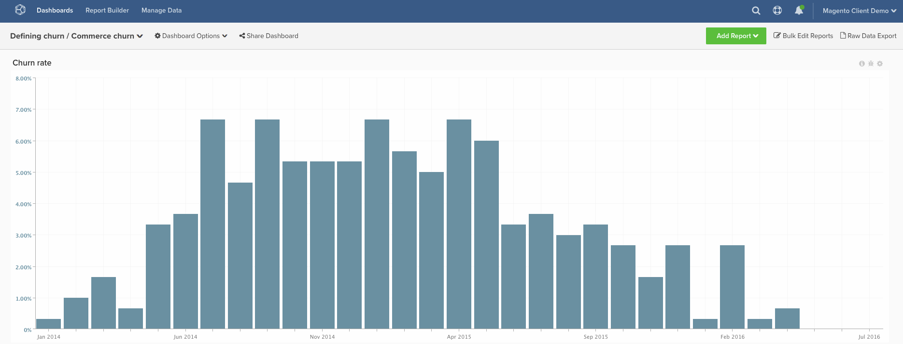

# Tasa de pérdida

En este tema se muestra cómo calcular una **tasa de pérdida** para sus **clientes de comercio**. A diferencia de SaaS o de las empresas de suscripción tradicionales, los clientes de comercio generalmente no tienen un &quot;evento de pérdida&quot; **concreto** que le muestre que ya no deben contar en sus clientes activos. Por este motivo, las siguientes instrucciones le permiten definir un cliente como &quot;perdido&quot; en función de un tiempo determinado transcurrido desde su último pedido.

Muchos clientes quieren ayuda para empezar a conceptualizar qué **periodo de tiempo** deben usar en función de sus datos. Si desea usar el comportamiento histórico del cliente para definir este **periodo de tiempo de pérdida**, quizá quiera familiarizarse con el tema [definición de cancelación](../analysis/define-cust-churn.md). A continuación, puede utilizar los resultados en la fórmula para la tasa de pérdida en las instrucciones siguientes.

## Columnas calculadas

Columnas para crear

* **`customer_entity`** tabla
* **`Customer's last order date`**
   * Seleccionar un(a) [!UICONTROL definition]: `Max`
   * Seleccionar [!UICONTROL table]: `sales_flat_order`
   * Seleccionar [!UICONTROL column]: `created_at`
   * `sales_flat_order.customer_id = customer_entity.entity_id`
   * [!UICONTROL Filter]: `Orders we count`

* **`Seconds since customer's last order date`**
   * Seleccionar un(a) [!UICONTROL definition]: `Age`
   * Seleccionar [!UICONTROL column]: `Customer's last order date`

>[!NOTE]
>
>Asegúrese de [agregar todas las columnas nuevas como dimensiones a las métricas](../data-warehouse-mgr/manage-data-dimensions-metrics.md) antes de crear nuevos informes.

## Métricas

* **Clientes nuevos (por fecha de primer pedido)**
   * Clientes que se cuentan

>[!NOTE]
>
>Esta métrica puede existir en su cuenta.

* En la tabla **`customer_entity`**
* Esta métrica realiza **Count**
* En la columna **`entity_id`**
* Ordenado por la marca de tiempo **`Customer's first order date`**
* [!UICONTROL Filter]:

* **Clientes nuevos (por fecha de último pedido)**
   * Clientes que se cuentan

  >[!NOTE]
  >
  >Esta métrica puede existir en su cuenta.

* En la tabla **`customer_entity`**
* Esta métrica realiza **Count**
* En la columna **`entity_id`**
* Ordenado por la marca de tiempo **`Customer's last order date`**
* [!UICONTROL Filter]:

>[!NOTE]
>
>Asegúrese de [agregar todas las columnas nuevas como dimensiones a las métricas](../data-warehouse-mgr/manage-data-dimensions-metrics.md) antes de crear nuevos informes.

## Informes

* **Tasa de pérdida**
   * [!UICONTROL Metric]: nuevos clientes (por fecha de primer pedido)
   * [!UICONTROL Filter]: `Lifetime number of orders Greater Than 0`
   * &#x200B;
     [!UICONTROL Perspective]: `Cumulative`
   * [!UICONTROL Metric]: `New customers (by last order date)`
   * [!UICONTROL Filter]:
   * Segundos transcurridos desde la última fecha de pedido del cliente >= [Su límite autodefinido para los clientes perdidos ]&#x200B;**`^`**
   * `Lifetime number of orders Greater Than 0`

   * [!UICONTROL Metric]: `New customers (by last order date)`
   * [!UICONTROL Filter]: `Lifetime number of orders Greater Than 0`
   * &#x200B;
     [!UICONTROL Perspective]: Cumulative
   * [!UICONTROL Formula]: `(B / ((A + B) - C)`
   * &#x200B;
     [!UICONTROL Format]: Percentage

* *Métrica `A`:`New customers cumulative`*
* *Métrica `B`:`Churned customers by last order date`*
* *Métrica `C`:`Customers by last order date cumulative`*
* *`Formula`:`Repeat order probability`*
* *`Time period`:`All time (or custom range)`*
* *`Group by`:`Customer's order number`*
* *`Chart Type`:`Column`*

A continuación se muestran algunas conversiones comunes de mes > segundo, pero Google proporciona otros valores, incluidas las conversiones de semana > segundo para cualquier valor personalizado que pueda estar buscando.

| **Meses** | **Segundos** |
|---|---|
| 3 | 7.776.000 |
| 6 | 15.552.000 |
| 9 | 23.328.000 |
| 12 | 31.104.000 |

Después de compilar todos los informes, puede organizarlos en el panel según lo desee. El resultado puede ser similar al panel de muestra anterior.
