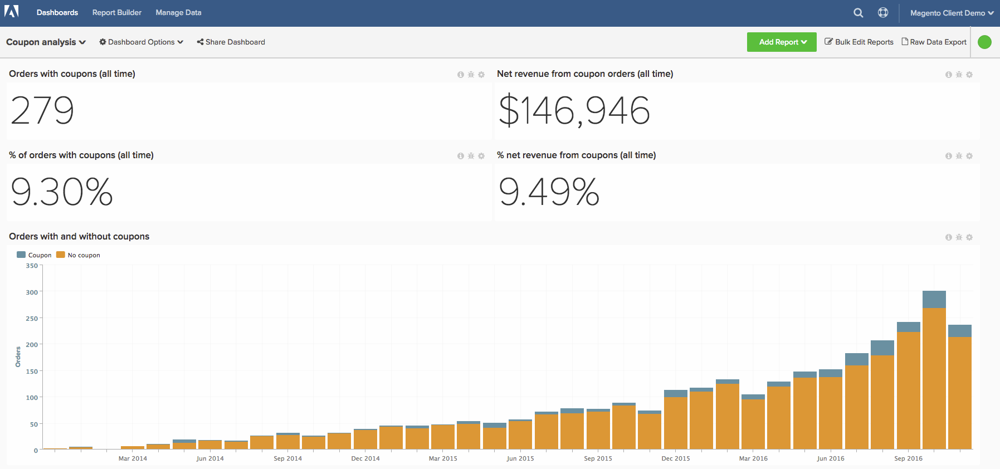

# Análisis avanzado de código de cupones

Comprender el rendimiento de los cupones de su negocio es una manera interesante de segmentar sus pedidos y también comprender mejor a sus clientes. En este tema se explican los pasos para crear análisis con el fin de comprender qué clientes obtiene mediante cupones, cómo funcionan y rastrean el uso general de cupones.

<!--{: width="800" height="375"}-->

Este análisis contiene [columnas calculadas avanzadas](../data-warehouse-mgr/adv-calc-columns.md).

## Primeros pasos

Como primer paso, debe asegurarse de que las siguientes columnas estén sincronizadas con la Data Warehouse. Si no es así, realice un seguimiento de los mismos. Para ello, vaya a `Manage Data` > `Data Warehouse` y sincronice lo siguiente:

* tabla **sales\_flat\_order**
* **cupón\_código**
* **base\_descuento\_amount**

## Columnas calculadas

Columnas que se van a crear independientemente de la directiva de pedidos de invitado:

* `sales\_flat\_order` tabla
* **El pedido tiene un cupón aplicado?**
   * [!UICONTROL Column type]: `Same Table => CALCULATION`
   * [!UICONTROL Inputs]:
      * `A`: `coupon\_code`

   * 
     [!UICONTROL Tipo de datos]: `String`
   * [!UICONTROL Calculation]: caso en el que `A` es nulo, entonces `No coupon` más `Coupon` finalizarán

* **\[INPUT\] customer\_id - código de cupón**
   * [!UICONTROL Column type]: `Same Table => CALCULATION`
   * [!UICONTROL Inputs]:
      * `A`: `customer\_id`
      * `B`: `coupon\_code`

   * [!UICONTROL Datatype] cadena
   * [!UICONTROL Calculation]: `concat(A,' - ',B)`

* **Número de pedidos con este cupón**
   * [!UICONTROL Column type]: `Same Table => EVENT\_NUMBER`
   * Propietario del evento:`INPUT customer_id - coupon code`
   * Clasificación del evento: `created\_at`
   * [!UICONTROL Filters]: conjunto de filtros `Orders we count`

Columnas adicionales para crear si NO se admiten pedidos de invitado:

* `customer\_entity` tabla
   * ¿El primer pedido de **cliente incluyó un cupón? (Cupón/Sin cupón)**
   * [!UICONTROL Column type]: `Many to One => MAX`
   * [!UICONTROL Path]: `sales\_flat\_order.customer\_id = customer\_entity.entity\_id`
   * Seleccionar un(a) [!UICONTROL column]: `Order has coupon applied? (Coupon/No coupon)`
   * [!UICONTROL Filters]:
      * `A`: `Orders we count`
      * `B`: `Customer's order number = 1`

   * **Cupón del primer pedido del cliente**
      * [!UICONTROL Column type]: `Many to One => MAX`
      * [!UICONTROL Path]: `sales\_flat\_order.customer\_id = customer\_entity.entity\_id`
      * Seleccionar un(a) [!UICONTROL column]: `coupon\_code`
      * [!UICONTROL Filter]:
         * `A`: `Orders we count`
         * `B`: `Customer's order number = 1`

   * **Número de cupones utilizados por el cliente durante toda la vida**
      * [!UICONTROL Column type]: `Many to One => COUNT`
      * [!UICONTROL Path]: `sales\_flat\_order.customer\_id = customer\_entity.entity\_id`
      * [!UICONTROL Filter]:
         * `A`: `Orders we count`
         * `B`: `Order has coupon applied? (Coupon/No coupon) = Coupon`

   * **Cliente de adquisición de cupón o cliente de adquisición sin cupón**
      * [!UICONTROL Column type]: `Same Table => CALCULATION`
      * [!UICONTROL Inputs]:
         * `A`: `Customer's first order included a coupon? (Coupon/No coupon)`

      * 
        [!UICONTROL Tipo de datos]: `String`
      * [!UICONTROL Calculation]: **caso cuando A=&#39;Coupon&#39; then &#39;Coupon acquisition customer&#39; else &#39;Non-coupon acquisition customer&#39; end**

   * **Porcentaje de pedidos del cliente con cupón**
      * [!UICONTROL Column type]: `Same Table => CALCULATION`
      * [!UICONTROL Inputs]:
         * `A`: `User's lifetime number of coupons used`
         * `B`: `User's lifetime number of orders`

      * 
        [!UICONTROL Tipo de datos]: `Decimal`
      * [!UICONTROL Calculation]: **caso cuando A es nulo o B es nulo o B=0 entonces nulo otro extremo A/B**

   * **Uso del cupón del cliente**
      * [!UICONTROL Column type]: `Same Table => Calculation`
      * [!UICONTROL Inputs]:
         * `A`: `Percent of customer's orders with coupon`

      * 
        [!UICONTROL Tipo de datos]: `String`
      * [!UICONTROL Calculation]: **caso cuando A es nulo entonces nulo cuando A=0 entonces &#39;Cupón nunca usado&#39; cuando A&lt;0.5 entonces &#39;Precio mayormente completo&#39; cuando A=0.5 entonces &#39;50/50&#39; cuando A=1 entonces &#39;Solo cupones&#39; cuando A>0.5 entonces &#39;Cupón mayoritario&#39; o &#39;Indefinido&#39; terminan**

* `sales\_flat\_order` tabla
   * ¿El primer cupón incluido del cliente es **? (Cupón/Sin cupón)**
      * [!UICONTROL Column type]: `One to Many => JOINED\_COLUMN`
      * [!UICONTROL Path]: `sales\_flat\_order.customer\_id = customer\_entity.entity\_id`
      * Seleccionar un(a) [!UICONTROL column]: `Customer's first order included a coupon? (Coupon/No coupon)`
^

   * **Cupón del primer pedido del cliente**
      * [!UICONTROL Column type]: `One to Many => JOINED\_COLUMN`
      * [!UICONTROL Path]: `sales\_flat\_order.customer\_id = customer\_entity.entity\_id`
      * Seleccionar un(a) [!UICONTROL column]: `Customer's first order coupon?`

Columnas adicionales para crear si NO se admiten pedidos de invitado:

* `sales\_flat\_order` tabla
   * ¿El primer pedido de **cliente incluyó un cupón? (Cupón/Sin cupón)** **-** creado por el analista como parte de su vale \[COUPON ANALYSIS\]
   * **Cupón de primer pedido del cliente**{::}**-** creado por el analista como parte de su ticket \[COUPON ANALYSIS\]

* Número de cupones de por vida de **cliente utilizado**{::}**-** creado por el analista como parte de su vale \[COUPON ANALYSIS\]
* **Cliente de adquisición de cupón o cliente de adquisición sin cupón**
   * [!UICONTROL Column type]: `Same Table => CALCULATION`
   * [!UICONTROL Inputs]:
      * `A`: `Customer's first order included a coupon? (Coupon/No coupon)`

   * 
     [!UICONTROL Tipo de datos]: `String`
   * [!UICONTROL Calculation]: **caso cuando A=&#39;Coupon&#39; then &#39;Coupon acquisition customer&#39; else &#39;Non-coupon acquisition customer&#39; end**

* **Porcentaje de pedidos del cliente con cupón**
   * [!UICONTROL Column type]: `Same Table => CALCULATION`
   * [!UICONTROL Inputs]:
      * `A`: `User's lifetime number of coupons used`
      * `B`: `User's lifetime number of orders`

   * 
     [!UICONTROL Tipo de datos]: `Decimal`
   * [!UICONTROL Calculation]: **caso cuando A es nulo o B es nulo o B=0 entonces nulo otro extremo A/B**

* **Uso del cupón del cliente**
   * [!UICONTROL Column type]: `Same Table => Calculation`
   * [!UICONTROL Inputs]:
      * `A`: `Percent of customer's orders with coupon`

   * 
     [!UICONTROL Tipo de datos]: `String`
   * [!UICONTROL Calculation]: **caso cuando A es nulo entonces nulo cuando A=0 entonces &#39;Cupón nunca usado&#39; cuando A&lt;0.5 entonces &#39;Precio mayormente completo&#39; cuando A=0.5 entonces &#39;50/50&#39; cuando A=1 entonces &#39;Solo cupones&#39; cuando A>0.5 entonces &#39;Cupón mayoritario&#39; o &#39;Indefinido&#39; terminan**

## Métricas

* **Importe de descuento de cupón**
   * `Orders we count`
   * `Order has coupon applied? (Coupon/No coupon)= Coupon`

* En la tabla `sales\_flat\_order`
* Esta métrica arroja una **Sum**
* En la columna `discount\_amount`
* Ordenado por la marca de tiempo `created\_at`
* [!UICONTROL Filter]:

* **Número de cupones utilizados**
   * `Orders we count`
   * `Order has coupon applied? (Coupon/No coupon)= Coupon`

* En la tabla `sales\_flat\_order`
* Esta métrica realiza **Count**
* En la columna `entity\_id`
* Ordenado por la marca de tiempo `created\_at`
* [!UICONTROL Filter]:

>[!NOTE]
>
>Asegúrese de [agregar todas las columnas nuevas como dimensiones a las métricas](../data-warehouse-mgr/manage-data-dimensions-metrics.md) antes de crear nuevos informes.

## Informes

* **% de clientes adquiridos con cupones y no adquiridos con cupones**
   * [!UICONTROL Metric]: `New customers`

* Métrica `A`: `Coupon acquisitions`
* [!UICONTROL Time period]: `All time`
* 
  [!INTERVALO UICONTROL]: `None`
* [!UICONTROL Group by]: `Coupon acquisitions customer` o `Non coupon acquisition customer`
* 
  [!UICONTROL Tipo de gráfico]: `Pie`

* **Número de clientes adquiridos con cupones y no adquiridos con cupones**
   * [!UICONTROL Metric]: `New customers`

* Métrica A: `Coupon acquisitions`
* [!UICONTROL Time period]: `All time`
* [!UICONTROL Interval]: `By Month`
* [!UICONTROL Group by]: `Coupon acquisitions customer` o `Non coupon acquisition customer`
* [!UICONTROL Chart type]: `Stacked column`

* **Ingresos promedio por vida útil: Cupón Acq. (edad superior a 90 días)**
   * [!UICONTROL Metric]: `Average lifetime revenue`
   * [!UICONTROL Filter]:
      * El primer pedido del cliente incluía un cupón (Cupón/Sin cupón) = Cupón

* Métrica `A`: `Average lifetime revenue (at least 3 months age)`
* [!UICONTROL Time period]: `X years ago to 90 days ago`
* 
  [!INTERVALO UICONTROL]: `None`
* 
  [!UICONTROL Tipo de gráfico]: `Scalar`

* **Ingresos promedio de por vida: Cuenta acumulada sin cupón. (edad superior a 90 días)**
   * [!UICONTROL Metric]: ingresos promedio de por vida
   * [!UICONTROL Filter]:
      * El primer pedido del cliente incluía un cupón (Cupón/Sin cupón) = Sin cupón

* Métrica `A`: `Average lifetime revenue (at least 3 months age)`
* [!UICONTROL Time period]: `X years ago to 90 days ago`
* 
  [!INTERVALO UICONTROL]: `None`
* 
  [!UICONTROL Tipo de gráfico]: `Scalar`

* **Ingresos promedio por vida útil por cupón de primer pedido**
   * [!UICONTROL Metric]: `Average lifetime revenue`

* Métrica `A`: `Average lifetime revenue`
* [!UICONTROL Time period]: `All time`
* 
  [!INTERVALO UICONTROL]: `None`
* [!UICONTROL Group by]: `Customer's first order's coupon`
* 
  [!UICONTROL Tipo de gráfico]: `Column`

>[!NOTE]
>
>Si tiene muchos códigos de cupón, como muchos clientes, desea aplicar un Top/Bottom como Top 10 ordenado por ingresos medios de duración

* **Probabilidad de repetición de pedidos: Adquisiciones de cupones**
   * [!UICONTROL Metric]: `Number of orders`
   * [!UICONTROL Filter]:
      * El primer pedido del cliente incluía un cupón (Cupón/Sin cupón) = Cupón

   * [!UICONTROL Metric]: `Number of orders`
   * [!UICONTROL Filter]:
      * El primer pedido del cliente incluía un cupón (Cupón/Sin cupón) = Cupón
      * ¿Es el último pedido del cliente? = No
   * 
     [!UICONTROL Fórmula]: `B/A`
   * [!UICONTROL Format]: `Percentage %`

   * Seleccione un número estadísticamente significativo del gráfico `Customer's by lifetime orders`. Cuando se mira el gráfico, una buena regla es buscar números de pedidos con 30 o más clientes en el bloque. Según el conjunto de datos, puede ser un número elevado, por lo que puede añadir del 1 al 10.

* Métrica `A`: `Number of orders`
* Métrica `B`: `Number of non last orders`
* [!UICONTROL Formula]: `Repeat order probability`
* [!UICONTROL Time period]: `All time`
* 
  [!INTERVALO UICONTROL]: `None`
* [!UICONTROL Group by]: `Customer's order number`
* [!UICONTROL Chart type]: `Bar chart`

* **Probabilidad de repetición de pedido: adquisiciones sin cupones**
   * [!UICONTROL Metric]: `Number of orders`
   * [!UICONTROL Filter]:
      * El primer pedido del cliente incluía un cupón (Cupón/Sin cupón) = Sin cupón

   * [!UICONTROL Metric]: `Number of orders`
   * [!UICONTROL Filter]:
      * El primer pedido del cliente incluía un cupón (Cupón/Sin cupón) = Sin cupón
      * ¿Es el último pedido del cliente? = No

   * 
     [!UICONTROL Fórmula]: `B/A`
   * [!UICONTROL Format]: `Percentage %`

   * Seleccione un número estadísticamente significativo del gráfico `Customer's by lifetime orders` o del 1 al 5.

* Métrica `A`: `Number of orders`
* Métrica `B`: `Number of non last orders`
* [!UICONTROL Formula]: `Repeat order probability`
* [!UICONTROL Time period]: `All time`
* 
  [!INTERVALO UICONTROL]: `None`
* [!UICONTROL Group by]: `Customer's order number`
* [!UICONTROL Chart type]: `Bar chart`

* **Tasa de uso de cupones de clientes adquiridos con cupones (pedidos repetidos)**
   * [!UICONTROL Metric]: `New customers`
   * [!UICONTROL Filter]:
      * Adquisición de cupón cliente o adquisición no de cupón cliente = Adquisición de cupón

   * [!UICONTROL Metric]: `Number of orders`
   * [!UICONTROL Filter]:
      * Número de pedido del cliente > 1
      * ¿El primer pedido del cliente incluía un cupón? (Cupón/Sin cupón) = Cupón

   * [!UICONTROL Metric]:`Number of orders`
   * [!UICONTROL Filter]:
      * Número de pedido del cliente > 1
      * ¿El primer pedido del cliente incluía un cupón? (Cupón/Sin cupón) = Cupón
      * ¿Se ha aplicado el cupón del pedido? (Cupón/Sin cupón) = Cupón

   * 
     [!UICONTROL Fórmula]: `C/B`
   * [!UICONTROL Format]: `Percentage %`

* Métrica `A`: `Coupon-acquired customers`
* Métrica `B`: `Number of repeat orders`
* Métrica `C`: `Number of repeat orders with coupon`
* [!UICONTROL Formula]: `% of repeat orders with coupon`
* [!UICONTROL Time period]: `All time`
* 
  [!INTERVALO UICONTROL]: `None`
* 
  [!UICONTROL Tipo de gráfico]: `Table` (puede transponer esta tabla para una mejor visualización)

* **Tasa de uso de cupones de clientes no adquiridos con cupones (pedidos repetidos)**
   * [!UICONTROL Metric]: `New customers`
   * [!UICONTROL Filter]:
      * Adquisición de cupón cliente o cliente de adquisición no de cupón = Adquisición no de cupón

   * [!UICONTROL Metric]: `Number of orders`
   * [!UICONTROL Filter]:
      * Número de pedido del cliente > 1
      * ¿El primer pedido del cliente incluía un cupón? (Cupón/Sin cupón) = Sin cupón

   * [!UICONTROL Metric]: `Number of orders`
   * [!UICONTROL Filter]:
      * Número de pedido del cliente > 1
      * ¿El primer pedido del cliente incluía un cupón? (Cupón/Sin cupón) = Sin cupón
      * ¿Se ha aplicado el cupón del pedido? (Cupón/Sin cupón) = Cupón

   * 
     [!UICONTROL Fórmula]: `C/B`
   * [!UICONTROL Format]: `Percentage %`

* Métrica `A`: `Non-coupon-acquired customers`
* Métrica `B`: `Number of repeat orders`
* Métrica `C`: `Number of repeat orders with coupon`
* [!UICONTROL Formula]: `% of repeat orders with coupon`
* [!UICONTROL Time period]: `All time`
* 
  [!INTERVALO UICONTROL]: `None`
* 
  [!UICONTROL Tipo de gráfico]: `Table` (puede transponer esta tabla para una mejor visualización)

* **Detalles de uso del cupón (pedidos por primera vez)**
   * [!UICONTROL Metric]: `Number of orders`
   * [!UICONTROL Filter]:
      * Número de pedido del cliente = 1
      * Número de pedidos con este cupón > 10

   * 
     [!UICONTROL Métrica]: `Revenue`
   * [!UICONTROL Filter]:
      * Número de pedido del cliente = 1
      * Número de pedidos con este cupón > 10

   * [!UICONTROL Metric]: `Coupon discount amount`
   * [!UICONTROL Filter]:
      * Número de pedido del cliente = 1
      * Número de pedidos con este cupón > 10

   * [!UICONTROL Formula]: `B-C` (si C es negativo); B+C (si C es positivo)
   * 
     [!UICONTROL Formato]: `Currency`

   * [!UICONTROL Metric]: `Average order value`
   * [!UICONTROL Filter]:
      * Número de pedido del cliente = 1
      * Número de pedidos con este cupón > 10

* Métrica `A`: `First time orders (FTO)`
* Métrica `B`: `Revenue from FTO`
* Métrica `C`: `Discounts applied to FTO`
* [!UICONTROL Formula]: `Gross revenue from FTO`
* Métrica `E`: `Average order value for FTO`
* [!UICONTROL Time period]: `All time`
* 
  [!INTERVALO UICONTROL]: `None`
* [!UICONTROL Group by]: `coupon code`
* 
  [!UICONTROL Tipo de gráfico]: `Table`
>[!NOTE]
>
>La cantidad de 10 para &quot;Número de pedidos con este cupón&quot; es arbitraria. No dude en utilizar la cantidad más adecuada para este filtro.

* **Número de pedidos con cupón (todo el tiempo)**
   * [!UICONTROL Metric]: `Number of coupons used`

* Métrica `A`: `Number or orders with coupon`
* [!UICONTROL Time period]: `All time`
* 
  [!INTERVALO UICONTROL]: `None`
* 
  [!UICONTROL Tipo de gráfico]: `Scalar`

* **Ingresos netos de pedidos con cupones (todo el tiempo)**
   * 
     [!UICONTROL Métrica]: `Revenue`
   * [!UICONTROL Filter]:
      * ¿Se ha aplicado el cupón del pedido? (Cupón/Sin cupón) = Cupón

* Métrica `A`: `Net revenue from orders with coupons`
* [!UICONTROL Time period]: `All time`
* 
  [!INTERVALO UICONTROL]: `None`
* 
  [!UICONTROL Tipo de gráfico]: `Scalar`

* **Descuentos de cupones (todo el tiempo)**
   * [!UICONTROL Metric]: `Number of coupons used`

* Métrica `A`: `Coupon discount amount`
* [!UICONTROL Time period]: `All time`
* 
  [!INTERVALO UICONTROL]: `None`
* 
  [!UICONTROL Tipo de gráfico]: `Scalar`

* **Número de pedidos con y sin cupones**
   * [!UICONTROL Metric]: `Number of orders`

* Métrica `A`: `Number of orders`
* [!UICONTROL Time period]: `Last 24 months`
* 
  [!INTERVALO UICONTROL]: `None`
* [!UICONTROL Group by]: `Order has coupon applied? (Coupon/No coupon)`
* [!UICONTROL Chart type]: `Stacked column`

* **Uso de cupones entre usuarios repetidos**
   * [!UICONTROL Metric]: `New customers`
   * [!UICONTROL Filter]:
      * Número de pedidos > 1 de duración del cliente

* Métrica `A`: `New customers`
* [!UICONTROL Time period]: `All time`
* 
  [!INTERVALO UICONTROL]: `None`
* [!UICONTROL Group by]: `Customer's coupon usage`
* 
  [!UICONTROL Tipo de gráfico]: `Pie`

* **Detalles de uso del cupón**
   * [!UICONTROL Metric]: `Number of orders with coupon`
   * [!UICONTROL Filter]:
      * Número de pedidos con este cupón > 10

   * 
     [!UICONTROL Métrica]: `Revenue`
   * [!UICONTROL Filter]:
      * Número de pedidos con este cupón > 10

   * [!UICONTROL Metric]: `Coupon discount amount`
   * [!UICONTROL Filter]:
      * Número de pedidos con este cupón > 10

   * [!UICONTROL Formula]: `B-C` (si `C` es negativo); `B+C` (si `C` es positivo)
   * 
     [!UICONTROL Formato]: `Currency`

   * [!UICONTROL Formula]: `C/(B-C)` (si `C` es negativo); `C/(B+C)` (si `C` es positivo)
   * 
     [!UICONTROL Formato]: `Percentage`

   * [!UICONTROL Metric]: `Average order value`
   * [!UICONTROL Filter]:
      * Número de pedidos con este cupón > 10

   * 
     [!UICONTROL Fórmula]: `C/A`
   * 
     [!UICONTROL Formato]: `Currency`

   * [!UICONTROL Metric]: `Distinct buyers`
   * [!UICONTROL Filter]:
      * Número de pedidos con este cupón > 10

* Métrica `A`: `Number of orders`
* Métrica `B`: `Net revenue from orders`
* Métrica `C`: `Total discounts applied`
* [!UICONTROL Formula]: `Gross revenue`
* [!UICONTROL Formula]: `% discounted`
* Métrica `F`: `Average net order value`
* [!UICONTROL Formula]: `Average order discount`
* Métrica `H`: `Distinct buyers`
* [!UICONTROL Time period]: `All time`
* 
  [!INTERVALO UICONTROL]: `None`
* [!UICONTROL Group by]: `coupon code`
* 
  [!UICONTROL Tipo de gráfico]: `Table`

>[!NOTE]
>
>La cantidad de 10 para &quot;Número de pedidos con este cupón&quot; es arbitraria. No dude en utilizar la cantidad más adecuada para este filtro.

Después de compilar todos los informes, puede organizarlos en el panel según lo desee. El resultado puede ser similar a la imagen de la parte superior de la página.

Si tiene alguna pregunta al generar este análisis o simplemente desea contactar con el equipo de Servicios profesionales, [póngase en contacto con el servicio de asistencia](https://experienceleague.adobe.com/docs/commerce-knowledge-base/kb/troubleshooting/miscellaneous/mbi-service-policies.html).

>[!NOTE]
>
>A partir de Adobe Commerce 2.4.7, los clientes pueden utilizar las tablas **quote_coupons** y **sales_order_coupons** para obtener información sobre cómo los clientes utilizan varios cupones.

