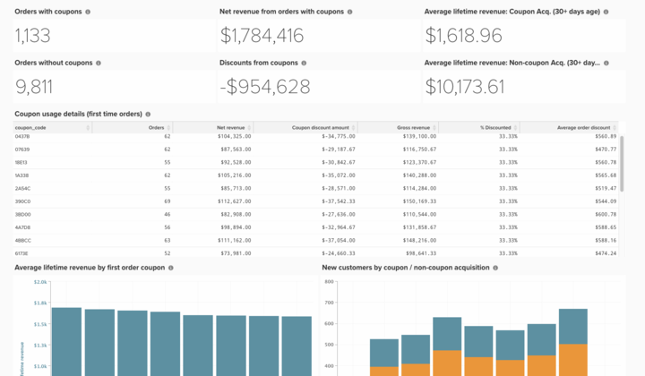

# Análisis básico de código de cupón

Comprender el rendimiento de los cupones de su negocio es una forma interesante de segmentar sus pedidos y comprender mejor los hábitos de los clientes.

En este tema se explican los pasos necesarios para crear este análisis con el fin de comprender el rendimiento de los clientes con cupones adquiridos, ver las tendencias y realizar un seguimiento del uso del código de cupones individual.

<!--{: width="807" height="471"}-->

## Primeros pasos

En primer lugar, una nota sobre cómo se realiza el seguimiento de los códigos de cupones. Si un cliente aplica un cupón a un pedido, ocurren tres cosas:

* Un descuento se refleja en la cantidad de `base_grand_total` (su métrica de `Revenue` en Commerce Intelligence)
* El código de cupón se almacena en el campo `coupon_code`. Si este campo es NULL (vacío), el pedido no tiene un cupón asociado.
* La cantidad con descuento se almacena en `base_discount_amount`. Según la configuración, este valor puede parecer negativo o positivo.

A partir de la versión 2.4.7 de Commerce, un cliente puede aplicar más de un código de cupón a un pedido. En este caso:

* Todos los códigos de cupón aplicados se almacenan en el campo `coupon_code` de `sales_order_coupons`. El primer código de cupón aplicado también se almacena en el campo `coupon_code` de `sales_order`. Si este campo es NULL (vacío), el pedido no tiene un cupón asociado.

## Creación de una métrica

El primer paso es construir una nueva métrica con los siguientes pasos:

* Vaya a **[!UICONTROL Manage Data > Metrics > Create New Metric]**.

* Seleccione `sales_order`.
* Esta métrica realiza una **Suma** en la columna **base_discount_amount**, ordenada por **created_at**.
   * [!UICONTROL Filters]:
      * Agregar `Orders we count` (conjunto de filtros guardado)
      * Añada lo siguiente:
         * `coupon_code`**NO ES**`[NULL]`
      * Asigne un nombre a la métrica, como `Coupon discount amount`.

## Creación del tablero

* Una vez creada la métrica:
   * Vaya a [!UICONTROL Dashboards > Dashboard Options > Create New Dashboard]**.
   * Asigne un nombre al tablero, como `_Coupon Analysis_`.

* Aquí es donde se crean y agregan todos los informes.

## Creación de informes

* **Nuevos informes:**

>[!NOTE]
>
>El [!UICONTROL Time Period]** de cada informe se muestra como `All-time`. No dude en modificar esto para adaptarlo a sus necesidades de análisis. Adobe recomienda que todos los informes de este tablero abarquen el mismo período de tiempo, como `All time`, `Year-to-date` o `Last 365 days`.

* **Pedidos con cupones**
   * 
     [!UICONTROL Métrica]: `Orders`
      * Añadir filtro:
         * [`A`] `coupon_code` **NO ES** `[NULL]`

   * [!UICONTROL Time period]: `All time`
   * 
     [!INTERVALO UICONTROL]: `None`
   * [!UICONTROL Chart type]:`Number (scalar)`

* **Pedidos sin cupones**
   * 
     [!UICONTROL Métrica]: `Orders`
      * Añadir filtro:
         * [`A`] `coupon_code` **ES** `[NULL]`

   * [!UICONTROL Time period]: `All time`
   * 
     [!INTERVALO UICONTROL]: `None`
   * [!UICONTROL Chart type]:`Number (scalar)`

* **Ingresos netos de pedidos con cupones**
   * 
     [!UICONTROL Métrica]: `Revenue`
      * Añadir filtro:
         * [`A`] `coupon_code` **NO ES** `[NULL]`

   * [!UICONTROL Time period]: `All time`
   * 
     [!INTERVALO UICONTROL]: `None`
   * [!UICONTROL Chart type]: `Number (scalar)`

* **Descuentos de cupones**
   * [!UICONTROL Metric]: `Coupon discount amount`
   * [!UICONTROL Time period]: `All time`
   * 
     [!INTERVALO UICONTROL]: `None`
   * [!UICONTROL Chart type]: `Number (scalar)`

* **Ingresos promedio por vida útil: Clientes adquiridos con cupones**
   * [!UICONTROL Metric]: `Avg lifetime revenue`
      * Añadir filtro:
         * [`A`] `Customer's first order's coupon_code` **NO ES** `[NULL]`

   * [!UICONTROL Time period]: `All time`
   * 
     [!INTERVALO UICONTROL]: `None`
   * [!UICONTROL Chart type]: `Number (scalar)`

* **Ingresos promedio de por vida: clientes adquiridos sin cupón**
   * [!UICONTROL Metric]: `Avg lifetime revenue`
      * Añadir filtro:
         * [A] `Customer's first order's coupon_code` **ES**`[NULL]`

   * [!UICONTROL Time period]: `All time`
   * 
     [!INTERVALO UICONTROL]: `None`
   * [!UICONTROL Chart type]: `Number (scalar)`

* **Detalles de uso del cupón (pedidos por primera vez)**
   * Métrica `1`: `Orders`
      * Añadir filtro:
         * [`A`] `coupon_code` **NO ES**`[NULL]`
         * [`B`] `Customer's order number` **Igual a** `1`

   * Métrica `2`: `Revenue`
      * Añadir filtro:
         * [`A`] `coupon_code` **NO ES**`[NULL]`
         * [`B`] `Customer's order number` **Igual a** `1`

      * Cambiar nombre: `Net revenue`

   * Métrica `3`: `Coupon discount amount`
      * Añadir filtro:
         * [`A`] `coupon_code` **NO ES**`[NULL]`
         * [`B`] `Customer's order number` **Igual a** `1`

   * Crear fórmula: `Gross revenue`
      * [!UICONTROL Formula]: `(B – C)`
      * 
        [!UICONTROL Format]: `Currency`

   * Crear fórmula:**% con descuento**
      * Fórmula: `(C / (B - C))`
      * 
        [!UICONTROL Format]: `Percentage`

   * Crear fórmula: `Average order discount`
      * [!UICONTROL Formula]: `(C / A)`
      * 
        [!UICONTROL Format]: `Percentage`

   * [!UICONTROL Time period]: `All time`
   * 
     [!INTERVALO UICONTROL]: `None`
   * 
     [!UICONTROL Tipo de gráfico]: `Table`

* **Ingresos promedio por vida útil por cupón de primer pedido**
   * [!UICONTROL Metric]:**Ingresos promedio por duración**
      * Añadir filtro:
         * [`A`] `coupon_code` **ES**`[NULL]`

   * [!UICONTROL Time period]: `All time`
   * 
     [!INTERVALO UICONTROL]: `None`
   * [!UICONTROL Chart type]: `Number (scalar)`

* **Detalles de uso del cupón (pedidos por primera vez)**
   * [!UICONTROL Metric]: `Avg lifetime revenue`
      * Añadir filtro:
         * [`A`] `Customer's first order's coupon_code` **NO ES** `[NULL]`

   * [!UICONTROL Time period]: `All time`
   * 
     [!INTERVALO UICONTROL]: `None`
   * [!UICONTROL Group by]: `Customer's first order's coupon_code`
   * 
     [!UICONTROL Tipo de gráfico]: **Column**

* **Nuevos clientes por adquisición de cupones / no cupones**
   * Métrica `1`: `New customers`
      * Añadir filtro:
         * [`A`] `Customer's first order's coupon_code` **NO ES** `[NULL]`

      * [!UICONTROL Rename]: `Coupon acquisition customer`

   * Métrica `2`: `New customers`
      * Añadir filtro:
         * [`A`] `coupon_code` **ES**`[NULL]`

      * [!UICONTROL Rename]: `Non-coupon acquisition customer`

   * [!UICONTROL Time period]: `All time`
   * [!UICONTROL Interval]: `By Month`
   * [!UICONTROL Chart type]: `Stacked Column`

Después de crear los informes, consulte la imagen de la parte superior de este tema para saber cómo organizar los informes en el panel.

>[!NOTE]
>
>A partir de Adobe Commerce 2.4.7, los clientes pueden utilizar las tablas **quote_coupons** y **sales_order_coupons** para obtener información sobre cómo los clientes utilizan varios cupones.

