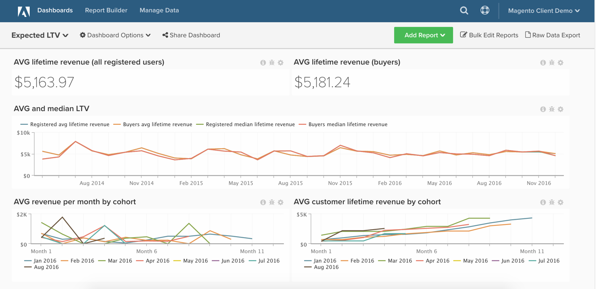

# Análisis de valor de duración esperada

En este tema se muestra cómo configurar un tablero que le ayuda a comprender el crecimiento del valor de duración del cliente y el valor de duración esperado de sus clientes.

Este análisis solo está disponible para los clientes de cuenta de Pro en la nueva arquitectura. Si su cuenta tiene acceso a `Persistent Views` función en la `Manage Data` barra lateral, se encuentra en la nueva arquitectura y puede seguir las instrucciones que se enumeran aquí para crear este análisis usted mismo.

Antes de empezar, debe familiarizarse con el [creador de informes de cohorte.](../dev-reports/cohort-rpt-bldr.md)

## Columnas calculadas

Columnas para crear en **pedidos** tabla si se utiliza **meses de 30 días**:

* [!UICONTROL Column name]: `Months between first order and this order`
* [!UICONTROL Column type]: `Same Table`
* 
   [!UICONTROL Column equation]: `CALCULATION`
* [!UICONTROL Column input]: A = `Seconds between customer's first order date and this order`
* 
   [!UICONTROL Datatype]: `Integer`
* **Definición:**`case when A is null then null when A <= 0 then '1'::int else (ceil(A)/2629800)::int end`

* [!UICONTROL Column name]: `Months since order`
* [!UICONTROL Column type]: `Same Table`
* 
   [!UICONTROL Column equation]: `CALCULATION`
* [!UICONTROL Column input]: A = `created_at`
* 
   [!UICONTROL Datatype]: `Integer`
* Definición: `case when created_at is null then null else (ceil((extract(epoch from current_timestamp) - extract(epoch from created_at))/2629800))::int end`

Columnas para crear en **`orders`** tabla si se utiliza **calendario** meses:

* [!UICONTROL Column name]: `Calendar months between first order and this order`
* [!UICONTROL Column type]: `Same Table`
* 
   [!UICONTROL Column equation]: `CALCULATION`
* [!UICONTROL Column inputs]:
   * `A` = `created_at`
   * `B` = `Customer's first order date`

* 
   [!UICONTROL Datatype]: `Integer`
* Definición: `case when (A::date is null) or (B::date is null) then null else ((date_part('year',A::date) - date_part('year',B::date))*12 + date_part('month',A::date) - date_part('month',B::date))::int end`

* [!UICONTROL Column name]: `Calendar months since order`
* [!UICONTROL Column type]: `Same Table`
* 
   [!UICONTROL Column equation]: `CALCULATION`
* [!UICONTROL Column input]: `A` = `created_at`
* 
   [!UICONTROL Datatype]: `Integer`
* **Definición:**`case when A is null then null else ((date_part('year',current_timestamp::date) - date_part('year',A::date))*12 + date_part('month',current_timestamp::date) - date_part('month',A::date))::int end`

* [!UICONTROL Column name]: `Is in current month? (Yes/No)`
* [!UICONTROL Column type]: `Same Table`
* 
   [!UICONTROL Column equation]: `CALCULATION`
* [!UICONTROL Column input]: A = `created_at`
* 
   [!UICONTROL Datatype]: `String`
* Definición: `case when A is null then null when (date_trunc('month', current_timestamp::date))::varchar = (date_trunc('month', A::date))::varchar then 'Yes' else 'No' end`

## Métricas

### Instrucciones de métrica

Métricas que crear

* **Distintos clientes por fecha de primer pedido**
   * Si activa los pedidos de invitado, utilice `customer_email`

* En el **`orders`** tabla
* Esta métrica realiza una **Contar valores distintos**
* En el **`customer_id`** columna
* Ordenado por el **`Customer's first order date`** timestamp

>[!NOTE]
>
>Asegúrese de lo siguiente [añadir todas las columnas nuevas como dimensiones a las métricas](../../data-analyst/data-warehouse-mgr/manage-data-dimensions-metrics.md) antes de crear nuevos informes.

## Informes

### Instrucciones del informe

**Ingresos esperados por cliente y mes**

* Métrica `A`: `Revenue (hide)`
   * `Calendar months between first order and this order` `<= X` (Elija un número razonable para X, por ejemplo, 24 meses)
   * `Is in current month?` = `No`

* 
   [!UICONTROL Métrica]: `Revenue`
* [!UICONTROL Filter]:

* Métrica `B`: `All time customers (hide)`
   * `Is in current month?` = `No`

* [!UICONTROL Metric]: `New customers by first order date`
* [!UICONTROL Filter]:

* Métrica `C`: `All time customers by month since first order (hide)`
   * `Calendar months since order` `<= X`
   * `Is in current month?` = `No`

* [!UICONTROL Metric]: `New customers by first order date`
* [!UICONTROL Filter]:

* [!UICONTROL Formula]: `Expected revenue`
* [!UICONTROL Formula]: `A / (B - C)`
* 

   [!UICONTROL Format]: `Currency`

Otros detalles del gráfico

* [!UICONTROL Time period]: `All time`
* Intervalo de tiempo: `None`
* [!UICONTROL Group by]: `Calendar months between first order and this order` - mostrar todo
* Cambie el `group by` para el `All time customers` a Independiente mediante el icono de lápiz situado junto a la variable `group by`
* Edite el `Show top/bottom` como se indica a continuación:
   * [!UICONTROL Revenue]: `Top 24 sorted by Calendar months between first order and this order`
   * [!UICONTROL All time customers]: `Top 24 sorted by All time customers`
   * [!UICONTROL All time customers by month since first order]: `Top 24 sorted by All time customers by month since first order`

**Ingresos medios por mes por cohorte**

* Métrica `A`: `Revenue`
* 
   [!UICONTROL Metric view]: `Cohort`
* [!UICONTROL Cohort date]: `Customer's first order date`
* [!UICONTROL Perspective]: `Average value per cohort member`

**Ingresos medios acumulados por mes por cohorte**

* Métrica `A`: `Revenue`
* 
   [!UICONTROL Metric view]: `Cohort`
* [!UICONTROL Cohort date]: `Customer's first order date`
* [!UICONTROL Perspective]: `Cumulative average value per cohort member`

Después de compilar todos los informes, puede organizarlos en el panel según lo desee. El resultado puede ser similar a la imagen de la parte superior de la página.

Si tiene alguna pregunta mientras realiza este análisis o simplemente desea contactar con el equipo de Servicios profesionales, [soporte de contacto](https://experienceleague.adobe.com/docs/commerce-knowledge-base/kb/troubleshooting/miscellaneous/mbi-service-policies.html).
