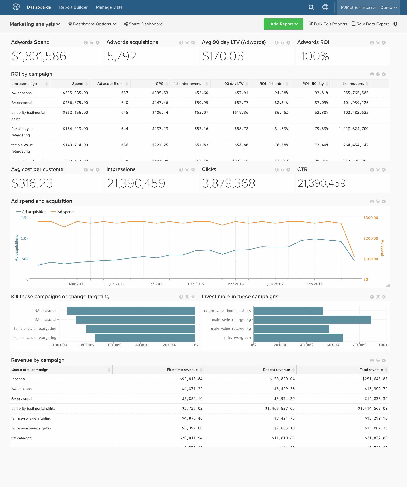

# ROI de marketing

>[!NOTE]
>
>Este tema contiene instrucciones para los clientes que utilizan la arquitectura original y la nueva arquitectura. Se encuentra en la [nueva arquitectura](../../administrator/account-management/new-architecture.md) si tiene la sección &quot;Vistas de Data Warehouse&quot; disponible después de seleccionar &quot;Administrar datos&quot; en la barra de herramientas principal.

Si está gastando dinero en publicidad en línea, quiere rastrear su retorno de este gasto y tomar decisiones basadas en datos sobre futuras inversiones. En este tema se muestra cómo configurar un tablero que realice un seguimiento del análisis de canal, incluido el retorno de la inversión en términos agregados y por campaña.

Antes de comenzar, debe conectar sus cuentas de [!DNL [Facebook Ads]](../importing-data/integrations/facebook-ads.md), [!DNL [Adwords]](../importing-data/integrations/google-adwords.md) y [!DNL [Google Ecommerce]](../importing-data/integrations/google-ecommerce.md) y traer los datos adicionales de gasto de anuncios en línea. Este análisis contiene [columnas calculadas avanzadas](../data-warehouse-mgr/adv-calc-columns.md).

## Tablas consolidadas

**Arquitectura original:** Para reunir tu gasto de varias fuentes, como [!DNL Facebook Ads] o [!DNL Google Adwords], Adobe recomienda crear una **tabla consolidada** de todo tu gasto en publicidad. Necesita un analista para completar este paso. Si no lo ha hecho, [envíe una solicitud de soporte técnico](../../guide-overview.md#Submitting-a-Support-Ticket) con el asunto `[MARKETING ROI ANALYSIS]` y un analista creará esta tabla.

**Nueva arquitectura:** Puede seguir el ejemplo de [este tema de la biblioteca de análisis](../../data-analyst/data-warehouse-mgr/create-dw-views.md). Las tablas consolidadas ahora se conocen como Vistas de Data Warehouse en la nueva arquitectura.

## Columnas calculadas

Columnas para crear

* **`Consolidated Digital Ad Spend`** tabla
* Un analista de Adobe ha creado **`Campaign name`** como parte de su vale de **[ANÁLISIS DE ROI DE MARKETING]**

**Arquitecturas originales y nuevas:**

* **`sales_flat_order`** tabla
   * **`Order's GA campaign`**
      * Seleccione una definición: `Joined Column`
      * [!UICONTROL Create Path]:
      * 
        [!UICONTROL Many]: `sales_flat_order.increment_id`
      * 
        [!UICONTROL One]: `ecommerce####.transaction_id`

      * Seleccionar un(a) [!UICONTROL table]: `ecommerce####`
      * Seleccionar un(a) [!UICONTROL column]: `campaign`
      * [!UICONTROL Path]: `sales_flat_order.increment_id = ecommerce#####.transactionID`

   * **`Order's GA medium`**
      * Seleccione una definición: Columna combinada
      * Seleccionar un(a) [!UICONTROL table]: `ecommerce####`
      * Seleccionar un(a) [!UICONTROL column]: `medium`
      * [!UICONTROL Path]: sales_plain_order.increment_id = ecommerce#####.transactionId

   * **`Order's GA source`**
      * Seleccione una definición: Columna combinada
      * Seleccionar un(a) [!UICONTROL table]: `ecommerce####`
      * Seleccionar un(a) [!UICONTROL column]: `source`
      * [!UICONTROL Path]: sales_plain_order.increment_id = ecommerce#####.transactionId
^

* **`customer_entity`** tabla
* **`Customer's first order GA campaign`**
   * Seleccione una definición: `Max`
   * Seleccionar un(a) [!UICONTROL table]: `sales_flat_order`
   * Seleccionar un(a) [!UICONTROL column]: `Order's GA campaign`
   * [!UICONTROL Path]: `sales_flat_order.customer_id = customer_entity.entity_id`
   * [!UICONTROL Filter]:
      * `Orders we count`
      * `Customer's order number = 1`

* **`Customer's first order GA source`**
   * Seleccione una definición: `Max`
   * Seleccionar un(a) [!UICONTROL table]: `sales_flat_order`
   * Seleccionar un(a) [!UICONTROL column]: `Order's GA source`
   * [!UICONTROL Path]: sales_plain_order.customer_id = customer_entity.entity_id
   * [!UICONTROL Filter]:
      * `Orders we count`
      * `Customer's order number = 1`

* **`Customer's first order GA medium`**
   * Seleccione una definición: `Max`
   * Seleccionar un(a) [!UICONTROL table]: `sales_flat_order`
   * Seleccionar un(a) [!UICONTROL column]: `Order's GA medium`
   * [!UICONTROL Path]: `sales_flat_order.customer_id = customer_entity.entity_id`
   * [!UICONTROL Filter]:
      * `Orders we count`
      * `Customer's order number = 1`

* **`sales_flat_order`** tabla
* **`Customer's first order GA campaign`**
   * Seleccione una definición: `Joined Column`
   * Seleccionar un(a) [!UICONTROL table]: `customer_entity`
   * Seleccionar un(a) [!UICONTROL column]: `Customer's first order GA campaign`
   * [!UICONTROL Path]: `sales_flat_order.customer_id = customer_entity.entity_id`

* **`Customer's first order GA source`**
   * Seleccione una definición: Columna combinada
   * Seleccionar un(a) [!UICONTROL table]: `customer_entity`
   * Seleccionar un(a) [!UICONTROL column]: `Customer's first order GA source`
   * [!UICONTROL Path]: `sales_flat_order.customer_id = customer_entity.entity_id`

* **`Customer's first order GA medium`**
   * Seleccione una definición: `Joined Column`
   * Seleccionar un(a) [!UICONTROL table]: `customer_entity`
   * Seleccionar un(a) [!UICONTROL column]: `Customer's first order GA medium`
   * [!UICONTROL Path]: `sales_flat_order.customer_id = customer_entity.entity_id`

## Métricas

* **Gasto en publicidad**
* En la tabla **`Consolidated Digital Ad Spend`**
* Esta métrica arroja una **Sum**
* En la columna **`adCost`**
* Ordenado por la marca de tiempo **`date`**

* **Impresiones de anuncios**
* En la tabla **`Consolidated Digital Ad Spend`**
* Esta métrica arroja una **Sum**
* En la columna **`Impressions`**
* Ordenado por la marca de tiempo **`Month`**

* **Clics en publicidad**
* En la tabla **`Consolidated Digital Ad Spend`**
* Esta métrica arroja una **Sum**
* En la columna **`adClicks`**
* Ordenado por la marca de tiempo **`Month`**

>[!NOTE]
>
>Asegúrese de [agregar todas las columnas nuevas como dimensiones a las métricas](../../data-analyst/data-warehouse-mgr/manage-data-dimensions-metrics.md) antes de crear nuevos informes.

## Informes

* **Gasto en publicidad (todo el tiempo)**
   * [!UICONTROL Metric]: gasto en publicidad

* Métrica `A`: gasto en publicidad
* [!UICONTROL Time period]: `All time`
* 
  [!INTERVALO UICONTROL]: `None`
* 
  [!UICONTROL Chart Type]: `Scalar`

* **Agregar adquisiciones de clientes (todo el tiempo)**
   * [!UICONTROL Metric]: `New customers`
   * [!UICONTROL Filters]:
      * `User's first order's source LIKE %google%`
      * `User's first order's source LIKE %facebook%`
      * `User's first order's source LIKE %fb%`
      * `User's first order's medium IN cpc, ppc`
      * Lógica de filtro: ([`A`] O [`B`] O [`C`]) Y [`D`]

* Métrica `A`: `Ad customer acquisitions`
* [!UICONTROL Time period]: `All time`
* 
  [!INTERVALO UICONTROL]: `None`
* 
  [!UICONTROL Chart Type]: `Scalar`

* **ROI del anuncio**
   * [!UICONTROL Metric]: gasto en publicidad

   * [!UICONTROL Metric]: `New customers`
   * [!UICONTROL Filters]:
      * `User's first order's source LIKE %google%`
      * `User's first order's source LIKE %facebook%`
      * `User's first order's source LIKE %fb%`
      * `User's first order's medium IN cpc, ppc`
      * Lógica de filtro: ([`A`] O [`B`] O [`C`]) Y [`D`]

   * [!UICONTROL Metric]: ingresos promedio de por vida
   * [!UICONTROL Filters]:
      * `User's first order's source LIKE %google%`
      * `User's first order's source LIKE %facebook%`
      * `User's first order's source LIKE %fb%`
      * `User's first order's medium IN cpc, ppc`
      * Lógica de filtro: ([`A`] O [`B`] O [`C`]) Y [`D`]

   * [!UICONTROL Formula]: `((C - (A / B)) / (A / B))`
   * 
     [!UICONTROL Format]: `Percentage`

* Métrica `A`: `Ad Spend (hide)`
* Métrica `B`: `Ad customer acquisitions (hide)`
* Métrica `C`: `Average LTV (hide)`
* [!UICONTROL Formula]: `Ads ROI`
* [!UICONTROL Time period]: `All time`
* 
  [!INTERVALO UICONTROL]: `None`
* 
  [!UICONTROL Chart Type]: `Scalar`

* **Pedidos por medio de ga**
   * 
     [!UICONTROL Métrica]: `Orders`

* Métrica `A`: `Orders`
* [!UICONTROL Time period]: `All time`
* [!UICONTROL Interval]: `By Month`
* [!UICONTROL Group by]: `Order's medium`
* 
  [!UICONTROL Chart Type]: `Area`

* **ROI del anuncio por campaña**
   * [!UICONTROL Metric]: `Ad Spend`

   * [!UICONTROL Metric]:`New customers`
   * [!UICONTROL Filters]:
      * `User's first order's source LIKE %google%`
      * `User's first order's source LIKE %facebook%`
      * `User's first order's source LIKE %fb%`
      * `User's first order's medium IN cpc, ppc`
      * Lógica de filtro: ([`A`] O [`B`] O [`C`]) Y [`D`]

   * [!UICONTROL Metric]: ingresos promedio de por vida
   * [!UICONTROL Filters]:
      * `User's first order's source LIKE %google%`
      * `User's first order's source LIKE %facebook%`
      * `User's first order's source LIKE %fb%`
      * `User's first order's medium IN cpc, ppc`
      * Lógica de filtro: ([`A`] O [`B`] O [`C`]) Y [`D`]

   * [!UICONTROL Metric]: número promedio de pedidos durante toda la vida
   * [!UICONTROL Filters]:
      * `User's first order's source LIKE %google%`
      * `User's first order's source LIKE %facebook%`
      * `User's first order's source LIKE %fb%`
      * `User's first order's medium IN cpc, ppc`
      * Lógica de filtro: ([`A`] O [`B`] O [`C`]) Y [`D`]

   * [!UICONTROL Formula]: `(A / B)`
   * 
     [!UICONTROL Format]: `Currency`

   * [!UICONTROL Formula]: `(C - (A / B))`
   * 
     [!UICONTROL Format]: `Currency`

   * [!UICONTROL Formula]: `((C - (A / B)) / (A / B))`
   * 
     [!UICONTROL Format]: `Percentage`

   * [!UICONTROL Metric]: `Ad Clicks`

   * [!UICONTROL Metric]: `Ad Impressions`

   * [!UICONTROL Formula]: `(H / I)`
   * 
     [!UICONTROL Format]: `Percentage`

   * [!UICONTROL Formula]: `(A / H)`
   * 
     [!UICONTROL Format]: `Currency`

* Métrica `A`: `Ad Spend` (ocultar)
* Métrica `B`: `Ad customer acquisitions`
* Métrica `C`: `Average LTV`
* Métrica `D`: `Average lifetime # of orders`
* 
  [!UICONTROL Fórmula]: `CAC`
* [!UICONTROL Formula]: `Avg return`
* [!UICONTROL Formula]: `Ads ROI`
* Métrica `H`: `adClicks`
* Métrica `I`: `Impressions`
* 
  [!UICONTROL Fórmula]: `CTR`
* 
  [!UICONTROL Fórmula]: `CPC`
* [!UICONTROL Time period]: `All time`
* 
  [!INTERVALO UICONTROL]: `None`
* 
  [!UICONTROL Agrupar por]: `campaign` (Utilice la campaña &quot;Primer pedido del cliente&quot; para métricas de tabla de gasto que no sean de publicidad)
* 
  [!UICONTROL Chart Type]: `Table`

Si tiene alguna pregunta al generar este análisis o simplemente desea contactar con el equipo de Servicios profesionales, [póngase en contacto con el servicio de asistencia](https://experienceleague.adobe.com/docs/commerce-knowledge-base/kb/troubleshooting/miscellaneous/mbi-service-policies.html).

### Relacionado

* [Prácticas recomendadas para el etiquetado UTM en  [!DNL Google Analytics]](../../best-practices/utm-tagging-google.md)
* [¿Cómo funciona la atribución de  [!DNL Google Analytics] UTM?](../analysis/utm-attributes.md)
