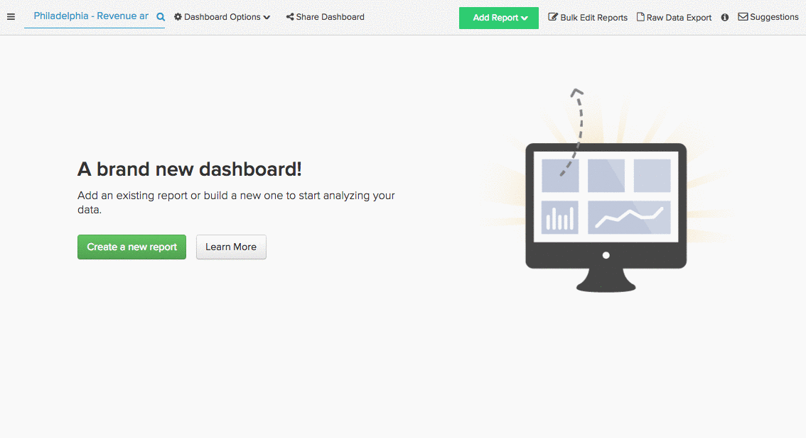

# Identificación de fuentes de marketing correctas

Investigaste tu audiencia, creaste tu campaña, invertiste en algunos canales de marketing. Ahora que ha pasado algún tiempo, ¿cómo van esos canales? ¿Qué canal ha atraído a la mayoría de los usuarios nuevos? ¿Qué fuente ha contribuido más a sus ingresos totales?

Con [!DNL Adobe Commerce Intelligence], puede segmentar fácilmente sus ingresos y usuarios por fuente de referencia, independientemente de si corresponde a [!DNL [Google Analytics' UTM fields]](https://support.google.com/analytics/answer/1191184?hl=en) o campos de datos personalizados. Esta segmentación le permite encontrar los canales con mejor rendimiento e invertir mejor su presupuesto de marketing.

En este tema se exploran algunos informes que puede utilizar para descubrir los canales de marketing más valiosos:

* [Nuevos usuarios por fuentes](#newusersbysource)
* [Ingresos promedio por duración por origen de usuario](#avglifetimerev)
* [Valor de pedido promedio por origen de usuario](#avgorderval)
* [Ingresos por fecha y origen de registro de usuario](#revbyregdateandsource)
* [Repetir pedidos por origen de usuario](#repeatordersbysource)

## Requisitos previos {#prereqs}

Para generar los análisis de este tema, necesita acceder a los datos de adquisición de marketing/fuente de referencia. Si aún no lo está rastreando, debe traer [solicitar datos de origen de referencia de [!DNL Google ECommerce]](../importing-data/integrations/google-ecommerce.md) en [!DNL Adobe Commerce Intelligence] antes de continuar. Además, al agregar información del dispositivo del usuario a los análisis, puede ver qué tecnología utilizan las referencias.

## Nuevos usuarios por origen {#newusersbysource}

La evaluación del rendimiento de las fuentes de referencia es clave para determinar los canales más valiosos. Este informe muestra el número de usuarios recién registrados, por fuente de adquisición, a lo largo del tiempo, lo que le permite realizar un seguimiento del rendimiento de las fuentes de referencia al adquirir nuevos usuarios registrados.

Para crear este informe en [Report Builder](../../tutorials/using-visual-report-builder.md), añada el **Nuevos usuarios** al informe (o una métrica equivalente que cuente el número de usuarios nuevos a lo largo del tiempo). A continuación, haga lo siguiente:

1. Configure las variables [!UICONTROL Time Period] al periodo de registro que desee analizar.
1. Configure las variables [!UICONTROL Interval] a mensualmente.
1. Establecer [!UICONTROL Group By] Vaya a la fuente de adquisición (o de referencia) y seleccione las fuentes que desea incluir.
1. Este ejemplo utiliza el `stacked columns` [!UICONTROL chart type].

Este es un tutorial visual:

## Ingresos promedio por duración por origen de usuario {#avglifetimerev}

Encontrar los canales que atraen a nuevos usuarios es importante, pero ¿cuán valiosas son esas referencias en general? Este informe muestra los ingresos promedio por duración de usuarios de fuentes de adquisición específicas a lo largo del tiempo. En otras palabras, esto le permite ver si los usuarios adquiridos de una fuente concreta gastan más con usted a lo largo de su vida que un grupo de usuarios adquiridos de una fuente diferente.

Para crear este informe en el Report Builder, agregue la variable **Ingresos medios a largo plazo** al informe. A continuación, haga lo siguiente:

1. Configure las variables [!UICONTROL Time Period] al período de tiempo que desee analizar.
1. Configure las variables [!UICONTROL Interval] a mensualmente.
   [!UICONTROL Group By] Vaya a la fuente de adquisición (o de referencia) y seleccione las fuentes que desea incluir.
1. Este ejemplo utiliza el `line chart` escriba.

Este es un tutorial visual:

.

Este ejemplo solo observa los ingresos acumulados a lo largo de la vida útil, pero también puede replicar este análisis para ver el [!UICONTROL Number of orders] o [!UICONTROL Distinct buyers] por fuente de referencia.

## Valor de pedido promedio por origen de usuario {#avgorderval}

Para obtener una mejor idea de cuánto dinero gastan los usuarios de una fuente de adquisición específica, puede crear un informe que observe su valor de pedido promedio. Esto le permite rastrear si los usuarios adquiridos de una fuente en particular gastan más por pedido que los usuarios de otra fuente.

Para crear este informe en el Report Builder, agregue la variable **Valor de pedido promedio** y luego haga lo siguiente:

1. Configure las variables [!UICONTROL Time Period] al periodo de registro que desee analizar.
1. Configure las variables [!UICONTROL Time Interval] a mensualmente.
1. Establecer [!UICONTROL Group By] Vaya a la fuente de adquisición (o de referencia) y seleccione las fuentes que desea incluir.
1. Este ejemplo utiliza el **columnas apiladas** tipo de gráfico.

Este es un tutorial visual:

## Ingresos totales por fecha y origen de registro de usuario {#revbyregdateandsource}

El análisis de ingresos de duración que se ha cubierto anteriormente le permite observar los ingresos promedio de duración de los usuarios adquiridos de diferentes fuentes, pero ¿qué sucede con los ingresos totales de duración? Este informe permite identificar cuántos ingresos generales generan los usuarios que se registraron durante un tiempo específico y que proceden de una fuente específica.

Para crear este informe en el Report Builder, agregue la variable `Revenue by user registration date` métrica. Si no ha [creó esta métrica](../../data-user/reports/ess-manage-data-metrics.md) ya puede hacerlo replicando la variable `Revenue` y cambiar el `time stamp` a la del usuario `creation date`. Después de agregar la métrica, haga lo siguiente:

1. Configure las variables [!UICONTROL Time Period] al periodo de registro que desee analizar.
1. Configure las variables [!UICONTROL Time Interval] a mensualmente.
1. Establecer [!UICONTROL Group By] Vaya a la fuente de adquisición (o de referencia) y seleccione las fuentes que desea incluir.
1. Este ejemplo utiliza el `stacked columns` tipo de gráfico.

Este es un tutorial visual:

## Repetir pedidos por origen de usuario {#repeatordersbysource}

El informe Valor de pedido promedio muestra, de media, cuántos usuarios adquiridos de un origen determinado invierten al realizar un pedido. Sin embargo, este informe no muestra si esos mismos usuarios son clientes repetidos. Sin embargo, con las fuentes de Repetir pedidos de los usuarios, puede ver si los usuarios de una fuente en particular realizan compras más o menos repetidas.

Para crear este informe en [Report Builder](../../tutorials/using-visual-report-builder.md), añada el **Número de pedidos** y luego haga lo siguiente:

1. Configure las variables [!UICONTROL Time Period] al periodo de registro que desee analizar.
1. Configure las variables [!UICONTROL Time Interval] a mensualmente.
1. Añadir un [!UICONTROL filter] para que solo se incluyan los usuarios con pedidos repetidos:

   Número de pedido del usuario bueno a 1

1. Establecer [!UICONTROL Group By] Vaya a la fuente de adquisición (o de referencia) y seleccione las fuentes que desea incluir.
1. Este ejemplo utiliza el `stacked columns` tipo de gráfico.

Este es un tutorial visual:

## Ajuste {#wrapup}

En este tema se han mencionado algunos análisis que puede utilizar para analizar el valor de los canales de adquisición y marketing, pero esto es solo la punta del iceberg.

## Relacionado {#related}

* [Origen de referencia de pedido de seguimiento mediante [!DNL Google ECommerce]](../importing-data/integrations/google-ecommerce.md)
* [Conexión de su [!DNL Google Adwords] account](../importing-data/integrations/google-adwords.md)
* [Edificio [!DNL Google ECommerce] dimensiones con pedidos y datos de clientes](../data-warehouse-mgr/bldg-google-ecomm-dim.md)
* [Prácticas recomendadas para el etiquetado UTM en [!DNL Google Analytics]](../../best-practices/utm-tagging-google.md)
