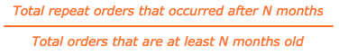

# Pérdida y deterioro de probabilidad de repetición

Si una parte de sus ingresos proviene de compras repetidas, probablemente sea consciente del enorme valor de una base de clientes fieles. Para ello, es fundamental comprender cómo transcurre el tiempo entre los pedidos y cuándo se espera que los clientes se pierdan.

En este tema se exploran los análisis que pueden ayudarle a responder las siguientes preguntas:

* ¿Cuál es la probabilidad de que un cliente realice otra compra?
* ¿Cómo varía la probabilidad de que se repita el pedido con el tiempo desde la compra más reciente del cliente?
* ¿Cuándo se debe considerar que se ha cancelado un cliente? Y por lo tanto, ¿cuándo debe comenzar una campaña de reactivación?

## Métricas recomendadas

Cuando analice la disminución y la pérdida de la probabilidad de repetición, considere la posibilidad de utilizar ([o generar](../../data-user/reports/ess-manage-data-metrics.md)) estas métricas:

### Probabilidad de orden repetido inicial

Esta medida se define como el número total de pedidos repetidos, como un porcentaje del total de pedidos. Dicho de otro modo, esta es la probabilidad de que una orden sea seguida por otra orden. Cuando esta probabilidad es superior al 50 por ciento, implica que más de la mitad de todos los pedidos van seguidos de un pedido posterior.

### Probabilidad de repetición de pedido dada meses desde el pedido

Esta medida demuestra la probabilidad de que un usuario vuelva a realizar un pedido teniendo en cuenta el número de meses que han transcurrido desde su último pedido. La fórmula utilizada para generar esta métrica simplifica a:

Según el modelo de negocio, la probabilidad de que se repita el pedido puede descender inmediatamente después de que un cliente realice un pedido y seguir disminuyendo en los meses siguientes, o puede mostrar variaciones y picos estacionales.

Entender el porcentaje de clientes que se espera que realicen compras repetidas (y cómo se tendencia con el tiempo) le permite dirigirse a sus clientes a intervalos para maximizar la probabilidad de una compra repetida. Por lo tanto, cuando la probabilidad de compra repetida disminuye, puede elegir un momento para identificar a un cliente como perdido y cambiar sus esfuerzos de retención a reactivación.

## Ejemplo de hoy

Observe la caída de probabilidad repetida para un negocio de comercio electrónico típico.

### Probabilidad de orden repetido inicial

En este ejemplo, la probabilidad inicial de que un cliente repita una compra es del 60 %. Esto significa que el 60 por ciento de todos los pedidos realizados con este negocio van seguidos de un pedido posterior.

### Probabilidad de repetición de pedido dada meses desde el pedido

Este informe muestra la probabilidad de que un cliente vuelva a realizar un pedido, ya que han transcurrido algunos meses desde su último pedido. Aunque no hay una definición única para el umbral de pérdida según este informe, Adobe recomienda definir la pérdida como el punto en el que la caída de probabilidad cruza el valor que es la mitad de la tasa de probabilidad de repetición inicial.

Dado que la tasa de probabilidad de repetición inicial para este ejemplo es del 60 %, la fecha de pérdida sería el momento en el que la probabilidad de orden repetido cae por debajo del 60 %/2 = 30 % o a los 6 meses aproximadamente. Del 60% de los pedidos que se esperaba seguir con otro pedido, la mitad de ellos se realizaron dentro de los primeros 6 meses.

Dicho de otro modo, si un cliente iba a hacer una orden de seguimiento, es más probable que lo haya hecho dentro de los seis meses de su último pedido que después de la marca de los seis meses. Si un cliente no ha vuelto a comprar después de seis meses, se debe iniciar una campaña de reactivación para volver a atraer a este cliente.

Según el modelo empresarial, es posible que desee elegir un umbral diferente, como el punto en el que la probabilidad de repetir pedido cae por debajo del 50 % o del 10 %. Si sus conocimientos internos sugieren un número diferente, entonces por todos los medios, debe utilizarlo!

En última instancia, el objetivo es seleccionar el umbral en el que tiene sentido cambiar de los esfuerzos de retención a los de reactivación. Los esfuerzos de retención pueden implicar correos electrónicos para volver a interactuar con clientes existentes con compras de seguimiento sugeridas que realizar, mientras que los esfuerzos de reactivación pueden implicar correos electrónicos a clientes caducados con cupones y ofertas.

## ¿Qué preguntas debo tener en cuenta?

Para ayudarle a comprender la probabilidad de que se repitan pedidos en su empresa, Adobe le sugiere tener en cuenta estas preguntas al explorar sus propios datos:

* ¿Se espera la probabilidad inicial de pedido repetido? Si no es así, ¿por qué cree que debería ser mayor o menor?
* ¿Hay grandes disminuciones en la probabilidad de pedidos repetidos para meses específicos desde el último pedido? En caso afirmativo, ¿se esperan estos cambios?
* ¿Cuál es su umbral de pérdida actual?
* ¿Se alinea el umbral de pérdida actual con uno de los valores del informe de probabilidad de pedido repetido transcurridos meses desde el último pedido?
* ¿Su umbral actual refleja sus esfuerzos publicitarios cambiando de retención a reactivación?
* ¿Tiene sentido que su empresa cambie el umbral al mes en el que la caída de la probabilidad cruza el valor que es la mitad de la tasa de probabilidad de repetición inicial?

## ¿Qué más debo analizar?

Después de crear el análisis anterior y determinar un umbral de pérdida, puede generar más análisis para identificar las tendencias comunes en los usuarios perdidos. Por ejemplo, ¿los clientes que han perdido son adquiridos durante el mismo periodo de tiempo o compraron productos similares en su último pedido? Una vez establecido un umbral de pérdida, puede profundizar más en los rasgos específicos de estos clientes perdidos.

Si ofrece más de un producto, probablemente se pregunte cómo los clientes que compran un producto específico se comportan de forma diferente a lo largo del tiempo en comparación con otros clientes. ¿Quiere saber más? Consulte este tutorial para explorar el comportamiento de compra de por vida de las cohortes de clientes en función de los productos específicos que han comprado.

Esta práctica recomendada la proporciona [!DNL Adobe Commerce Intelligence] Data Analysis Services (DAS). [Póngase en contacto con el soporte técnico](https://experienceleague.adobe.com/docs/commerce-knowledge-base/kb/troubleshooting/miscellaneous/mbi-service-policies.html) para obtener más información.

### Relacionado

* [Análisis del impacto de los cupones en la adquisición y retención de clientes](../analysis/coupon-impact.md)
* [Análisis del comportamiento de recompra del cliente](../analysis/repurchase-behavior.md)
