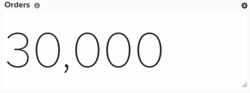

# Análisis de RFM

En este tema se muestra cómo configurar un tablero que le permita segmentar a los clientes por su actualización, frecuencia y clasificación monetaria. El análisis de RFM es una técnica de marketing que tiene en cuenta los comportamientos de los clientes para ayudarle a determinar la segmentación para la divulgación. Tiene en cuenta tres aspectos:

1. Actualización de la fecha de compra de un cliente en su tienda
1. Frecuencia de la frecuencia con la que compran a usted
1. Dinero en cuánto gasta el cliente

El análisis de RFM solo se puede configurar si tiene [!DNL Adobe Commerce Intelligence] Planifique Pro en la nueva arquitectura (por ejemplo, si tiene el `Data Warehouse Views` en la opción `Manage Data` menú). Estas columnas se pueden crear desde el **[!DNL Manage Data > Data Warehouse]** página. A continuación se proporcionan instrucciones detalladas.

## Primeros pasos

Primero debe cargar un archivo que contenga solo una clave principal con el valor de una. Esto permite crear algunas columnas calculadas necesarias para el análisis.

Puede usar esto [artículo](../importing-data/connecting-data/using-file-uploader.md) y la imagen siguiente para dar formato al archivo.

## Columnas calculadas

Se hace una distinción adicional si su negocio permite pedidos de invitados. Si es así, puede ignorar todos los pasos de `customer_entity` tabla. Si no se permiten pedidos de invitado, ignore todos los pasos para la `sales_flat_order` tabla.

Columnas para crear

* **`Sales_flat_order/customer_entity`** tabla
* `Customer's last order date`
* [!UICONTROL Column type]: `Many to one > Max`
* [!UICONTROL Pat]: `sales_flat_order.customer_id > customer_entity.entity_id`
* Seleccionado [!UICONTROL column]: `created_at`
* [!UICONTROL Filter]: `Orders we count`

* 
      Segundos desde la última fecha de pedido del cliente
  * [!UICONTROL Column type]: - &quot;Misma tabla > Edad
* Seleccionado [!UICONTROL column]: `Customer's last order date`

* (entrada) Referencia de recuento
* [!UICONTROL Column type]: `Same table > Calculation`
* 
  [!UICONTROL Entradas]: `entity_id`
* [!UICONTROL Calculation]: `**case when A is null then null else 1 end**`
* 
  [!UICONTROL Tipo de datos]: `Integer`

* **Referencia de recuento** (este es el archivo que subió con el número &quot;1&quot;)
* Número de clientes
* [!UICONTROL Column type]: `Many to One > Count Distinct`
* [!UICONTROL Path]: `ales_flat_order.(input) reference > Count reference.Primary Key` O `customer_entity.(input)reference > Count Reference`. `Primary Key`
* Seleccionado [!UICONTROL column]: `sales_flat_order.customer_email` O `customer_entity.entity_id`

* **Customer_entity** tabla
* Número de clientes
* [!UICONTROL Column type]: `One to Many > JOINED_COLUMN`
* [!UICONTROL Path]: `customer_entity`.Referencia de (entrada) > Concentración de clientes. `Primary Key`
* Seleccionado [!UICONTROL column]: `Number of customers`

* (entrada) `Ranking by customer lifetime revenue`
* [!UICONTROL Column type]: `Same table > Event Number`
* [!UICONTROL Event owner]: `(input) reference for count`
* [!UICONTROL Event rank]: `Customer's lifetime revenue`

* Clasificación por ingresos de duración de clientes
* [!UICONTROL Column type]: `Same table > Calculation`
* [!UICONTROL Inputs]: `(input) Ranking by customer lifetime revenue`, `Number of customers`
* [!UICONTROL Calculation]: `case when A is null then null else (B-(A-1)) end`
* 
  [!UICONTROL Tipo de datos]: `Integer`

* Puntuación monetaria del cliente (en percentiles)
* [!UICONTROL Column type]: `Same table > Calculation`
* [!UICONTROL Inputs]: `(input) Ranking by customer lifetime revenue`, `Number of customers`
* [!UICONTROL Calculation]: `Case when round((B-A+1)*100/B,0) <= 20 then 5 when round((B-A+1)*100/B,0) <= 40 then 4 when round((B-A+1)*100/B,0) <= 60 then 3 when round((B-A+1)*100/B,0) <= 80 then 2 when round((B-A+1)*100/B,0) <= 100 then 1 else 0 end`
* 
  [!UICONTROL Tipo de datos]: `Integer`

* (entrada) Clasificación por número de pedidos de duración del cliente
* [!UICONTROL Column type]: `Same table > Event Number`
* [!UICONTROL Event owner]: `(input) reference for count`
* [!UICONTROL Event rank]: `Customer's lifetime number of orders`

* Clasificación por número de pedidos de duración del cliente
* 
  [!UICONTROL Tipo de columna]: – "Misma tabla > Cálculo"
* [!UICONTROL Inputs]: - **(entrada) Clasificación por número de pedidos de duración del cliente**, **Número de clientes**
* [!UICONTROL Calculation]: - **Caso en el que A es nulo y, a continuación, fin nulo (B-(A-1))**
* [!UICONTROL Datatype]: - Entero

* Puntuación de frecuencia del cliente (en percentiles)
* [!UICONTROL Column type]: `Same table > Calculation`
* [!UICONTROL Inputs]: `(input) Ranking by customer lifetime number of orders`, `Number of customers`
* [!UICONTROL Calculation]: `Case when round((B-A+1)*100/B,0) <= 20 then 5 when round((B-A+1)*100/B,0) <= 40 then 4 when round((B-A+1)*100/B,0) <= 60 then 3 when round((B-A+1)*100/B,0) <= 80 then 2 when round((B-A+1)*100/B,0) <= 100 then 1 else 0 end`
* 
  [!UICONTROL Tipo de datos]: `Integer`

* Clasificación por segundos desde la última fecha de pedido del cliente
* [!UICONTROL Column type]: `Same table > Event Number`
* [!UICONTROL Event owner]: `(input) reference for count`
* [!UICONTROL Event rank]: `Seconds since customer's last order date`

* Puntuación de actualización del cliente (en percentiles)
* [!UICONTROL Column type]: `Same table > Calculation`
* [!UICONTROL Inputs]: `(input) Ranking by customer lifetime number of orders`, `Number of customers`
* [!UICONTROL Calculation]: `Case when (A * 100/B,0) <= 20 then 5 when (A * 100/B,0) <= 40 then 4 when (A * 100/B,0) <= 60 then 3 when (A * 100/B,0) <= 80 then 2 when (A * 100/B,0) <= 100 then 1 else 0 end`
* 
  [!UICONTROL Tipo de datos]: `Integer`

* Puntuación de actualización del cliente (en percentiles)
* [!UICONTROL Column type]: `Same table > Calculation`
* [!UICONTROL Inputs]: `Customer's recency score (by percentiles)`, `Customer's frequency score (by percentiles)`, `Customer's monetary score (by percentiles)`
* [!UICONTROL Calculation]: `case when (A IS NULL or B IS NULL or C IS NULL) then null else concat(A,B,C) end`
* 
  [!UICONTROL Tipo de datos]: String

* **Referencia de recuento** tabla
* [!UICONTROL Number of customers]: `(RFM > 0)`
* [!UICONTROL Column type]: `Many to One > Count Distinct`
* [!UICONTROL Path]: `sales_flat_order.(input) reference > Customer Concentration. Primary Key` O `customer_entity.(input)reference > Customer Concentration.Primary Key`
* Seleccionado [!UICONTROL column]: `sales_flat_order.customer_email` O `customer_entity.entity_id`
* [!UICONTROL Filter]: `Customer's RFM score (by percentile)` No Igual A 000

* **Customer_entity** tabla
* [!UICONTROL Number of customers]: `(RFM > 0)`
* [!UICONTROL Column type]: `One to Many > JOINED_COLUMN`
* [!UICONTROL Path]: `customer_entity.(input) reference > Customer Concentration.Primary Key`
* Seleccionado [!UICONTROL column]: - `Number of customers`

* Puntuación de actualización del cliente `(R+F+M)`
* [!UICONTROL Column type]: `Same table > Calculation`
* [!UICONTROL Inputs]: – `Customer's recency score (by percentiles)`, `Customer's frequency score (by percentiles)`, `Customer's monetary score (by percentiles)`
* [!UICONTROL Calculation]: `case when (A IS NULL or B IS NULL or C IS NULL) then null else A+B+C end`
* 
  [!UICONTROL Tipo de datos]: `Integer`

* Clasificación por puntuación RFM general del cliente (entrada)
* [!UICONTROL Column type]: `Same table > Event Number`
* [!UICONTROL Event owner]: `(input) reference for count`
* [!UICONTROL Event rank]: `Customer's recency score (R+F+M)`
* [!UICONTROL Filter]: `Customer's RFM score (by percentile)` No Igual A 000

* Clasificación por puntuación RFM general del cliente
* [!UICONTROL Column type]: `Same table > Calculation`
* [!UICONTROL Inputs]: `(input) Ranking by customer's overall RFM score`, `Number of customers (RFM > 0)`
* [!UICONTROL Calculation]: `case when A is null then null else (B-(A-1)) end`
* 
  [!UICONTROL Tipo de datos]: `Integer`

* Grupo RFM del cliente
* [!UICONTROL Column type]: `Same table > Calculation`
* [!UICONTROL Inputs]: `(input) Ranking by customer lifetime revenue`, `Number of customers`
* [!UICONTROL Calculation]: `Case when round(A * 100/B,0) <= 20 then '5. copper' when round(A * 100/B,0) <= 40 then '4. bronze' when round(A * 100/B,0) <= 60 then '3. silver' when round(A * 100/B,0)<= 80 then '2. gold' else '1. Platinum' end`
* 
  [!UICONTROL Tipo de datos]: `Integer`

>[!NOTE]
>
>Los percentiles utilizados son incluso divisiones de clientes (por ejemplo, 20 por ciento de bloques para devolver 1-5). Si tiene alguna forma personalizada de ponderar estos elementos, informe al analista cuando envíe el ticket.

## Métricas

No hay métricas nuevas.

>[!NOTE]
>
>Asegúrese de lo siguiente [añadir todas las columnas nuevas como dimensiones a las métricas](../data-warehouse-mgr/manage-data-dimensions-metrics.md) antes de crear nuevos informes.

## Informes

* **Clientes por agrupación RFM**
* Métrica `A`: `New customers`
* [!UICONTROL Metric]: `New customers`
* [!UICONTROL Filter]: `Customer's RFM score (by percentiles) Not Equal to 000`

* [!UICONTROL Time period]: `All time`
* 
  [!UICONTROL Interval]: `None`
* Ocultar gráfico
* [!UICONTROL Group by]: `Customer's RFM group`
* 
  [!UICONTROL Agrupar por]: `Email`
* 
  [!UICONTROL Chart type]: `Table`

* **Clientes con cinco puntuaciones de actualización**
* Métrica `A`: `New customers`
* [!UICONTROL Metric]: `New customers`
* [!UICONTROL Filter]: `Customer's recency score (by percentiles) Equal to 5`

* [!UICONTROL Time period]: `All time`
* 
  [!UICONTROL Interval]: `None`
* 
  [!UICONTROL Chart Type]: `Scalar`
* Ocultar gráfico
* 
  [!UICONTROL Agrupar por]: `Email`
* [!UICONTROL Group by]: `Customer's RFM score (R+F+M)`
* 
  [!UICONTROL Chart type]: `Table`

* **Clientes con una puntuación de actualización**
* Métrica `A`: `New customers`
* [!UICONTROL Metric]: `New customers`
* [!UICONTROL Filter]: `Customer's recency score (by percentiles) Equal to 1`

* [!UICONTROL Time period]: `All time`
* 
  [!UICONTROL Interval]: `None`
* 
  [!UICONTROL Chart Type]: `Scalar`
* Ocultar gráfico
* 
  [!UICONTROL Agrupar por]: `Email`
* [!UICONTROL Group by]: `Customer's RFM score (R+F+M)`
* 
  [!UICONTROL Chart type]: `Table`

Después de compilar todos los informes, puede organizarlos en el panel según lo desee. El resultado puede parecer el panel de muestra anterior, pero las tres tablas generadas son solo ejemplos de los tipos de segmentación de clientes que puede realizar.
