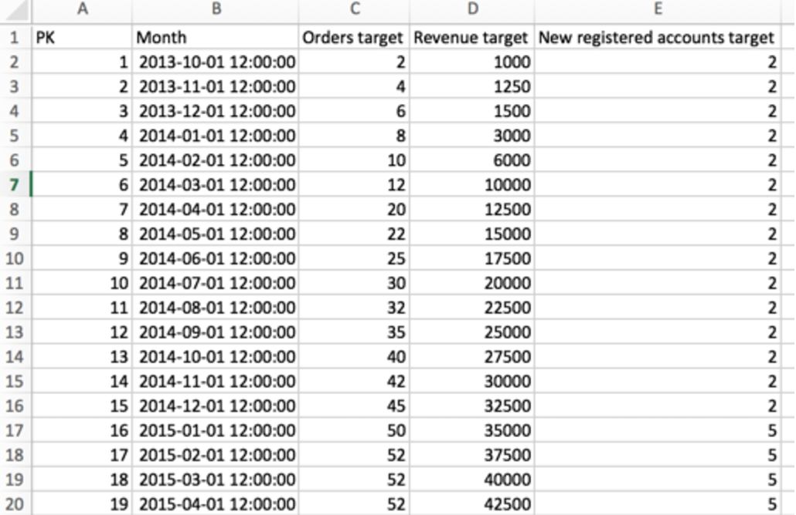

# Seguimiento De Objetivos Con Métricas De Rendimiento

A la mayoría de los clientes les gustaría hacer un seguimiento de sus **objetivos comerciales**, pero no se dan cuenta de que esto es posible en [!DNL Adobe Commerce Intelligence]. En este tema se muestra cómo configurar un tablero que le ayudará a realizar un seguimiento de los objetivos de su empresa en relación con los datos reales, incluidos los ingresos, los nuevos usuarios registrados y los pedidos a lo largo del tiempo. También aprenderá a comparar el rendimiento año tras año, todo en un tablero como este:

Antes de empezar, debería revisar el [cargador de archivos](../importing-data/connecting-data/using-file-uploader.md) y asegurarse de haber definido sus objetivos comerciales para un período determinado.

## Primeros pasos

Primero debe cargar un archivo que contenga objetivos diarios, mensuales o trimestrales específicos para su empresa.

Puede usar el [cargador de archivos](../importing-data/connecting-data/using-file-uploader.md) y la imagen siguiente para dar formato al archivo. Los destinos más comunes que los clientes rastrean en [!DNL Commerce Intelligence] son Pedidos, Ingresos y Nuevas cuentas registradas.

## Métricas

Cree una nueva métrica para cada destino. Por ejemplo, si carga objetivos de ingresos y pedidos mensuales, debe crear dos métricas nuevas:

* **Objetivo de ingresos mensuales**
* En la tabla **`Monthly goals`**
* Esta métrica arroja una **Sum**
* En la columna **`Revenue target`**
* Ordenado por la marca de tiempo **`Month`**

* **Destino de pedidos mensuales**
* En la tabla **`Monthly goals`**
* Esta métrica arroja una **Sum**
* En la columna **`Orders target`**
* Ordenado por la marca de tiempo **`Month`**

* **Destino de nuevas cuentas registradas mensuales**
* En la tabla **`Monthly goals`**
* Esta métrica arroja una **Sum**
* En la columna **`New registered accounts target`**
* Ordenado por la marca de tiempo **`Month`**

## Informes

Es útil tener una combinación de valores estáticos y gráficos visuales al analizar los destinatarios. A continuación se muestran tres informes de ejemplo para ayudarle a empezar a rastrear el rendimiento de los ingresos.

* Quedan **ingresos para alcanzar el objetivo**
* Métrica `A`: `Revenue`
* &#x200B;
  [!UICONTROL Métrica]: `Revenue`

* Métrica `B`: `Target Revenue`
* [!UICONTROL Metric]: `Monthly Revenue Target`

* [!UICONTROL Formula]: `Revenue left to achieve target`
* &#x200B;
  [!UICONTROL Fórmula]: `(B-A)`
* &#x200B;
  [!UICONTROL Format]: `Number`

* [!UICONTROL Time period]: (el período de tiempo relevante que desee)
* &#x200B;
  [!UICONTROL Interval]: `Month`
* &#x200B;
  [!UICONTROL Tipo de gráfico]: `Scalar`

* **Destinos de ingresos**
* Métrica `A`: `Revenue`
* &#x200B;
  [!UICONTROL Métrica]: `Revenue`

* Métrica `B`: `Target Revenue`
* [!UICONTROL Metric]: `Monthly Revenue Target`

* Métrica `C`: `Revenue (amount change since previous year)` (ocultar)
* &#x200B;
  [!UICONTROL Métrica]: `Revenue`
* [!UICONTROL Perspective]: `Amount change vs. Previous year`

* [!UICONTROL Formula]: (Este mes del año pasado)
* &#x200B;
  [!UICONTROL Fórmula]: `(A-C)`
* &#x200B;
  [!UICONTROL Format]: `Currency`

* Desactivar `Multiple Y-Axes`
* [!UICONTROL Time period]: (el período de tiempo relevante que desee)*
* &#x200B;
  [!UICONTROL Interval]: `Month`
* [!UICONTROL Chart Type]: `Line Chart`

Una vez completados los informes anteriores para los objetivos de ingresos, puede crear informes idénticos para los objetivos relacionados con pedidos, cuentas registradas o cualquier otro valor que haya incluido en la carga del archivo de objetivos.

Después de compilar todos los informes, puede organizarlos en el panel según lo desee. El resultado puede ser similar a la imagen de la parte superior de esta página.
