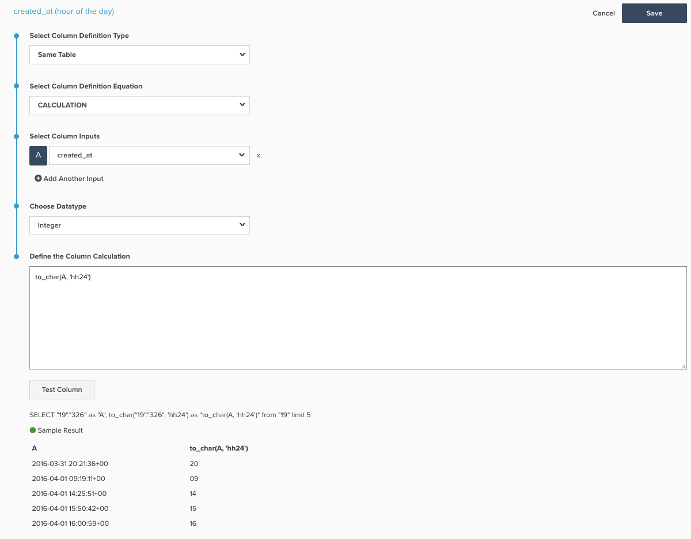

# Informes a lo largo de periodos de tiempo

>[!NOTE]
>
>Este artículo contiene instrucciones para clientes que utilizan la arquitectura original y la nueva arquitectura. Usted está en el [nueva arquitectura](../../administrator/account-management/new-architecture.md) si tiene la variable _Vistas de Data Warehouse_ sección disponible después de seleccionar `Manage Data` de la barra de herramientas principal.

El Creador de informes permite ver fácilmente las tendencias a lo largo del tiempo y cambiar la perspectiva de los períodos de tiempo que desee comparar. En este artículo, demostraremos cómo configurar un tablero para profundizar un nivel que le permita crear informes para análisis de semana a semana, mes a mes y año a año.

Antes de comenzar, debe familiarizarse con las perspectivas de exploración con más detalle [here](../../tutorials/using-visual-report-builder.md) así como opciones de tiempo independientes [here](../../tutorials/time-options-visual-rpt-bldr.md).

Este análisis contiene [columnas calculadas avanzadas](../data-warehouse-mgr/adv-calc-columns.md).

## Columnas calculadas

* **`Sales_flat_order`** tabla
* **Arquitectura original:** los analistas crearán las columnas siguientes como parte de su `[YoY WoW MoM ANALYSIS]` ticket
* `created_at (month-day)`
* `created_at (month)`
* `created_at (day of the month)`
* `created_at (day of the week)`
* `created_at (hour of the day)`

* **Nueva arquitectura:** SQL enumerado a continuación con una foto de un ejemplo de cómo crear este cálculo
   * `created_at (month-day)` [!UICONTROL Calculation]:: **to_char(A, &#39;mm-dd&#39;)**
   * `created_at (month)` [!UICONTROL Calculation]: **to_char(A, &#39;mm-month&#39;)**
   * `created_at (day of the month)`&lt; [!UICONTROL Calculation]: **to_char(A, &#39;dd&#39;)**
   * `created_at (day of the week)` [!UICONTROL Calculation]: **to_char(A, &#39;d-Day&#39;)**
   * **`created_at (hour of the day)` [!UICONTROL Calculation]:: **to_char(A, &#39;hh24&#39;)**

      

## Métricas

Ninguno.

>[!NOTE]
>
>Asegúrese de [agregar todas las columnas nuevas como dimensiones a métricas](../data-warehouse-mgr/manage-data-dimensions-metrics.md) antes de crear nuevos informes.

## Informes

* **Gráfico de año**
   * [!UICONTROL Metric]: `Number of orders`

   * [!UICONTROL Metric]: `Number of orders`
   * [!UICONTROL Time options]: `Time range (Custom)`: `2 years ago to 1 year ago`

   * [!UICONTROL Show top/bottom]: Principales 100 % ordenados por **`created_at (month-day)`***

* Métrica `A`: `This year`
* Métrica `B`: `Last year`
* [!UICONTROL Time period]: `1 year ago to 0 years ago`
* 
   [!UICONTROL Interval]: `None`
* [!UICONTROL Group by]: `created_at (month-day)`
* 
   [!UICONTROL Chart Type]: `Line`

* **Gráfico MoM**
   * [!UICONTROL Metric]: `Number of orders`

   * [!UICONTROL Metric]: `Number of orders`
   * Opciones de tiempo: `Time range (Custom)`: `2 months ago to 1 month ago`

   * Mostrar arriba/abajo: Principales 100 % ordenados por **`created_at (day of month)`***

* Métrica `A`: Este mes*
* Métrica `B`: Último mes*
* [!UICONTROL Time period]: Hace 1 mes a hace 0 meses
* 
   [!UICONTROL Interval]: None
* [!UICONTROL Group by]: `created_at (day of month)`
* 
   [!UICONTROL Chart Type]: Line

* **Gráfico W**
   * [!UICONTROL Metric]: `Number of orders`

   * [!UICONTROL Metric]: `Number of orders`
   * [!UICONTROL Time options]: `Time range (Custom)`: `2 weeks ago to 1 week ago`

   * [!UICONTROL Show top/bottom]: Principales 100 % ordenados por `created_at (day of week)`

* Métrica `A`: `This week`
* Métrica `B`: `Last week`
* [!UICONTROL Time period]: `1 week ago to 0 weeks ago`
* 
   [!UICONTROL Interval]: `None`
* [!UICONTROL Group by]: `created_at (day of week)`
* 
   [!UICONTROL Chart Type]: `Line`

* **Gráfico DoD**
   * [!UICONTROL Metric]: `Number of orders`

   * [!UICONTROL Metric]: `Number of orders`
   * [!UICONTROL Time options]: `Time range (Custom)`: `2 days ago to 1 day ago`

   * [!UICONTROL Show top/bottom]: Principales 100 % ordenados por `created_at (hour of day)`

* Métrica `A`: `Today`
* Métrica B: `Yesterday`
* [!UICONTROL Time period]: `1 day ago to 0 days ago`
* 
   [!UICONTROL Interval]: `None`
* [!UICONTROL Group by]: `created_at (hour of day)`
* 
   [!UICONTROL Chart Type]: `Line`

Después de compilar todos los informes, puede organizarlos en el panel como desee. El resultado final puede ser similar a la imagen de la parte superior de esta página.
