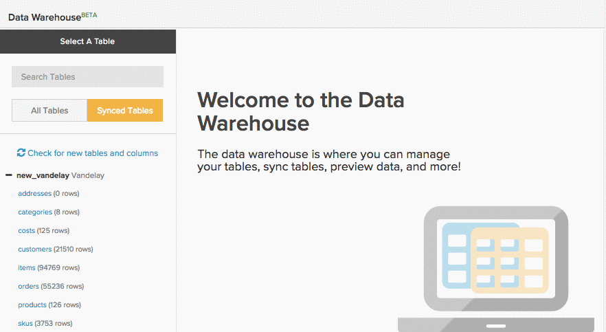

# Generar [!DNL Google ECommerce] Dimension

>[!NOTE]
>
>Requiere [permisos de administrador](../../administrator/user-management/user-management.md).

Ahora que ha terminado de [conectar su cuenta[!DNL Google ECommerce]](../../data-analyst/importing-data/integrations/google-ecommerce.md), ¿qué puede hacer con esos datos en [!DNL Commerce Intelligence]? En este tema se explica cómo crear dimensiones que vinculen los datos de comercio electrónico con los datos de pedidos y clientes.

Las dimensiones que cubre le permiten generar análisis que [responden a preguntas vitales sobre sus canales y campañas de marketing](../../data-analyst/analysis/most-value-source-channel.md). ¿Qué porcentaje de los ingresos proviene de cada fuente? ¿En qué se diferencia el valor de duración de [!DNL Facebook] clientes adquiridos de los de [!DNL Google]?

## Requisitos previos e información general

Para crear las dimensiones en este tema, necesita una tabla [!DNL Google ECommerce], una tabla `orders` y una tabla `customers`. Esas tablas deben estar [sincronizadas con su Data Warehouse](../../data-analyst/data-warehouse-mgr/tour-dwm.md) para poder crear dimensiones. Las tablas sincronizadas se muestran en la sección `Synced Tables` de `Data Warehouse Manager`.

A continuación se muestra un vistazo rápido a la sincronización de tablas y columnas si necesita un repaso:

Después de crear una unión desde la tabla `orders` a la tabla [!DNL Google eCommerce], se crean las tres primeras dimensiones en la lista siguiente. A continuación, utilice esas dimensiones para crear tres dimensiones usuario/cliente en la tabla `customers`. Para terminar, una esas columnas a la tabla `orders`.

Estas son las dimensiones que se tratan:

* **Tabla de pedidos**

* Origen [!DNL Google Analytics] del pedido
* Medio [!DNL Google Analytics] del pedido
* Campaña [!DNL Google Analytics]A del pedido
* Origen [!DNL Google Analytics] del primer pedido del cliente
* Medio [!DNL Google Analytics] del primer pedido del cliente
* Campaña [!DNL Google Analytics] del primer pedido del cliente

* **Tabla de clientes**

* Origen [!DNL Google Analytics] del primer pedido del cliente
* Medio [!DNL Google Analytics] del primer pedido del cliente
* Campaña [!DNL Google Analytics] del primer pedido del cliente

## Creación de dimensiones

Para crear dimensiones, abra el [Administrador de Datas Warehouse](../data-warehouse-mgr/tour-dwm.md) haciendo clic en **[!UICONTROL Data]** > **[!UICONTROL Data Warehouse]**.

### Tabla de pedidos, ronda 1

En este ejemplo se crea la dimensión [!DNL Google Analytics] Source **del pedido** Order.

1. En la lista de tablas de la Data Warehouse, haga clic en la tabla (en este caso, `orders`) que contenga la información del pedido.
1. Haga clic en **[!UICONTROL Create a Column]**.
1. Asigne un nombre a la columna
1. Seleccione `Joined Column` de la lista desplegable [definición](../data-warehouse-mgr/calc-column-types.md). Este ejemplo funciona con una [relación uno a uno](../data-warehouse-mgr/table-relationships.md), que coincide con la columna `eCommerce.transactionID` exactamente con una fila de la tabla `orders`.
1. A continuación, debe definir la ruta o cómo se conectan la tabla y la columna que se están utilizando. Haga clic en el menú desplegable `Select a table and column`.
1. La ruta que necesita no está disponible, por lo que debe crear una nueva. Haga clic en **[!UICONTROL Create new Path]**.
1. En la ventana que se muestra, establezca el lado `Many` en `orders.order\_id` o la columna de la tabla `orders` que contiene el identificador de pedido.
1. En el lado `One`, busque la tabla `Google ECommerce` y establezca la columna en `transactionID`.

   

1. Haga clic en **[!UICONTROL Save]** para crear la ruta.
1. Una vez agregada la ruta de acceso, haga clic de nuevo en el menú desplegable **[!UICONTROL Select table and column]**.
1. Busque la tabla `ECommerce` y haga clic en la columna `Source`. Esto vincula los pedidos con la información de origen.
1. Una vez que vuelva al esquema de tabla, haga clic de nuevo en **[!UICONTROL Save]** para crear la dimensión.

A continuación se muestra un vistazo a todo el proceso:

A continuación, intente crear **el medio [!DNL Google Analytics] del pedido** y `campaign`. No hay muchos cambios en estas dimensiones, así que pruébelo. Pero si se queda atascado, puede revisar [el final de este artículo](#stuck) para ver qué es diferente.

### Tabla Customers {#customers}

En este ejemplo se crea la dimensión [!DNL Google Analytics] de origen **del primer pedido de** Customer.

1. En la lista de tablas de la Data Warehouse, haga clic en la tabla (en este caso, `customers`) que contenga la información del cliente.
1. Haga clic en **[!UICONTROL Create a Column]**.
1. Asigne un nombre a la columna
1. Para este ejemplo, seleccione la definición `is MAX` de la lista desplegable [definición](../../data-analyst/data-warehouse-mgr/calc-column-types.md). La definición de `is MIN` también podría funcionar si se aplica a una columna de texto con un solo valor posible. La parte importante es garantizar que se establecen los filtros adecuados, cosa que hará más adelante.
1. Haga clic en el menú desplegable **[!UICONTROL Select a table and column]**, seleccione la tabla `orders` y luego la columna `Order's [!DNL Google Analytics] source`.
1. Haga clic en **[!UICONTROL Save]**.
1. Una vez que vuelva al esquema de tabla, haga clic en el menú desplegable `Options` y luego `Filters`.
1. Haga clic en **[!UICONTROL Add Filter Set]** y, a continuación, seleccione el conjunto `Orders we count`. Solo desea que se incluyan los pedidos incluidos en el conjunto de filtros que cuenta, por lo que es importante que se seleccione este conjunto de filtros.
1. Haga clic en **[!UICONTROL Add Filter]**. Desea encontrar el origen [!DNL Google Analytics] del primer pedido del cliente, por lo que debe agregar un filtro:

   _orders.Número de pedido del cliente = 1

   _
1. Haga clic en **[!UICONTROL Save]** para crear la dimensión.

A continuación, intente crear [!DNL Google Analytics] medio **y `campaign` del primer pedido de** cliente. No hay muchos cambios en estas dimensiones, así que pruébelo. Pero si se queda atascado, puede revisar [el final de este artículo](#stuck) para ver qué es diferente.

### Bonus: mesa de pedidos, ronda 2

Puede detenerse aquí si lo desea, pero esta sección permite un análisis más detallado al incluir las [!DNL Google Analytics] dimensiones **del primer pedido del** cliente que creó en la [última sección](#customers) en la tabla `orders`. La creación de las dimensiones en esta sección le permite analizar todas las métricas creadas en la tabla `orders` - `Revenue`, `Number of orders`, `Distinct buyers`, etc. - mediante los atributos [!DNL Google Analytics] del primer pedido de un cliente.

Este ejemplo une la dimensión `Customer's first order's [!DNL Google Analytics] source` a la tabla `orders`.

1. En la lista de tablas de la Data Warehouse, haga clic en la tabla (en este caso, `orders`) que contenga la información del pedido.
1. Haga clic en **[!UICONTROL Create a Column]**.
1. Asigne un nombre a la columna
1. Seleccione `Joined Column` de la lista desplegable de definiciones. Esto une las dimensiones de cliente que creó en la sección anterior a la tabla `orders`.
1. Haga clic en el menú desplegable **[!UICONTROL Select a table and column]**, luego seleccione la tabla `customers` y la columna `Customer's first order's [!DNL Google Analytics] source`.
1. Si una ruta no se rellena automáticamente, seleccione la ruta que mejor conecte las tablas de clientes y pedidos.
1. Haga clic en **[!UICONTROL Save]** para crear la dimensión.

A continuación se muestra un vistazo a todo el proceso:

Termine uniendo el medio `Customer's first order's` y las dimensiones `campaign` a la tabla `orders`. Únase a las dimensiones y, si hay problemas, consulte [el final del artículo](#stuck) si necesita ayuda.

### Ajuste

Ha terminado de crear las dimensiones, lo que significa que ahora puede crear análisis completos que hagan un seguimiento del rendimiento de los distintos canales y campañas. Recuerde que las **nuevas columnas no estarán disponibles hasta que se complete la siguiente actualización**.

Algunas de las dimensiones más populares se tratan en este tema, pero el cielo es el límite - intente crear su propio o no dude en hacernos ping si desea ayuda con la exploración de otras opciones. 

### Notas adicionales

**`Orders`tabla #1**: Al crear el medio `Order's [!DNL Google Analytics]` y las dimensiones `campaign`, la diferencia son las columnas seleccionadas en el paso 12. En este ejemplo, la columna era `Source`.

**`Customers`tabla**: Al crear el medio `Customer's first order's [!DNL Google Analytics]` y las dimensiones `campaign`, la diferencia son las columnas seleccionadas en el paso 5. En este ejemplo, la columna era `Order's [!DNL Google Analytics]` origen.

**`Orders`tabla #2**: Al unir el medio `Customer's first order's [!DNL Google Analytics]` y las columnas `campaign` a la tabla `orders`, la diferencia son las columnas seleccionadas en el paso 5. En este ejemplo, la columna era `Customer's first order's [!DNL Google Analytics]` origen.
