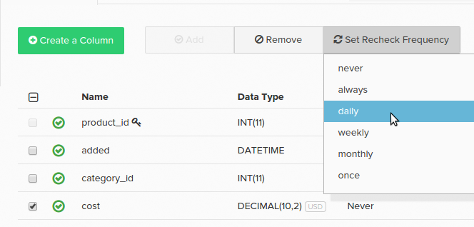

# Configuración de comprobaciones de datos

En una tabla de base de datos, puede haber columnas de datos con valores modificables. Por ejemplo, en un `orders` podría haber una columna llamada `status`. Cuando se escribe inicialmente un pedido en la base de datos, la columna de estado puede contener el valor _pendiente_. El orden se replica en su [Data Warehouse](../data-warehouse-mgr/tour-dwm.md) con esto `pending` valor.

Los estados de los pedidos pueden cambiar, aunque no siempre se encuentran en un `pending` estado. Con el tiempo podría convertirse en `complete` o `cancelled`. Para asegurarse de que la Data Warehouse sincronice este cambio, se debe volver a comprobar la columna para ver si hay nuevos valores.

¿Cómo encaja esto con el [métodos de replicación](../data-warehouse-mgr/cfg-replication-methods.md) ¿eso se discutió? El procesamiento de las comprobaciones varía en función del método de replicación elegido. El `Modified\_At` el método de replicación es la mejor opción para procesar los valores que cambian, ya que no es necesario configurar las comprobaciones nuevas. El `Auto-Incrementing Primary Key` y `Primary Key Batch Monitoring` Los métodos de requieren volver a comprobar la configuración.

Al utilizar cualquiera de estos métodos, las columnas modificables deben marcarse para volver a comprobarlas. Hay tres formas de hacerlo:

1. Proceso de auditoría que se ejecuta como parte de las columnas de indicadores de actualización que se van a volver a comprobar.

   >[!NOTE]
   >
   >El auditor se basa en un proceso de muestreo y las columnas que cambian pueden no detectarse inmediatamente.

1. Puede configurarlos usted mismo seleccionando la casilla de verificación situada junto a la columna en el administrador de Datas Warehouse y haciendo clic en **[!UICONTROL Set Recheck Frequency]** y elegir un intervalo de tiempo adecuado para cuándo se deben comprobar los cambios.

1. Un miembro de la [!DNL Adobe Commerce Intelligence] El equipo de Data Warehouse puede marcar manualmente las columnas para volver a comprobar en la Data Warehouse. Si tiene conocimiento de columnas que se pueden cambiar, póngase en contacto con el equipo de para solicitar que se vuelvan a configurar las comprobaciones. Incluya una lista de columnas, junto con la frecuencia, con la solicitud.

## Volver a comprobar frecuencias {#frequency}

**¿Lo sabías?**
Configuración de una nueva comprobación en un `primary key` La columna no comprueba la columna para ver si hay valores modificados. Se comprueban las filas eliminadas de la tabla y las eliminaciones se depuran de la Data Warehouse.

Cuando se marca una columna para volver a comprobarla, también puede establecer la frecuencia con la que se realiza una nueva comprobación. Si una columna concreta no cambia con frecuencia, elegir una nueva comprobación menos frecuente puede [optimizar el ciclo de actualización](../../best-practices/reduce-update-cycle-time.md).

Las opciones de frecuencia son:

* `always` - se vuelve a realizar la comprobación durante cada actualización
* `daily` - la comprobación se realiza primero después de la medianoche para la zona horaria declarada
* `weekly` - la nueva comprobación se realiza cada semana después de las 21:00, los viernes, para la zona horaria declarada
* `monthly` - la comprobación se realiza después de las 21:00 los viernes, y se actualiza cada cuatro semanas para la zona horaria declarada
* `once` : solo se produce en la siguiente actualización (una actualización única)

Como los tiempos de actualización se correlacionan con la cantidad de datos que deben sincronizarse, Adobe recomienda elegir una `daily`, `weekly`, o `monthly` vuelva a comprobar en lugar de cada actualización.

## Administración de frecuencias de repetición {#manage}

Para volver a comprobar las frecuencias en la Data Warehouse, haga clic en el nombre de la tabla y marque las columnas individuales. El estado de sincronización y la frecuencia de nueva comprobación (la variable **¿Cambios?** ) se muestra para cada columna de la tabla.

Para cambiar la frecuencia de repetición de la comprobación, haga clic en la casilla de verificación situada junto a las columnas que desee cambiar. Luego haga clic en **[!UICONTROL Set Recheck Frequency]** y establezca la frecuencia que desee.

A veces puede ver `Paused` en el `Changes?` columna. Este valor se muestra cuando la tabla [método de replicación](../../data-analyst/data-warehouse-mgr/cfg-data-rechecks.md) se establece en `Paused`.

[!DNL Adobe] recomienda revisar estas columnas para optimizar las actualizaciones y garantizar que se vuelvan a comprobar las columnas modificables. Si la frecuencia de nueva comprobación de una columna es alta, dada la frecuencia con la que cambian los datos, Adobe recomienda reducirla para optimizar las actualizaciones.

Póngase en contacto con nosotros si tiene alguna pregunta o pregunta sobre los métodos de replicación actuales o las comprobaciones nuevas.

**Relacionado:**

* [Reducción de los tiempos de actualización](../../best-practices/reduce-update-cycle-time.md)
* [Optimización de la base de datos para análisis](../../best-practices/opt-db-analysis.md)
