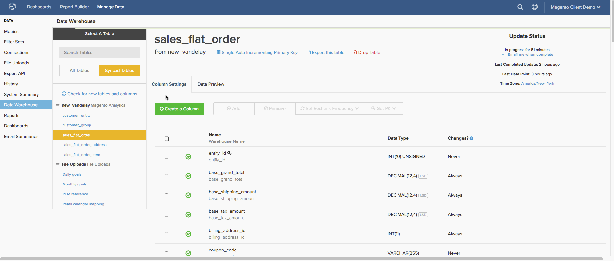

# Configuración de métodos de replicación

`Replication` métodos y [recomprobaciones](../data-warehouse-mgr/cfg-data-rechecks.md) se utilizan para identificar datos nuevos o actualizados en las tablas de la base de datos. La configuración correcta es crucial para garantizar la precisión de los datos y los tiempos de actualización optimizados. En este artículo, nos centraremos únicamente en los métodos de replicación.

Cuando se sincronizan nuevas tablas en el Administrador de Datas Warehouse, se elige automáticamente un método de replicación para la tabla. Comprender los distintos métodos de replicación, cómo se organizan las tablas y cómo se comportan los datos de las tablas le permitirá elegir el mejor método de replicación para sus tablas.

## ¿Cuáles son los métodos de replicación?

`Replication` los métodos se dividen en tres grupos: `Incremental`, `Full Table`y `Paused`.

[**[!UICONTROL Incremental Replication]**](#incremental) significa que [!DNL MBI] replicará solamente los datos nuevos o actualizados en cada intento de replicación. Como estos métodos reducirán en gran medida la latencia, recomendamos encarecidamente utilizarlos siempre que sea posible.

[**[!UICONTROL Full Table Replication]**](#fulltable) significa que [!DNL MBI] replicará todo el contenido de una tabla en cada intento de replicación. Debido a la cantidad potencialmente grande de datos que se van a replicar, estos métodos pueden aumentar los tiempos de latencia y actualización. Si una tabla contiene columnas con marca de hora o de fecha y hora, se recomienda utilizar un método Incremental en su lugar.

**[!UICONTROL Paused]** indica que la replicación de la tabla está detenida o pausada. [!DNL MBI] no comprobará la existencia de datos nuevos o actualizados durante un ciclo de actualización; esto significa que no se replicarán datos de una tabla que tenga esto como método de replicación.

## Métodos de replicación incremental {#incremental}

### Modificado en (el más ideal)

La variable `Modified At` el método de replicación utiliza una columna datetime (que se rellena cuando se crea una fila y luego se actualiza cuando cambian los datos) para encontrar datos que duplicar. Este método está diseñado para funcionar con tablas que cumplen los siguientes criterios:

* contiene un `datetime` que se rellena inicialmente al crear una fila y se actualiza cada vez que se modifica;
* el `datetime` column never null;
* las filas no se eliminan de la tabla

Además de estos criterios, también recomendamos encarecidamente **indexación** el `datetime` columna utilizada para `Modified At` replicación, ya que esto ayudará a optimizar la velocidad de replicación.

Cuando se ejecuta la actualización, los datos nuevos o modificados se identifican buscando filas que tengan un valor en la variable `datetime` que se produjo después de la última actualización. Cuando se descubren filas nuevas, se replican en la Data Warehouse. Si ya existen filas en la Data Warehouse, se sobrescribirán con los valores actuales de la base de datos.

Por ejemplo, una tabla puede tener una columna llamada `modified\_at` que indica la última vez que se modificaron los datos. Si la actualización más reciente se ejecutó el martes al mediodía, la actualización buscará todas las filas que tengan un `modified\_at` valor bueno que martes a mediodía. Las filas descubiertas que se hayan creado o modificado desde el martes a mediodía se replicarán en la Data Warehouse.

**¿Sabías?**
Aunque la base de datos no admita actualmente un `Incremental` Método de replicación, es posible que pueda [realice algunos cambios en la base de datos](../../best-practices/mod-db-inc-replication.md) que permitan el uso de `Modified At` o `Single Auto Incrementing PK`.

`Modified At` no es sólo el método de replicación más ideal, también es el más rápido. Este método no solo produce aumentos de velocidad notables con grandes conjuntos de datos, sino que tampoco requiere la configuración de una opción de recomprobación. Otros métodos deberán iterar en toda una tabla para identificar cambios, incluso si ha cambiado un pequeño subconjunto de datos. `Modified At` sólo se repite a través de ese subconjunto pequeño.

### Clave principal de aumento automático único

`Auto Incrementing` es un comportamiento que asigna claves principales secuencialmente a las filas. Si una tabla es `Auto Incrementing` y la clave principal más alta de la tabla es actualmente 1000, entonces el siguiente valor principal será 1001 o superior. Una tabla que no utilice `Auto Incrementing` puede asignar un valor de clave principal inferior a 1000 o saltar a un número mucho mayor, pero no se suele utilizar.

Este método está diseñado para replicar nuevos datos de tablas que cumplen los siguientes criterios:

* `single-column primary key`; y
* `primary key` el tipo de datos es `integer`; y
* `auto incrementing` valores de clave principal.

Cuando una tabla está utilizando `Single Auto Incrementing Primary Key` Para la replicación, se descubren nuevos datos buscando valores de clave principal que sean superiores al valor más alto actual de la Data Warehouse. Por ejemplo, si el valor de clave principal más alto de la Data Warehouse es 500, cuando se ejecute la siguiente actualización, buscará filas con valores de clave principal de 501 o superiores.

### Agregar fecha

La variable `Add Date` funciona de forma similar a la variable `Single Auto Incrementing Primary Key` método. En lugar de utilizar un entero para la clave principal de la tabla, este método utilizará un `timestamped` para buscar filas nuevas.

Cuando una tabla utiliza `Add Date` Para la replicación, se descubren nuevos datos buscando valores con marca de hora buenos a la fecha más reciente sincronizada con la Data Warehouse. Por ejemplo, si una actualización se ejecutó por última vez el 12/20/2015 09:00:00, cualquier fila con una marca de tiempo buena que no sea esta se marcará como datos nuevos y se replicará.

>[!NOTE]
>
>A diferencia de `Modified At` método, `Add Date` no buscará información actualizada en las filas existentes; solo buscará filas nuevas.

## Métodos de replicación de tablas completas {#fulltable}

### Tabla completa

`Full table` la replicación actualiza toda la tabla cada vez que se detectan nuevas filas. Este es, con mucho, el método de replicación menos eficiente, debido al hecho de que todos los datos deben ser reprocesados durante cada actualización, suponiendo que haya filas nuevas.

Las filas nuevas se detectan consultando la base de datos al principio del proceso de sincronización y contando el número de filas. Si la base de datos local contiene más filas que [!DNL MBI], se actualizará la tabla. Si los recuentos de fila son idénticos o si [!DNL MBI] contains *more* filas que la base de datos local, se omitirá la tabla.

Esto plantea el punto importante de que **`Full Table`la replicación no es compatible cuando:**

* se eliminan más filas de las que se crean en la tabla de la base de datos local entre ciclos de actualización posteriores, o
* los valores de columna cambian, pero no se crean filas adicionales

En cualquiera de los escenarios anteriores, `Full Table` la replicación no detectará ningún cambio y sus datos estarán obsoletos. Debido a la ineficacia de este método de replicación y a los requisitos mencionados anteriormente, `Full Table` la replicación solo se recomienda como último recurso.

### Lote de clave principal

Cuando una tabla utiliza `Primary Key Batch` (Lote PK), se descubren nuevos datos contando las filas dentro de intervalos o lotes de valores de clave principal. Aunque normalmente pensamos que esto se utiliza con enteros, incluso los valores de texto pueden ordenarse de manera que el sistema defina intervalos constantes.

Por ejemplo, supongamos que una actualización se ejecuta y realiza un recuento de filas para el rango de claves de 1 a 100. En esta actualización, el sistema encuentra y registra 37 filas. En la siguiente actualización, se vuelve a realizar un recuento de filas en el rango 1-100 y se encuentran 41 filas. Dado que hay una diferencia en el número de filas en comparación con la última actualización, el sistema inspeccionará ese rango (o lote) con más detalle.

Este método está diseñado para replicar datos de tablas que cumplen los siguientes criterios:

* non-integer de una sola columna; o
* claves compuestas (varias columnas que componen la clave principal): tenga en cuenta que las columnas utilizadas en una clave principal compuesta nunca pueden tener valores nulos; o
* valores de clave principal de una sola columna, enteros, sin incrementar automáticamente.

Este método no es ideal, ya que es increíblemente lento debido a la cantidad de procesamiento que debe producirse para examinar lotes y encontrar cambios. No se recomienda utilizar este método a menos que no sea posible realizar las modificaciones necesarias para admitir los demás métodos de replicación. Se espera que los tiempos de actualización aumenten si se debe utilizar este método.

## Configuración de métodos de replicación

Los métodos de replicación se establecen tabla por tabla. Para establecer un método de replicación para una tabla, necesita [`Admin`](../../administrator/user-management/user-management.md) para acceder al Administrador de Datas Warehouse.

1. Una vez en el Administrador de Datas Warehouse, seleccione la tabla en el `Synced Tables` para mostrar el esquema de la tabla.
1. El método de replicación actual se muestra debajo del nombre de tabla. Para cambiarlo, haga clic en el vínculo .
1. En la ventana emergente que aparece, haga clic en el botón de opción situado junto a una de las opciones siguientes: `Incremental` o `Full Table` replicación para seleccionar un tipo de replicación.
1. A continuación, haga clic en el **[!UICONTROL Replication Method]** lista desplegable para seleccionar un método, por ejemplo, `Paused` o `Modified At`.

   >[!NOTE]
   >
   >**Algunos métodos incrementales requieren que establezca un`Replication Key`**. [!DNL MBI] utilizará esta clave para determinar dónde debe comenzar el siguiente ciclo de actualización.
   >
   >Por ejemplo, si queremos usar la variable `modified at` método para `orders` , necesitamos configurar un `date column` como clave de replicación. Puede que existan varias opciones para las claves de replicación, pero seleccionaremos `created at`o la hora en que se creó el pedido. Si el último ciclo de actualización se detuvo a las 12/1/2015 00:10:00, el siguiente ciclo comenzaría a replicar datos con un `created at` fecha buena que ésta.

1. Cuando termine, haga clic en **[!UICONTROL Save]**.

Eche un vistazo a todo el proceso:

<!--{: width="801" height="341"}-->

## Ajuste

Para terminar, hemos creado esta tabla que compara los distintos métodos de replicación. Nos parece muy útil seleccionar un método para las tablas en nuestro almacén de datos.

| **`Method`** | **`Syncing New Data`** | **`Processing Rechecks on Large Data Sets`** | **`Handle Composite Keys?`** | **`Handle Non-Integer PKs?`** | **`Handle Non-Sequential PK Population?`** | **`Handle Row Deletion?`** |
|-----|-----|-----|-----|-----|-----|-----|
| `Auto-Incrementing Primary Key` | Más rápido | Lento | No | No | No | Sí |
| `Primary Key Batch Monitoring` | Lento | Lento | Sí | Sí | Sí | Sí |
| `Modified At` | Más rápido | Más rápido | Sí | Sí | Sí | No |

{style=&quot;table-layout:auto&quot;}

## Documentación relacionada

* [Explicación de las recomprobaciones de datos](../data-warehouse-mgr/cfg-data-rechecks.md)
* [Modificación de la base de datos para admitir ](../../best-practices/mod-db-inc-replication.md)
* [Optimización de la base de datos para análisis](../../best-practices/opt-db-analysis.md)
* [Reducción de los tiempos de actualización](../../best-practices/reduce-update-cycle-time.md)
