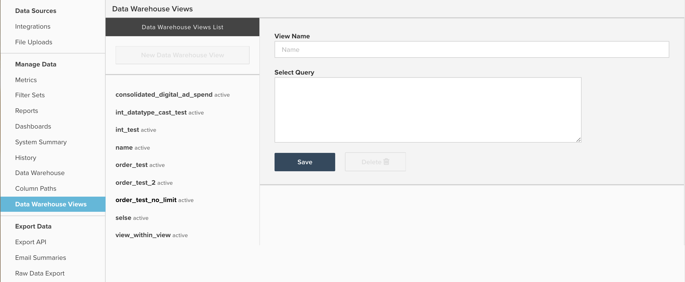

# Uso de las vistas de Data Warehouse

Este documento describe el propósito y los usos de `Data Warehouse Views` a los que se puede acceder navegando hasta **[!UICONTROL Manage Data]** > **[!UICONTROL Data Warehouse Views]**. A continuación se explica qué hace y cómo crear vistas, así como un ejemplo de cómo usar `Data Warehouse Views` para consolidar los datos de gasto de [!DNL Facebook] y [!DNL AdWords].

## Finalidad general

La característica `Data Warehouse Views` es un método para crear nuevas tablas almacenadas modificando una tabla existente o uniendo o consolidando varias tablas mediante SQL. Una vez que un ciclo de actualización ha creado y procesado un `Data Warehouse View`, se rellena en su Data Warehouse como una nueva tabla en el menú desplegable `Data Warehouse Views`, como se muestra a continuación:


Desde aquí, la nueva vista funciona como cualquier otra tabla, lo que le permite crear nuevas columnas calculadas o crear métricas e informes sobre ella.

`Data Warehouse Views` se utilizan principalmente para consolidar varias tablas similares pero dispares juntas, de manera que todos los informes se puedan crear en una sola tabla nueva. Algunos ejemplos comunes incluyen la consolidación de las tablas de una base de datos heredada y una base de datos activa para combinar datos históricos y actuales, o la combinación de varias fuentes de anuncios como Facebook y AdWords en una tabla `Consolidated ad spend` singular.

Si está familiarizado con SQL, ambos ejemplos de consolidación utilizan la función `UNION`, pero puede utilizar cualquier sintaxis y función de PostgreSQL al crear una nueva vista.

## Creación y administración de vistas de Data Warehouse

Se puede crear un(a) nuevo(a) `Data Warehouse Views` y eliminar las vistas existentes navegando a **[!UICONTROL Manage Data]** > **[!UICONTROL Data Warehouse Views]**, como se muestra a continuación:



Desde aquí puede crear una vista siguiendo las instrucciones de ejemplo siguientes:

1. Si observa una vista existente, haga clic en **[!UICONTROL New Data Warehouse View]** para abrir una ventana de consulta en blanco. Si ya está abierta una ventana de consulta en blanco, continúe con el paso siguiente.
1. Asigne un nombre a la vista escribiendo en el campo `View Name`. El nombre proporcionado aquí determina el nombre para mostrar de la vista en Data Warehouse. `View names` se limitan a letras minúsculas, números y guiones bajos (_). Todos los demás caracteres están prohibidos.
1. Escriba la consulta en la ventana denominada `Select Query`, utilizando la sintaxis estándar de PostgreSQL.

   >[!NOTE]
   >
   >La consulta debe hacer referencia a nombres de columna específicos. No se permite el uso del carácter `*` para seleccionar todas las columnas.

1. Cuando termine, haga clic en **[!UICONTROL Save]** para guardar la vista. La vista tiene temporalmente un estado `Pending` hasta que se procese en el siguiente ciclo de actualización completo, momento en el cual el estado cambia a `Active`. Después de ser procesada por una actualización, la vista está lista para utilizarse en los informes.

Es importante mencionar que después de guardar, la consulta subyacente utilizada para generar un `Data Warehouse View` no se puede editar. Si necesita ajustar la estructura de un(a) `Data Warehouse View`, debe crear una vista y migrar manualmente cualquier columna, métrica o informe calculado de la vista original a la nueva. Una vez completada la migración, puede eliminar con seguridad la vista original. Como `Data Warehouse Views` no se pueden editar, Adobe recomienda probar el resultado de la consulta con `SQL Report Builder` antes de guardar la consulta como una vista de Data Warehouse.

## Ejemplo: datos de [!DNL Facebook] y [!DNL Google AdWords]

Observe con más detalle uno de los ejemplos mencionados anteriormente en este artículo: consolidar los datos de gasto de [!DNL Facebook] y [!DNL AdWords] en una nueva tabla de anuncios consolidados. Normalmente, esto implica la consolidación de dos tablas, con conjuntos de datos de ejemplo a continuación:

`Ad source: Google AdWords`

`Table name: campaigns67890`

`Sample data:`

| **`_id`** | **`campaign`** | **`adClicks`** | **`date`** | **`impressions`** | **`adCost`** |
|--- |--- |--- |--- |--- |--- |
| 1 | eee | 60 | 00:00:00 de mayo de 2017-05-05 | 2000 | 10,2 |
| 2 | ggg | 40 | 2017-05-23 00:00:00 | 900 | 4,6 |
| 3 | aaa | 22 | 00:00:00 del 12-06-2017 | 400 | 2,5 |
| 4 | eee | 350 | 00:00:00 del 30-06-2017 | 14500 | 35 |
| 5 | fff | 280 | 00:00:00 del 10-07-2017 | 10200 | 28,5 |

`Ad source: Facebook`

`Table name: facebook_ads_insights_12345`

`Sample data:`

| **`_id`** | **`campaign`** | **`adClicks`** | **`date`** | **`impressions`** | **`adCost`** |
|--- |--- |--- |--- |--- |--- |
| 1 | aaa | 25 | 00:00:00 de mayo de 2017-05-01 | 1200 | 5 |
| 2 | ddd | 12 | 00:00:00 del 15-05-2017 | 800 | 2,5 |
| 3 | aaa | 40 | 2017-05-22 00:00:00 | 2000 | 7 |
| 4 | aaa | 110 | 00:00:00 de 08-06-2017 | 6000 | 10 |
| 5 | ccc | 5 | 00:00:00 de 06-07-2017 | 300 | 1,2 |

Para crear una sola tabla de gasto de anuncios que contenga las campañas [!DNL Facebook] y [!DNL Google AdWords], debe escribir una consulta SQL y utilizar la función `UNION ALL`. La instrucción `UNION ALL` se utiliza con mayor frecuencia para combinar varias consultas SQL distintas y anexar los resultados de cada consulta a un único resultado.

Hay algunos requisitos de una instrucción `UNION` que vale la pena mencionar, como se describe en la [documentación](https://www.postgresql.org/docs/8.3/queries-union.html) de PostgreSQL:

* Todas las consultas deben devolver el mismo número de columnas
* Las columnas correspondientes deben tener tipos de datos idénticos

Al ejecutar una instrucción `UNION` o `UNION ALL`, los nombres de las columnas del resultado final reflejan el nombre de las columnas de la primera consulta.

Normalmente, la consolidación de los datos de gasto de [!DNL Facebook] y [!DNL Google AdWords] en un(a) `Data Warehouse View` requiere la creación de una tabla con siete columnas, con una consulta similar a la siguiente:

```sql
    SELECT
        "_id" as id,
        'AdWords' as ad_source,
        "date",
        "campaign",
        "adCost" as spend,
        "impressions",
        "adClicks" as clicks
    FROM campaigns67890
    UNION
    SELECT
        "_id" as id,
        'Facebook' as ad_source,
        "date_start" as date,
        "campaign_name" as campaign,
        "spend",
        "impressions",
        "clicks"
    FROM facebook_ads_insights_12345
```

Un par de puntos importantes sobre lo anterior:

* Para mayor claridad, todas las columnas están suavizadas arriba de modo que los nombres coinciden en todas las consultas. Sin embargo, esto no es un requisito. El orden en el que se llama a las columnas en las consultas SELECT dicta cómo se alinean.
* Se crea una nueva columna denominada `ad_source` para facilitar el filtrado de datos de [!DNL AdWords] o [!DNL Facebook]. Recuerde que esta consulta combina todos los datos de ambas tablas. Si no crea una columna como `ad_source`, no hay una manera fácil de identificar el gasto de un origen en particular.

Si guarda la consulta anterior como `Data Warehouse View`, se creará una tabla con los gastos de [!DNL Facebook] y [!DNL AdWords], de forma similar a la siguiente:

| **`id`** | **`ad_source`** | **`date`** | **`campaign`** | **`spend`** | **`impressions`** | **`clicks`** |
|--- |--- |--- |--- |--- |--- |--- |
| **1** | [!DNL Facebook] | 00:00:00 de mayo de 2017-05-01 | aaa | 5 | 1200 | 25 |
| **1** | [!DNL Google AdWords] | 00:00:00 de mayo de 2017-05-05 | eee | 10,2 | 2000 | 60 |
| **2** | [!DNL Facebook] | 00:00:00 del 15-05-2017 | ddd | 2,5 | 800 | 12 |
| **2** | [!DNL Google AdWords] | 2017-05-23 00:00:00 | ggg | 4,6 | 900 | 40 |
| **3** | [!DNL Facebook] | 2017-05-22 00:00:00 | aaa | 7 | 2000 | 40 |
| **3** | [!DNL Google AdWords] | 00:00:00 del 12-06-2017 | aaa | 2,5 | 400 | 22 |
| **4** | [!DNL Facebook] | 00:00:00 de 08-06-2017 | aaa | 10 | 6000 | 110 |
| **4** | [!DNL Google AdWords] | 00:00:00 del 30-06-2017 | eee | 35 | 14500 | 350 |
| **5** | [!DNL Facebook] | 00:00:00 de 06-07-2017 | ccc | 1,2 | 300 | 5 |
| **5** | [!DNL Google AdWords] | 00:00:00 del 10-07-2017 | fff | 28,5 | 10200 | 280 |

En lugar de crear un conjunto independiente de métricas de marketing para cada fuente de publicidad, puede crear un único conjunto de métricas utilizando la tabla anterior para capturar todos los anuncios.

**¿Busca ayuda adicional?**

La escritura de SQL y la creación de `Data Warehouse Views` no se incluyen en el soporte técnico. Sin embargo, el [equipo de servicios](https://experienceleague.adobe.com/docs/commerce-knowledge-base/kb/troubleshooting/miscellaneous/mbi-service-policies.html) ofrece asistencia en la creación de vistas. Desde migrar una base de datos heredada con una nueva base de datos hasta crear una única vista de Data Warehouse para realizar un análisis específico, el equipo de asistencia puede ayudarle.

Normalmente, la creación de un nuevo(a) `Data Warehouse View` con el fin de consolidar de 2 a 3 tablas de estructura similar requiere cinco horas de tiempo de servicio, lo que se traduce en aproximadamente 1.250 $ de trabajo. Sin embargo, a continuación se presentan algunos factores comunes que pueden aumentar la inversión esperada requerida:

* Consolidación de más de tres tablas en una sola vista
* Creación de varias vistas de Data Warehouse
* Lógica de unión compleja o condiciones de filtrado
* Consolidación de dos o más tablas con estructuras de datos diferentes
