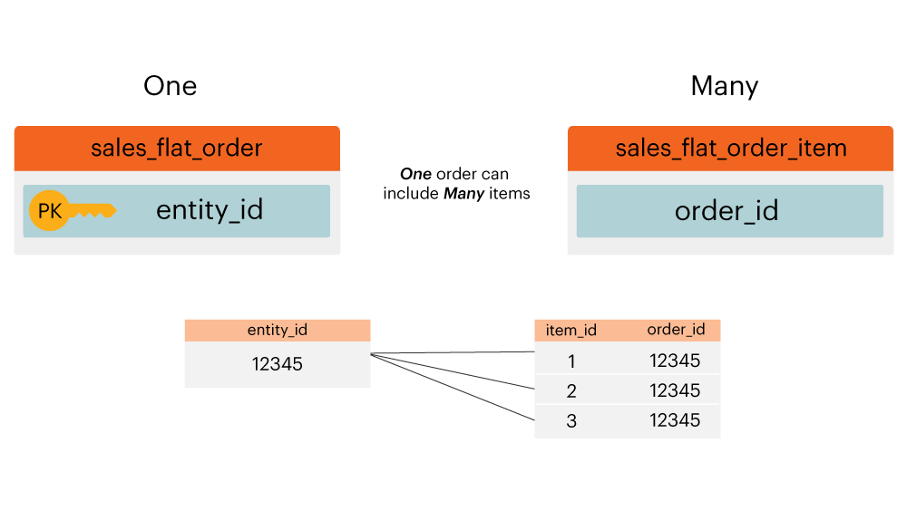

# Diagrama de relación de entidad

¿Qué es un **[!UICONTROL entity relationship (ER) diagram]**? Un diagrama [!UICONTROL ER] es una visualización de las tablas de una base de datos y de cómo se relacionan entre sí. Este tema contiene algunos diagramas de [!UICONTROL ER] que le ayudarán a visualizar la relación entre algunas tablas comunes de bases de datos de Adobe Commerce.

>[!NOTE]
>
>A lo largo de este tema, verá las palabras **join**, **relation** y **path**. Todas estas palabras se utilizan para describir cómo se conectan dos tablas.

## Diagrama de Core Commerce [!UICONTROL ER]

Este diagrama `ER` representa las relaciones entre las tablas principales de una base de datos de Commerce. Al ver varias relaciones a la vez, puede ver cómo se relacionan los datos en muchas tablas.

Las secciones siguientes contienen `ER` diagramas específicos de dos tablas a la vez. Para ver un diagrama y la descripción que lo acompaña, haga clic en el encabezado de esa sección.

## `customer\_entity & sales\_flat\_order`

Un cliente puede realizar muchos pedidos. La relación entre estas dos tablas es `customer\_entity.entity\_id = sales\_flat\_order.customer\_id`

>[!IMPORTANT]
>
>`customer\_entity.entity\_id` no es igual a `sales\_flat\_order.entity\_id`. El primero se puede considerar como `customer\_id` y el segundo como `order\_id.`

En [!DNL Commerce Intelligence], si la ruta entre estas dos tablas no existe, puede [crear la ruta](../data-warehouse-mgr/create-paths-calc-columns.md) en la pestaña Data Warehouse. Cuando esté listo para crear la ruta, se define de la siguiente manera:

## `sales\_flat\_order & sales\_flat\_order\_item`

Un pedido puede contener muchos elementos. La relación entre estas dos tablas es `sales\_flat\_order.entity\_id = sales\_flat\_order\_item.order\_id`.

En [!DNL Commerce Intelligence], si la ruta entre estas dos tablas no existe, puede [crear la ruta](../data-warehouse-mgr/create-paths-calc-columns.md) en la pestaña Data Warehouse. Cuando esté listo para crear la ruta, defina la ruta como se muestra a continuación.

## `catalog\_product\_entity & sales\_flat\_order\_item`

Un producto se puede comprar muchos artículos. La relación entre estas dos tablas es `catalog\_product\_entity.entity\_id = sales\_flat\_order\_item.product`.

En [!DNL Commerce Intelligence], si la ruta entre estas dos tablas no existe, puede [crear la ruta](../data-warehouse-mgr/create-paths-calc-columns.md) en la pestaña Data Warehouse. Cuando esté listo para crear la ruta, defina la ruta como se muestra a continuación.

