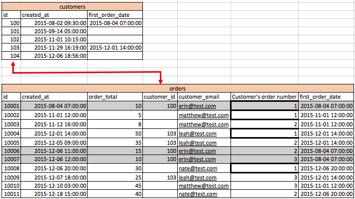

# Pedidos de invitado

Mientras revisa sus pedidos, si nota que muchos `customer\_id` Los valores de son nulos o no tienen un valor para volver a unirse a `customers` mesa, esto es indicativo de que su tienda permite pedidos de invitados. Esto significa que su `customers` es muy probable que no incluya a todos sus clientes.

En este tema se analiza el impacto que los pedidos de invitados tienen en los datos y qué opciones tiene para tener en cuenta correctamente los pedidos de invitados en su [!DNL MBI] Data Warehouse.

## Impacto de los pedidos de invitados en los datos

En la base de datos de comercio típica, hay un `orders` tabla que se une a una `customers` tabla. Cada fila de la `orders` La tabla tiene un `customer\_id` que es única para una fila de la columna `customers` tabla.

* **Si todos los clientes están registrados** y los pedidos de los invitados no están permitidos, lo que significa que todos los registros de `orders` tiene un valor en la variable `customer\_id` columna. Como resultado, cada pedido se une de nuevo a la `customers` tabla. Puede ver esto en la siguiente imagen.

   

* **Si se permiten pedidos de invitados**, esto significa que algunos pedidos no tienen un valor en `customer\_id` columna. Solo los clientes registrados reciben un valor para `customer\_id` en la columna `orders` tabla. Los clientes que no están registrados reciben una `NULL` (o en blanco) valor de esta columna. Como resultado, no todos los registros de pedidos tienen registros coincidentes en la `customers` tabla.

   >[!NOTE]
   >
   >Para identificar al particular único que realizó el pedido, debe haber otro atributo de usuario único junto a `customer\_id` adjunto a un pedido. Normalmente, se utiliza la dirección de correo electrónico del cliente.

## Cómo contabilizar pedidos de invitado en la configuración de Data Warehouse

Normalmente, el ingeniero de ventas que implementa su cuenta tiene en cuenta los pedidos de los invitados al crear la base de la Data Warehouse.

La forma más óptima de contabilizar los pedidos de invitado es basar todas las métricas de nivel de cliente en la variable `orders` tabla. Esta configuración utiliza un ID de cliente único que tienen todos los clientes, incluidos los invitados (normalmente se utiliza el correo electrónico del cliente). Esto ignora los datos de registro de `customers` tabla. Con esta opción, solo se incluyen en los informes de nivel de cliente los clientes que han realizado al menos una compra. No se incluyen los usuarios registrados que aún no hayan realizado una compra. Con esta opción, su `New customer` se basa en la primera fecha de pedido del cliente en el `orders` tabla.

Puede observar que la variable `Customers we count` el conjunto de filtros de este tipo de configuración tiene un filtro para `Customer's order number = 1`. Piensen en por qué es esto.

En una situación sin pedidos de invitado, cada cliente existe como una fila única en la tabla de clientes (consulte la imagen 1). Una métrica como `New customers` puede simplemente contar el id de esta tabla en función de `created\_at` fecha para comprender los clientes nuevos en función de la fecha de registro.

En una configuración de pedidos de invitado en la que todas las métricas de clientes se basan en la variable `orders` para tener en cuenta los pedidos de los invitados, debe asegurarse de que está `not counting customers twice`. Si cuenta el ID de la tabla de pedidos, contará todos los pedidos. Si, en su lugar, cuenta el ID en `orders` y utilice un filtro, `Customer's order number = 1`, entonces va a contar cada cliente único `only one time`. Esto es aplicable a todas las métricas de nivel de cliente, como `Customer's lifetime revenue` o `Customer's lifetime number of orders`.

En la imagen 2 anterior, puede ver que hay valores nulos `customer\_ids` en el `orders` tabla. Si usa el `customer\_email` para identificar clientes únicos, puede ver lo siguiente `erin@test.com` ha realizado tres (3) pedidos. Por lo tanto, puede crear un `New customers` métrica en su `orders` tabla basada en las siguientes condiciones:

* `Operation table = orders`
* `Operation column = id`
* `Operation = count`
* `Timestamp = Customer's first order date`
* `Filter = Customer's we count (where Customer's order number = 1)`
