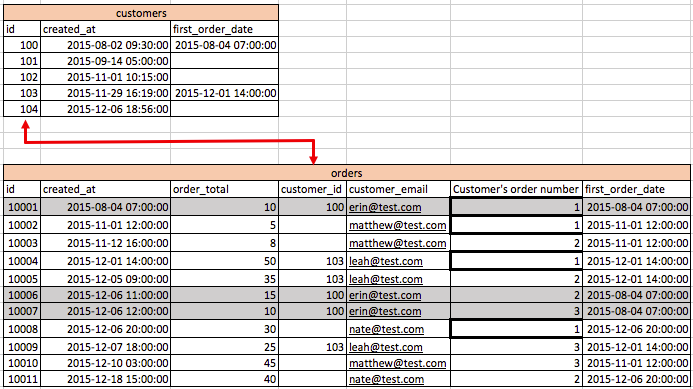

# Pedidos de invitado

Al revisar sus pedidos, si observa que muchos valores de `customer\_id` son nulos o no tienen un valor para volver a unirse a la tabla `customers`, esto indica que su tienda permite pedidos de invitado. Esto significa que es muy probable que la tabla `customers` no incluya a todos los clientes.

En este tema se describe el impacto que tienen los pedidos de invitados en los datos y qué opciones tiene para tener en cuenta correctamente los pedidos de invitados en la Data Warehouse [!DNL Commerce Intelligence].

## Impacto de los pedidos de invitados en los datos

En la base de datos de comercio típica, hay una tabla `orders` que se une a una tabla `customers`. Cada fila de la tabla `orders` tiene una columna `customer\_id` que es única para una fila de la tabla `customers`.

* **Si todos los clientes están registrados** y no se permiten pedidos de invitado, significa que cada registro de la tabla `orders` tiene un valor en la columna `customer\_id`. Como resultado, cada pedido se vuelve a unir a la tabla `customers`.

  

* **Si se permiten pedidos de invitado**, significa que algunos pedidos no tienen un valor en la columna `customer\_id`. Solo los clientes registrados reciben un valor para la columna `customer\_id` en la tabla `orders`. Los clientes que no están registrados reciben un valor `NULL` (o en blanco) para esta columna. Como resultado, no todos los registros de pedidos tienen registros coincidentes en la tabla `customers`.

  >[!NOTE]
  >
  >Para identificar al individuo único que realizó el pedido, debe haber otro atributo de usuario único junto a `customer\_id` adjunto a un pedido. Normalmente, se utiliza la dirección de correo electrónico del cliente.

## Cómo contabilizar pedidos de invitados en la configuración de Data Warehouse

Normalmente, el ingeniero de ventas que implementa su cuenta tiene en cuenta los pedidos de los invitados al crear la base de su Data Warehouse.

La forma más óptima de tener en cuenta los pedidos de invitados es basar todas las métricas de nivel de cliente en la tabla `orders`. Esta configuración utiliza un ID de cliente único que tienen todos los clientes, incluidos los invitados (normalmente se utiliza el correo electrónico del cliente). Esto ignora los datos de registro de la tabla `customers`. Con esta opción, solo se incluyen en los informes de nivel de cliente los clientes que han realizado al menos una compra. No se incluyen los usuarios registrados que aún no hayan realizado una compra. Con esta opción, la métrica `New customer` se basa en la primera fecha de pedido del cliente en la tabla `orders`.

Observará que el filtro `Customers we count` establecido en este tipo de configuración tiene un filtro para `Customer's order number = 1`.

En una situación sin pedidos de invitado, cada cliente existe como una fila única en la tabla de clientes (consulte la imagen 1). Una métrica como `New customers` puede simplemente contar el ID de esta tabla en función de la fecha `created\_at` para comprender a los nuevos clientes en función de la fecha de registro.

En una configuración de pedidos de invitado en la que todas las métricas de clientes se basen en la tabla `orders` para tener en cuenta los pedidos de invitado, debe asegurarse de que es `not counting customers twice`. Si cuenta el ID de la tabla de pedidos, contará todos los pedidos. Si en su lugar cuenta el identificador en la tabla `orders` y usa un filtro, `Customer's order number = 1`, entonces va a contar cada cliente único `only one time`. Esto es aplicable a todas las métricas de nivel de cliente, tales como `Customer's lifetime revenue` o `Customer's lifetime number of orders`.

Más arriba puede ver que hay `customer\_ids` nulos en la tabla `orders`. Si usa `customer\_email` para identificar clientes únicos, verá que `erin@test.com` ha realizado tres (3) pedidos. Por lo tanto, puede generar una métrica `New customers` en su tabla `orders` en función de las siguientes condiciones:

* `Operation table = orders`
* `Operation column = id`
* `Operation = count`
* `Timestamp = Customer's first order date`
* `Filter = Customer's we count (where Customer's order number = 1)`
