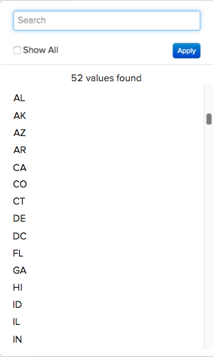

# Estandarización de datos con tablas de asignación

Imagine que está en el `Report Builder` creando un informe de `Revenue by State`. Todo va bien hasta que intente agregar una agrupación `billing state` al informe y vea lo siguiente:

## ¿Cómo pudo pasar esto?

Desafortunadamente, la falta de estandarización a veces puede generar problemas de datos y dolores de cabeza al crear informes. En este ejemplo, es posible que no haya un menú desplegable o una forma estandarizada para que los clientes introduzcan la información de estado de facturación. Esto genera varios valores - `pa`, `PA`, `penna`, `pennsylvania` y `Pennsylvania` - todos para el mismo estado, lo que da lugar a resultados extraños en `Report Builder`.

Es posible que haya un recurso técnico que pueda ayudarle a limpiar los datos o a insertar las columnas que necesite directamente en la base de datos. Si no, hay otra solución: **la tabla de asignación**. Una tabla de asignación le permite limpiar y estandarizar rápida y fácilmente cualquier dato desordenado asignando datos a una sola salida.

>[!NOTE]
>
>No se puede crear una tabla de asignación para tablas consolidadas sin la ayuda del equipo de soporte técnico de Adobe.

## ¿Cómo se crea? {#how}

**Actualizador de formato de datos:**

* Asegúrese de que la hoja de cálculo tenga una fila de encabezado.
* Evite utilizar comas. Esto causa problemas al cargar el archivo.
* Use el formato de fecha estándar `(YYYY-MM-DD HH:MM:SS)` para las fechas.
* Los porcentajes deben introducirse como decimales.
* Asegúrese de que se retienen correctamente los ceros a la izquierda y a la derecha.

Antes de sumergirse, Adobe recomienda [exportar los datos de tabla sin procesar](../../tutorials/export-raw-data.md). Mirar primero los datos sin procesar significa que puede explorar todas las combinaciones posibles de los datos que necesita limpiar, asegurándose así de que la tabla de asignación cubra todo.

Para crear una tabla de asignación, debe crear una hoja de cálculo de dos columnas que siga las [reglas de formato para las cargas de archivos](../../data-analyst/importing-data/connecting-data/using-file-uploader.md).

En la primera columna, escriba los valores almacenados en la base de datos con **sólo un valor en cada fila**. Por ejemplo, `pa` y `PA` no pueden estar en la misma línea; cada entrada debe tener su propia fila. Consulte a continuación un ejemplo.

En la segunda columna, escriba cuáles son estos valores **debería ser**. Continuando con el ejemplo del estado de facturación, si desea que `pa`, `PA`, `Pennsylvania` y `pennsylvania` sean simplemente `PA`, debe escribir `PA` en esta columna para cada valor de entrada.

## ¿Qué debo hacer en [!DNL Commerce Intelligence] para utilizarlo? {#use}

Una vez que haya terminado de crear la tabla de asignación, debe [cargar el archivo](../../data-analyst/importing-data/connecting-data/using-file-uploader.md) en [!DNL Commerce Intelligence] y [crear una columna combinada](../../data-analyst/data-warehouse-mgr/calc-column-types.md) que reubique el nuevo campo en la tabla deseada. Puede hacerlo después de sincronizar el archivo con la Data Warehouse.

Este ejemplo mueve la columna que creó en la tabla `mapping_state` (`state_input`) a la tabla `customer_address` mediante una columna combinada. Esto nos permite agrupar por la columna `state_input` limpia en sus informes en lugar de por la columna `state`.

Para crear la columna `joined`, vaya a la tabla a la que se reubicará el campo en el Administrador de Datas Warehouse. En este ejemplo, sería la tabla `customer_address`.

1. Haga clic en **[!UICONTROL Create a Column]**.
1. Seleccione `Joined Column` de la lista desplegable `Definition`.
1. Asigne un nombre a la columna que la diferencie de la columna `state` de la base de datos. Asigne un nombre a la columna `billing state (mapped)` para que pueda saber qué columna utilizar al segmentar en Report Builder.
1. La ruta que necesita para conectar las tablas no existe, por lo que debe crear una. Haga clic en **[!UICONTROL Create new path]** en la lista desplegable `Select a table and column`.

   Si no está seguro de cuál es la relación de tabla o de cómo definir correctamente las claves principales y externas, consulte [el tutorial](../../data-analyst/data-warehouse-mgr/create-paths-calc-columns.md) para obtener ayuda.

   * En el lado `Many`, seleccione la tabla a la que está reubicando el campo (de nuevo, para nosotros es `customer_address`) y la columna `Foreign Key`, o la columna `state`, en el ejemplo.
   * En el lado `One`, seleccione la tabla `mapping` y la columna `Primary key`. En este caso, seleccionaría la columna `state_input` de la tabla `mapping_state`.
   * Este es un vistazo a la apariencia de la ruta:

     

1. Cuando termine, haga clic en **[!UICONTROL Save]** para crear la ruta.
1. Es posible que la ruta de acceso no se rellene inmediatamente después de guardar. Si esto sucede, haga clic en el cuadro `Path` y seleccione la ruta de acceso que ha creado.
1. Haga clic en **[!UICONTROL Save]** para crear la columna.

## ¿Qué hago ahora? {#wrapup}

Una vez completado el ciclo de actualización, podrá utilizar la nueva columna combinada para segmentar correctamente los datos en lugar de la columna desordenada de la base de datos. Mira tus opciones de agrupación ahora - no más líos de estrés:

Las tablas de asignación son útiles para cualquier momento en el que desee limpiar algunos datos potencialmente desordenados en la Data Warehouse. Sin embargo, las tablas de asignación también se pueden usar para otros casos de uso interesantes, como [replicar su [!DNL Google Analytics channels] en [!DNL Commerce Intelligence]](../data-warehouse-mgr/rep-google-analytics-channels.md).

### Relacionado

* [Explicación y evaluación de las relaciones de tabla](../data-warehouse-mgr/table-relationships.md)
* [Creación/eliminación de rutas para columnas calculadas](../data-warehouse-mgr/create-paths-calc-columns.md)
