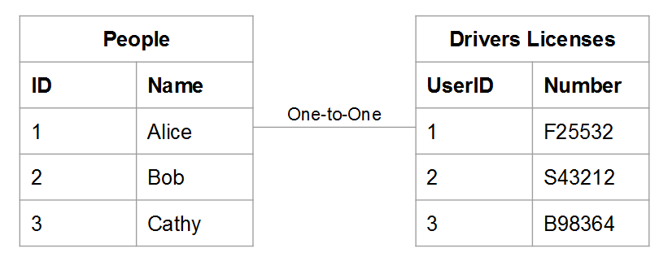
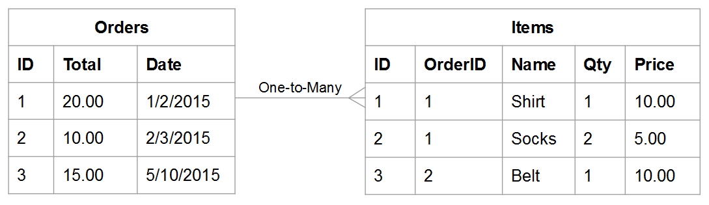

# Explicación y evaluación de las relaciones de tabla

Al evaluar la relación entre dos tablas determinadas, debe comprender cuántas ocurrencias posibles de una tabla pueden pertenecer a una entidad de otra y viceversa. Por ejemplo, vamos a usar un `users` tabla y `orders` tabla. En este caso, desea saber cuántas **pedidos** un **usuario** ha colocado y cuántos posibles **usuarios** an **pedido** podría pertenecer a.

Comprender las relaciones es vital para mantener la integridad de los datos, ya que afecta a la precisión de su [columnas calculadas](../data-warehouse-mgr/creating-calculated-columns.md) y [dimensiones](../data-warehouse-mgr/manage-data-dimensions-metrics.md). Para obtener más información, consulte [tipos de relación](#types) y [cómo evaluar las tablas de la Data Warehouse.](#eval)

## Tipos de relación {#types}

Existen tres tipos de relaciones que pueden existir entre dos tablas:

* [&quot;uno a uno&quot;](#onetoone)
* [&quot;uno a varios&quot;](#onetomany)
* [&quot;varios a varios&quot;](#manytomany)

### `One-to-One` {#onetoone}

En un `one-to-one` relación, un registro en Tabla `B` pertenece a un registro de la tabla y solo a uno `A`. Y un registro en Tabla `A` pertenece a un registro de la tabla y solo a uno `B`.

Por ejemplo, en la relación entre las personas y los números de licencia de conducir, una persona puede tener un número de licencia de conducir y otro solo, y un número de licencia de conducir pertenece a una sola persona.

### `One-to-Many` {#onetomany}

En un `one-to-many` relación, un registro en Tabla `A` puede pertenecer potencialmente a varios registros de la tabla `B`. Piense en la relación entre `orders` y `items` - un pedido puede contener muchos elementos, pero un elemento pertenece a un único pedido. En este caso, la variable `orders` La tabla es de un lado y la variable `items` es el lado múltiple.

### `Many-to-Many` {#manytomany}

En un `many-to-many` relación, un registro en Tabla `B` puede pertenecer potencialmente a varios registros de la tabla `A`. Y viceversa, un registro en Tabla `A` puede pertenecer potencialmente a varios registros de la tabla `B`.

Piense en la relación entre **products** y **categories**: un producto puede pertenecer a muchas categorías y una categoría puede contener muchos productos.

## Evaluación de tablas {#eval}

Dados los tipos de relaciones que existen entre tablas, puede aprender a evaluar las tablas en su almacén de datos. Como estas relaciones moldean la forma en que se definen las columnas calculadas de varias tablas, es importante que entienda cómo identificar las relaciones de tablas y qué lado - `one` o `many` - la tabla pertenece a.

Existen dos métodos que puede utilizar para evaluar las relaciones de un par determinado de tablas dentro de la Data Warehouse. El primer método emplea un [marco conceptual](#concept) que considera cómo interactúan las entidades de la tabla entre sí. El segundo método utiliza la variable [esquema de tabla](#schema).

### Uso del marco conceptual {#concept}

Este método utiliza un marco conceptual para describir cómo las entidades de las dos tablas pueden interactuar entre sí. Es importante entender que este marco evalúa lo que es posible, dada la relación.

Por ejemplo, al pensar en usuarios y pedidos, considere todo lo que es posible en la relación. Un usuario registrado no puede realizar pedidos, solo un pedido o varios pedidos durante su vida útil. Si acaba de iniciar su negocio y aún no se han realizado pedidos, es posible que un usuario dado pueda realizar muchos pedidos en su vida útil y las tablas se hayan creado para acomodarlo.

Para utilizar este método:

1. Identifique la entidad que se describe en cada tabla. **Sugerencia: normalmente es un sustantivo**. Por ejemplo, la variable `user` y `orders` las tablas describen explícitamente usuarios y pedidos.
1. Identifique los verbos que describen cómo interactúan estas entidades. Por ejemplo, al comparar usuarios con pedidos, los usuarios &quot;realizan&quot; pedidos. En la otra dirección, los pedidos &quot;pertenecen&quot; a los usuarios.

Este tipo de estructura se puede aplicar a cualquier emparejamiento de tablas de la Data Warehouse, lo que le permite identificar fácilmente el tipo de relación, así como qué tabla es una sola cara y qué tabla es una cara múltiple.

Una vez que haya identificado la terminología que describe cómo interactúan las dos tablas, defina la interacción en ambas direcciones teniendo en cuenta cómo se relaciona una instancia determinada de la primera entidad con la segunda. Estos son algunos ejemplos de cada relación:

### `One-to-One`

Una persona puede tener un número de licencia de conducir y sólo uno. Un número de licencia de conducir determinado pertenece a una sola persona.

Esto es un `one-to-one` relación en la que cada tabla es un lado.

### `One-to-Many`

Un pedido determinado puede contener muchos elementos. Un elemento determinado pertenece a un único pedido.

Esto es un `one-to-many` relación en la que la tabla pedidos es de un lado y la tabla artículos es de varios.

### `Many-to-Many`

Un producto determinado puede pertenecer a muchas categorías. Una categoría determinada puede contener muchos productos.

Esto es un `many-to-many` relación en la que cada tabla es de varios lados.

### Uso del esquema de la tabla {#schema}

El segundo método aprovecha el esquema de tabla. El esquema define qué columnas son las [`Primary`](http://en.wikipedia.org/wiki/Unique_key) y [`Foreign`](https://en.wikipedia.org/wiki/Foreign_key) teclas. Puede utilizar estas claves para vincular tablas y ayudar a determinar los tipos de relación.

Una vez identificadas las columnas que vinculan dos tablas juntas, utilice los tipos de columna para evaluar la relación de tabla. Estos son algunos ejemplos:

### `One-to-one`

Si las tablas están vinculadas mediante la variable `primary key` de ambas tablas, se describe la misma entidad única en cada tabla y la relación es `one-to-one`.

Por ejemplo, una `users` puede capturar la mayoría de los atributos de usuario (como el nombre) mientras que una `user_source` captura los orígenes de registro de los usuarios. En cada tabla, una fila representa a un usuario.

### `One-to-many`

>[!NOTE]
>
>¿Acepta pedidos de invitados? Consulte [Pedidos invitados](../data-warehouse-mgr/guest-orders.md) para conocer cómo los pedidos de los invitados pueden afectar a las relaciones de la tabla.

Cuando las tablas están vinculadas mediante un `Foreign key` apuntando a un `primary key`, esta configuración describe un `one-to-many` relación. Un lado será la tabla que contiene la variable `primary key` y el lado múltiple será la tabla que contiene la variable `foreign key`.

### `Many-to-many`

Si alguno de los siguientes es verdadero, la relación es `many-to-many`:

* `Non-primary key` se están utilizando las columnas para vincular dos tablas
   
* Parte de un compuesto `primary key` se utiliza para vincular dos tablas

## Pasos siguientes

La evaluación correcta de las relaciones de las tablas es crucial para modelar los datos con precisión. Ahora que comprende cómo las tablas están relacionadas entre sí, consulte [lo que puede hacer con el Administrador de Datas Warehouse](../data-warehouse-mgr/tour-dwm.md).
