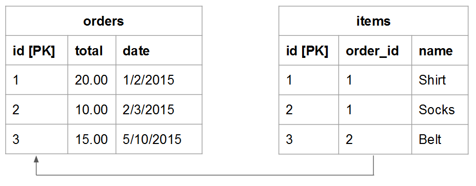

# Comprender y evaluar las relaciones entre tablas

Al evaluar la relación entre dos tablas determinadas, debe comprender cuántas ocurrencias posibles de una tabla podrían pertenecer a una entidad en otra y viceversa. Por ejemplo, utilice un `users` y una tabla `orders` tabla. En este caso, desea saber cuántas **pedidos** un determinado **usuario** ha colocado y cuántas posibles **usuarios** un **pedido** podría pertenecer a.

Comprender las relaciones es vital para mantener la integridad de los datos, ya que afecta a la precisión de su [columnas calculadas](../data-warehouse-mgr/creating-calculated-columns.md) y [dimensiones](../data-warehouse-mgr/manage-data-dimensions-metrics.md). Para obtener más información, consulte [tipos de relación](#types) y [cómo evaluar las tablas de la Data Warehouse.](#eval)

## Tipos de relaciones {#types}

Existen tres tipos de relaciones que pueden existir entre dos tablas:

* [&quot;uno a uno&quot;](#onetoone)
* [&quot;uno a varios&quot;](#onetomany)
* [&quot;varios a varios&quot;](#manytomany)

### `One-to-One` {#onetoone}

En un `one-to-one` relación, un registro en la Tabla `B` solo pertenece a un registro de la tabla `A`. Y un registro en la tabla `A` solo pertenece a un registro de la tabla `B`.

Por ejemplo, en la relación entre las personas y los números de licencia de conducir, una persona solo puede tener un número de licencia de conducir, y un número de licencia de conducir pertenece a una sola persona.

### `One-to-Many` {#onetomany}

En un `one-to-many` relación, un registro en la Tabla `A` puede pertenecer potencialmente a varios registros de la Tabla `B`. Piense en la relación entre `orders` y `items` - un pedido puede contener muchos artículos, pero un artículo pertenece a un único pedido. En este caso, la variable `orders` La tabla es el lado uno y el `items` La tabla es el lado varios.

### `Many-to-Many` {#manytomany}

En un `many-to-many` relación, un registro en la Tabla `B` puede pertenecer potencialmente a varios registros de la Tabla `A`. Y viceversa, un registro en la Tabla `A` puede pertenecer potencialmente a varios registros de la Tabla `B`.

Piense en la relación entre **products** y **categorías**: un producto puede pertenecer a muchas categorías y una categoría puede contener muchos productos.

## Evaluación de las tablas {#eval}

Dados los tipos de relaciones que existen entre las tablas, puede aprender a evaluar las tablas en la Data Warehouse. A medida que estas relaciones configuran cómo se definen las columnas calculadas de varias tablas, es importante que entienda cómo identificar las relaciones de tabla y qué lado - `one` o `many` - la tabla pertenece a.

Puede utilizar dos métodos para evaluar las relaciones de un par determinado de tablas dentro de la Data Warehouse. El primer método emplea un [marco conceptual](#concept) que tiene en cuenta cómo interactúan las entidades de la tabla entre sí. El segundo método utiliza el [esquema de tabla](#schema).

### Uso del marco conceptual {#concept}

Este método utiliza un marco conceptual para describir cómo las entidades de las dos tablas pueden interactuar entre sí. Es importante entender que este marco evalúa lo que es posible, dada la relación.

Por ejemplo, cuando piense en usuarios y pedidos, tenga en cuenta todo lo que es posible en la relación. Un usuario registrado no puede realizar ningún pedido, solo uno o varios pedidos durante su vida útil. Si ha iniciado su negocio y no se han realizado pedidos, es posible que un usuario determinado pueda realizar muchos pedidos durante su vida útil. Las mesas están construidas para acomodar esto.

Para utilizar este método:

1. Identifique la entidad que se describe en cada tabla. **Pista: suele ser un sustantivo**. Por ejemplo, la variable `user` y `orders` Las tablas de describen explícitamente usuarios y pedidos.
1. Identifique uno o más verbos que describan cómo interactúan estas entidades. Por ejemplo, al comparar usuarios con pedidos, los usuarios &quot;realizan&quot; pedidos. En la otra dirección, los pedidos &quot;pertenecen&quot; a los usuarios.

Este tipo de marco de trabajo se puede aplicar a cualquier emparejamiento de tablas en la Data Warehouse. Esto le permite identificar fácilmente el tipo de relación y qué tabla es un lado uno y qué tabla es un lado varios.

Una vez identificada la terminología que describe cómo interactúan las dos tablas, enmarque la interacción en ambas direcciones teniendo en cuenta cómo se relaciona una instancia determinada de la primera entidad con la segunda. Estos son algunos ejemplos de cada relación:

### `One-to-One`

Una persona determinada solo puede tener un número de licencia de conducir. Un determinado número de licencia de conducir pertenece a una sola persona.

Este es un `one-to-one` relación en la que cada tabla es un lado.

### `One-to-Many`

Un pedido determinado puede contener muchos elementos. Un elemento dado pertenece a un único pedido.

Este es un `one-to-many` relación en la que la tabla pedidos es el lado uno y la tabla elementos es el lado varios.

### `Many-to-Many`

Un producto dado puede pertenecer posiblemente a muchas categorías. Una categoría determinada puede contener muchos productos.

Este es un `many-to-many` relación en la que cada tabla es un lado varios.

### Uso del esquema de la tabla {#schema}

El segundo método utiliza el esquema de tabla. El esquema define qué columnas son las [`Primary`](https://en.wikipedia.org/wiki/Unique_key) y [`Foreign`](https://en.wikipedia.org/wiki/Foreign_key) llaves. Puede utilizar estas claves para vincular tablas y ayudar a determinar los tipos de relación.

Una vez identificadas las columnas que vinculan dos tablas, utilice los tipos de columna para evaluar la relación entre las tablas. Estos son algunos ejemplos:

### `One-to-one`

Si las tablas están vinculadas mediante la variable `primary key` de ambas tablas, se describe la misma entidad única en cada tabla y la relación es `one-to-one`.

Por ejemplo, una `users` La tabla puede capturar la mayoría de los atributos de usuario (como el nombre) mientras que una `user_source` La tabla de captura las fuentes de registro del usuario. En cada tabla, una fila representa un usuario.

### `One-to-many`

>[!NOTE]
>
>¿Aceptas órdenes de invitados? Consulte [Pedidos de invitado](../data-warehouse-mgr/guest-orders.md) para conocer cómo los pedidos de invitados pueden afectar a las relaciones de tabla.

Cuando las tablas están vinculadas mediante una `Foreign key` apuntando a un `primary key`, esta configuración describe un `one-to-many` relación. Un lado es la tabla que contiene el `primary key` y el lado varios es la tabla que contiene el `foreign key`.

### `Many-to-many`

Si alguna de las siguientes opciones es verdadera, la relación es `many-to-many`:

* `Non-primary key` se utilizan para vincular dos tablas
   
* Parte de un compuesto `primary key` se utiliza para vincular dos tablas

## Pasos siguientes

La evaluación correcta de las relaciones de tabla es crucial para modelar los datos con precisión. Ahora que comprende cómo se relacionan las tablas entre sí, consulte [qué puede hacer con el Administrador de Datas Warehouse](../data-warehouse-mgr/tour-dwm.md).
