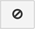

# Administrador de Datas Warehouse

>[!NOTE]
>
>Requiere [Permisos de administrador](../../administrator/user-management/user-management.md)

El Administrador de Datas Warehouse, al que se accede haciendo clic en **[!UICONTROL Manage Data > Data Warehouse]** en la barra lateral, es el portal para su [!DNL MBI] Data Warehouse. Con el Administrador de Datas Warehouse, puede administrar la configuración de sincronización de tablas y columnas, profundizar en el esquema de una tabla y crear columnas calculadas para utilizarlas en los informes.

En este artículo trataremos:

* [Aprender a seguir su camino](#learning)
* [Sincronización de tablas y columnas](#syncing)
* [Creación de columnas calculadas](#calculated)
* [Soltar tablas y quitar columnas](#delete)
* [Sincronización de nuevas tablas en segundo plano](#syncnew)
* [Entonces, ¿cuándo puedo usar mis columnas nuevas?](#when)

## Aprender a seguir su camino {#learning}

El lado izquierdo de `Data Warehouse Manager` contiene la lista de tablas, lo que permite alternar fácilmente entre las tablas. Cuando seleccione una tabla de la lista, el área de administración de la tabla se rellenará con el esquema de la tabla donde puede realizar cambios en la tabla seleccionada.

En la lista de la tabla, las tablas se agrupan por su origen de conexión. Estas fuentes se agregan en [!UICONTROL Manage Data > Integrations] y puede ser una base de datos, una [API](https://developer.adobe.com/commerce/services/reporting/)o un conector de terceros. En la parte superior de la lista de la tabla hay un cuadro de búsqueda que le permite encontrar fácilmente las tablas que desee.

Debajo del cuadro de búsqueda, verá dos opciones: `All Tables` y `Synced Tables`. La variable `All Tables` enumera todas las tablas que ha puesto a disposición de la Data Warehouse, las cuales incluyen tablas sincronizadas y no sincronizadas.

La variable `Synced Tables` muestra todas las tablas que ya se han agregado a la Data Warehouse y que tienen datos duplicados de las columnas seleccionadas.

No vea la tabla que está buscando en la `All Tables` lista? Hay algunas razones posibles para esto:

* La fuente de datos aún no se ha agregado
* La fuente de datos es una base de datos y la variable [!DNL MBI] el usuario que ha creado no tiene acceso. En este caso, usted o el administrador de la base de datos deberán conceder acceso.
* La fuente de datos o tabla se agregó recientemente y aún no se ha sincronizado

## Sincronización de tablas y columnas {#syncing}

### Sincronización de nuevas tablas y columnas nativas

El Administrador de Datas Warehouse no solo le permite ver y administrar fácilmente sus fuentes de datos, sino que también puede seleccionar las tablas y columnas individuales que desea sincronizar.

1. Haga clic en el `All Tables` y busque la tabla que desea sincronizar.
1. Haga clic en el nombre de la tabla para obtener una vista previa del esquema. Si la tabla es nueva, todas las columnas se mostrarán como `Unsynced`.
1. Marque las columnas que desee sincronizar.

   >[!NOTE]
   >
   >Las columnas nativas de una tabla tendrán Desde la base de datos en el `Location` para abrir el Navegador.

1. Asegúrese de marcar la variable `Primary Key` columnas : estas columnas tienen un símbolo de clave junto al nombre de la columna. A `Primary Key` es necesario para sincronizar correctamente los datos en la Data Warehouse.

   Si está sincronizando una tabla que proviene directamente de la base de datos, es posible que `Primary Keys` no se puede indicar. En este caso, póngase en contacto con el administrador de la base de datos para solicitar que se añada una o varias claves principales a la tabla.
1. Cuando termine, haga clic en el botón  botón.

A *¡Correcto!* aparecerá el mensaje y el estado cambiará a `Pending` para las columnas seleccionadas. Una vez finalizada la siguiente actualización completa, las tablas y columnas recién sincronizadas estarán disponibles para su uso en los informes; también puede configurar [métodos de replicación](./cfg-replication-methods.md) después de la sincronización inicial.

A continuación se muestra un breve vistazo a todo el proceso:

### Sincronización de nuevas tablas en segundo plano {#syncnew}

Al sincronizar una tabla nueva y grande por primera vez, el almacén de datos debe capturar de forma retroactiva todos los puntos de datos de la tabla antes de capturar los nuevos datos de forma continua. Si la tabla es particularmente grande, es posible que no desee que la sincronización inicial se ejecute en secuencia con su **ciclo de actualización** — en esta situación, querrá que la sincronización inicial se produzca en segundo plano, en *paralelo* con cualquier actualización en ejecución.

Para asegurarse de que se produzca, debe seleccionar la opción `Save and Sync Data Immediately` sincronización de esa tabla por primera vez.

### Comprobación de nuevas tablas y columnas {#forceupdate}

La Data Warehouse no detecta automáticamente nuevas fuentes, tablas o columnas en el momento en que se agregan. Un proceso de sincronización se ejecuta durante toda la semana para encontrar nuevas adiciones y ponerlas a disposición de los usuarios, pero puede forzar una sincronización de estructura si desea acceder a las tablas y columnas que se acaban de agregar antes de que se ejecute el proceso.

Debajo de la barra de búsqueda de la lista de la tabla hay una `Check for new tables and columns` vínculo. Al hacer clic en este vínculo, se fuerza el inicio del proceso de sincronización de estructura; las nuevas adiciones suelen estar disponibles tras 10 minutos. Actualice la página para ver el nuevo origen, tabla o columna.

## Creación de columnas calculadas {#calculated}

Simplemente poder ver y administrar los datos de todas las fuentes facilita la obtención de perspectivas en su negocio. Pero dentro del Administrador de Datas Warehouse, puede ir un paso más allá creando columnas calculadas dentro de las tablas. `Calculated` las columnas obtienen información nueva de los datos existentes.

Supongamos que desea agregar `user's lifetime revenue` a su `users` para buscar usuarios de alto valor. O bien, si desea segmentar los ingresos por sexo, puede agregar `customer's gender` a su `orders` tabla.

Para ayudarle a crear estas columnas, [hemos creado un tutorial](../../data-analyst/data-warehouse-mgr/creating-calculated-columns.md) para guiarte por él.

## Eliminación de tablas y eliminación de columnas {#delete}

Del mismo modo que tiene la capacidad de seleccionar tablas y columnas para sincronizar con su Data Warehouse, también puede soltarlas o eliminarlas.

>[!NOTE]
>
>Al soltar una tabla o eliminar columnas, se eliminarán todos los informes, métricas, conjuntos de filtros y columnas dependientes una vez que confirme la eliminación. Asegúrese de que desea hacer esto: **esta acción no se puede deshacer.**

No se preocupe si hace clic en **[!UICONTROL Delete]** por accidente. Una comprobación de dependencia se ejecuta antes de que se elimine cualquier cosa, por lo que tendrá la oportunidad de revisar todo antes de confirmarlo.

Para quitar columnas, haga clic en la tabla a la que pertenece la columna. Marque las columnas que desee eliminar y haga clic en el botón  botón.

Para quitar una tabla sincronizada, seleccione todas las columnas de la tabla y vuelva a hacer clic en  botón. Esto eliminará todas las columnas nativas y calculadas que utilicen esta tabla del almacén de datos.

### Confirmación de cambios

Tanto si suelta una tabla como si elimina columnas, se ejecutará una comprobación de dependencia antes de que finalice el proceso de eliminación. Las dependencias son columnas calculadas, métricas, conjuntos de filtros e informes que utilizan la tabla o columna que se está eliminando. Se mostrarán todas las dependencias descubiertas; en este punto, puede cancelar el proceso o hacer clic en **[!UICONTROL Confirm Changes]** para soltar la tabla o eliminar las columnas.

Aunque las dependencias eliminadas no se pueden restaurar, las tablas y columnas seguirán estando disponibles si necesita volver a sincronizar columnas nativas en el futuro.

A continuación, se muestra una breve explicación de cómo eliminar una columna:

## Entonces, ¿cuándo puedo usar mis columnas nuevas? {#when}

Las nuevas columnas sincronizadas y las columnas calculadas nuevas/actualizadas estarán listas para su uso una vez finalizada la siguiente actualización completa. Si una actualización aún no está en curso, puede forzar una actualización haciendo clic en **[!UICONTROL Force update]** se muestra en la parte superior del `Data Warehouse` o `Integrations` página. También puede programar una notificación por correo electrónico una vez finalizada la actualización haciendo clic en **[!UICONTROL Email me when complete]**.

Cuando esté listo para usar las nuevas columnas en los informes, [primero debe agregarlas a las métricas](../data-warehouse-mgr/manage-data-dimensions-metrics.md). Aunque los datos no estarán disponibles hasta que se complete una actualización, puede seguir utilizando columnas nuevas en los informes. Los datos dentro del informe se mostrarán cuando finalice la actualización.

## Eso es todo - ¡estamos al final!

Hemos cubierto mucho material en este tutorial. A partir de ahora, tendrá una idea clara de qué es una base de datos, cómo se organizan los datos, cómo se relacionan las tablas entre sí y qué puede hacer con el Administrador de Datas Warehouse.

¡Excelente! Pruebe su nuevo conocimiento por [creación de una columna calculada](../data-warehouse-mgr/creating-calculated-columns.md) o [hacer algunos informes interesantes](../../tutorials/using-visual-report-builder.md).
