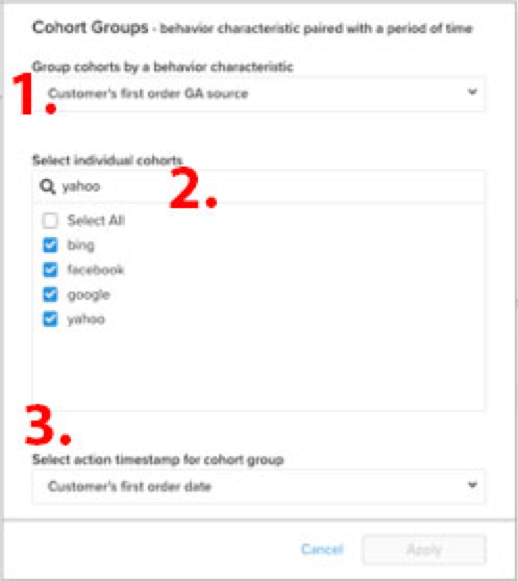

# [!DNL Cohort Report Builder] para cohortes no basadas en fechas

El [`Cohort Report Builder`](../dev-reports/cohort-rpt-bldr.md) es bueno en ayudar a los comerciantes a estudiar cómo se comportan los diferentes subconjuntos de usuarios con el paso del tiempo. En el pasado, la `Cohort Report Builder` se ha optimizado para agrupar usuarios por un `cohort date` (por ejemplo, el conjunto de todos los clientes que realizaron su primera compra en un mes determinado). El `Non-Date Based Cohort` Ahora, esta función le permite agrupar usuarios por una actividad o atributo similar. Consulte algunos casos de uso para esta función.

## Casos de uso

Esta no es una lista completa, pero aquí hay algunos análisis potenciales que se pueden lograr con esta función.

* Examen de los ingresos de los clientes adquiridos de [!DNL Google] frente [!DNL Facebook]
* Análisis de los clientes cuya primera compra se realizó en EE. UU. frente a Canadá
* Observar el comportamiento de los clientes adquiridos en varias campañas de publicidad

## Cómo crear el análisis

1. Clic **[!UICONTROL Report Builder]** en la pestaña izquierda o **[!UICONTROL Add Report** > **Create Report]** en cualquier tablero.

1. En el `Report Builder Selection` , haga clic en **[!UICONTROL Create Report]** junto al `Visual Report Builder` opción.

### Adición de una métrica

Ahora que está en la `Report Builder`A continuación, agregue la métrica en la que desea realizar el análisis (por ejemplo: `Revenue` o `Orders`).

>[!NOTE]
>
>Nativo [!DNL Google Analytics] Las métricas de no son compatibles con `Cohort Report Builder`. El objetivo de este ejemplo es observar los ingresos a lo largo del tiempo de los clientes de primer orden que se adquirieron a través de diferentes [!DNL Google Analytics] fuentes.

### Alternar `Metric View` hasta `Cohort`

Esto abre una nueva ventana en la que se pueden configurar los detalles del informe de cohorte.

Se necesitan cinco especificaciones para crear un informe de cohorte:

1. Cómo agrupar las cohortes
1. Selección de cohortes
1. Marca de tiempo de acción
1. Intervalo de tiempo de la primera acción de cohorte
1. Intervalo de tiempo después de la ocurrencia de cohorte

<!--{: width="200" height="224"}-->

#### 1. Agrupación `cohorts`

`Cohorts` se agrupan por una característica de comportamiento, en este ejemplo `Customer's first order GA source`. Las opciones disponibles aquí son columnas que ya están designadas como `groupable` para la métrica.

#### 2. Selección de cohortes

Puede mostrar todos los resultados de la característica determinada. Dado que esto puede dar lugar a muchos `cohorts`, puede seleccionar el específico `cohorts` (que corresponde a los distintos valores disponibles para `Customer's first order GA source`) que necesita.

<!--{: width="300" height="338"}-->

#### 3. `Action timestamp`

Esto le permite elegir una columna basada en fecha distinta a la columna en la que se crea la métrica. A continuación, se muestra cómo seleccionar el intervalo de tiempo que se aplica a un determinado `action timestamp`.

#### 4. `Cohort first action time range`

Aquí es donde se selecciona el intervalo de fechas que contiene la variable `cohorts action timestamp` (por lo tanto, clientes que tuvieron el primer pedido de noviembre de 2017 a octubre de 2018). Puede ser un intervalo de fecha móvil o un intervalo de fecha fijo.

#### 5. `Time range after cohort occurrence`

¿Desea ver el `cohorts` ¿con respecto al tiempo por mes, semana o año? Aquí es donde se realizan esas selecciones. Debajo de esa sección, debe seleccionar la opción `time range` después de `cohort action timestamp` ha ocurrido. Por ejemplo, esto muestra 12 meses de datos de los clientes que realizaron el primer pedido durante el intervalo de tiempo de acción.

<!--{: width="400" height="557"}-->

>[!NOTE]
>
>[!UICONTROL Filters] aplicados a las métricas permanecen intactos al alternar entre `Standard` y `Cohort` vistas.

### Relacionado

Consulte [`Perspectives`](../../data-analyst/dev-reports/cohort-rpt-bldr.md).
