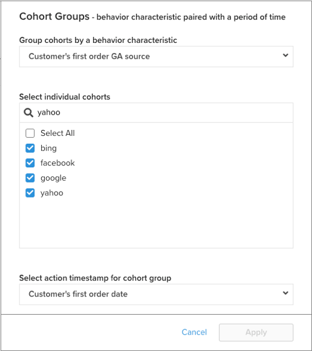

# [!DNL Cohort Report Builder] para cohortes no basadas en fecha

[`Cohort Report Builder`](../dev-reports/cohort-rpt-bldr.md) es ideal para ayudar a los comerciantes a estudiar cómo se comportan los distintos subconjuntos de usuarios a lo largo del tiempo. En el pasado, `Cohort Report Builder` se optimizaba para agrupar usuarios por un elemento común `cohort date` (por ejemplo, el conjunto de todos los clientes que realizaron su primera compra en un mes determinado). La característica `Non-Date Based Cohort` ahora le permite agrupar usuarios por una actividad o atributo similar. Consulte algunos casos de uso para esta función.

## Casos de uso

Esta no es una lista completa, pero aquí hay algunos análisis potenciales que se pueden lograr con esta función.

* Examinando los ingresos de los clientes adquiridos de [!DNL Google] frente a [!DNL Facebook]
* Análisis de los clientes cuya primera compra se realizó en EE. UU. frente a Canadá
* Observar el comportamiento de los clientes adquiridos en varias campañas de publicidad

## Cómo crear el análisis

1. Haga clic en **[!UICONTROL Report Builder]** en la ficha izquierda o en **[!UICONTROL Add Report** > **Create Report]** en cualquier panel.

1. En la pantalla `Report Builder Selection`, haga clic en **[!UICONTROL Create Report]** junto a la opción `Visual Report Builder`.

### Adición de una métrica

Ahora que se encuentra en `Report Builder`, agrega la métrica en la que desea realizar el análisis (por ejemplo: `Revenue` o `Orders`).

>[!NOTE]
>
>Las métricas nativas [!DNL Google Analytics] no son compatibles con `Cohort Report Builder`. El objetivo de este ejemplo es observar los ingresos a lo largo del tiempo de los clientes de primer pedido que se adquirieron a través de diferentes fuentes de [!DNL Google Analytics].

### Alternar `Metric View` a `Cohort`

Esto abre una nueva ventana en la que se pueden configurar los detalles del informe de cohorte.

Se necesitan cinco especificaciones para crear un informe de cohorte:

1. Cómo agrupar las cohortes
1. Selección de cohortes
1. Marca de tiempo de acción
1. Intervalo de tiempo de la primera acción de cohorte
1. Intervalo de tiempo después de la ocurrencia de cohorte

<!--{: width="200" height="224"}-->

#### &#x200B;1. Agrupación `cohorts`

`Cohorts` se agrupan por una característica de comportamiento, en este ejemplo `Customer's first order GA source`. Las opciones disponibles aquí son columnas que ya se han designado como `groupable` para la métrica.

#### &#x200B;2. Selección de cohortes

Puede mostrar todos los resultados de la característica determinada. Dado que esto puede generar muchos `cohorts`, puede seleccionar el `cohorts` específico (que corresponde a los distintos valores disponibles para `Customer's first order GA source`) que necesita.

<!--{: width="300" height="338"}-->

#### 3. `Action timestamp`

Esto le permite elegir una columna basada en fecha distinta a la columna en la que se crea la métrica. A continuación, observa cómo se selecciona el intervalo de tiempo que se aplica al(a) `action timestamp` dado(a).

#### 4. `Cohort first action time range`

Aquí es donde selecciona el intervalo de fechas que contiene `cohorts action timestamp` (por lo tanto, clientes que tuvieron el primer pedido de noviembre de 2017 a octubre de 2018). Puede ser un intervalo de fecha móvil o un intervalo de fecha fijo.

#### 5. `Time range after cohort occurrence`

¿Desea ver `cohorts` con respecto al tiempo por mes, semana o año? Aquí es donde se realizan esas selecciones. Debajo de esa sección, seleccionará `time range` después de que se produzca `cohort action timestamp`. Por ejemplo, esto muestra 12 meses de datos de los clientes que realizaron el primer pedido durante el intervalo de tiempo de acción.

<!--{: width="400" height="557"}-->

>[!NOTE]
>
>[!UICONTROL Filters] aplicados a sus métricas permanecen intactos cuando cambia entre `Standard` y `Cohort` vistas.

### Relacionado

Ver [`Perspectives`](../../data-analyst/dev-reports/cohort-rpt-bldr.md).
