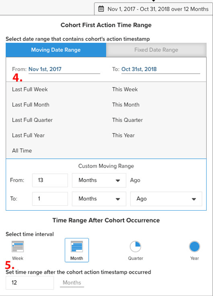

# `Cohort Report Builder for Non-Date-Based Cohorts`

Nuestra [`Cohort Report Builder`](../dev-reports/cohort-rpt-bldr.md) ha sido bueno en ayudar a los comerciantes a estudiar cómo se comportan los distintos subconjuntos de usuarios a lo largo del tiempo. En el pasado, la variable `Cohort Report Builder` se ha optimizado principalmente para agrupar usuarios por una `cohort date` (por ejemplo, el conjunto de todos los clientes que realizaron su primera compra en un mes determinado). La variable `Non-Date Based Cohort` ahora le da la capacidad de agrupar usuarios por una actividad o atributo similar. Eche un vistazo a algunos casos de uso de esta función.

## Casos de uso

Esta no es una lista completa, pero aquí hay algunos análisis potenciales que se pueden realizar con esta función:

* Examen de los ingresos de los clientes adquiridos de [!DNL Google] versus [!DNL Facebook]
* Análisis de clientes cuya primera compra se realizó en EE. UU. y Canadá
* Observar el comportamiento de los clientes adquiridos en diversas campañas publicitarias

## Cómo crear un análisis

1. Haga clic en **[!UICONTROL Report Builder]** en la pestaña izquierda o **[!UICONTROL Add Report** > **Create Report]** en cualquier tablero.

1. En el `Report Builder Selection` pantalla, haga clic en **[!UICONTROL Create Report]** junto a la variable `Visual Report Builder` .

### Adición de una métrica

Ahora que estamos en el `Report Builder`, agregamos la métrica en la que queremos realizar el análisis (ejemplo: `Revenue` o `Orders`).

>[!NOTE]
>
>Nativo [!DNL Google Analytics] las métricas no son compatibles con `Cohort Report Builder`. Nuestro objetivo para este ejemplo es ver los ingresos a lo largo del tiempo para los clientes de primer pedido que fueron adquiridos a través de diferentes fuentes de GA.

### Alternar `Metric View` a `Cohort`

Esto abre una nueva ventana en la que se pueden configurar los detalles del informe de cohorte.

Se necesitan cinco especificaciones para crear un informe de cohorte:

1. Agrupación de cohortes
1. Selección de cohortes
1. Marca de tiempo de la acción
1. Intervalo de tiempo de la primera acción de cohorte
1. Intervalo de tiempo después de la incidencia de cohorte

{: width=&quot;200&quot; height=&quot;224&quot;}

{: width=&quot;400&quot; height=&quot;554&quot;}

#### 1. Agrupación `cohorts`

`Cohorts` se agrupan por una característica de comportamiento, en este ejemplo `Customer's first order GA source`. Tenga en cuenta que las opciones disponibles aquí son columnas que ya están designadas como `groupable` para la métrica.

#### 2. Selección de cohortes

Tiene la opción de mostrar todos los resultados de una característica determinada. Dado que esto puede resultar en un gran número de `cohorts`, puede seleccionar el `cohorts` (que corresponde a los distintos valores disponibles para `Customer's first order GA source`) que necesite.

<!--{: width="300" height="338"}-->

#### 3. `Action timestamp`

Esto le permitirá elegir una columna basada en datos que no sea la columna en la que se crea la métrica. A continuación, analizamos la selección del intervalo de tiempo que se aplica al `action timestamp`.

#### 4. `Cohort first action time range`

Aquí es donde seleccionará el intervalo de fechas que contiene la variable `cohorts action timestamp` (por lo tanto, clientes que tuvieron el primer pedido de noviembre de 2017 a octubre de 2018). Puede ser un intervalo de fechas móvil o un intervalo de fechas fijo.

#### 5. `Time range after cohort occurrence`

¿Desea ver la variable `cohorts` con el tiempo, mes, semana o año? Aquí es donde hará esas selecciones. Debajo de esa sección, seleccione la variable `time range` después del `cohort action timestamp` se ha producido. Por ejemplo, esto le mostrará doce meses de datos para los clientes que realizaron el primer pedido durante el intervalo de tiempo de la acción.

<!--{: width="400" height="557"}-->

### Otras notas

* [!UICONTROL Filters]: aplicadas a sus métricas permanecerán intactas cuando alterne entre `Standard` y `Cohort` vistas
* Consulte [`Perspectives`](../../data-analyst/dev-reports/cohort-rpt-bldr.md).
