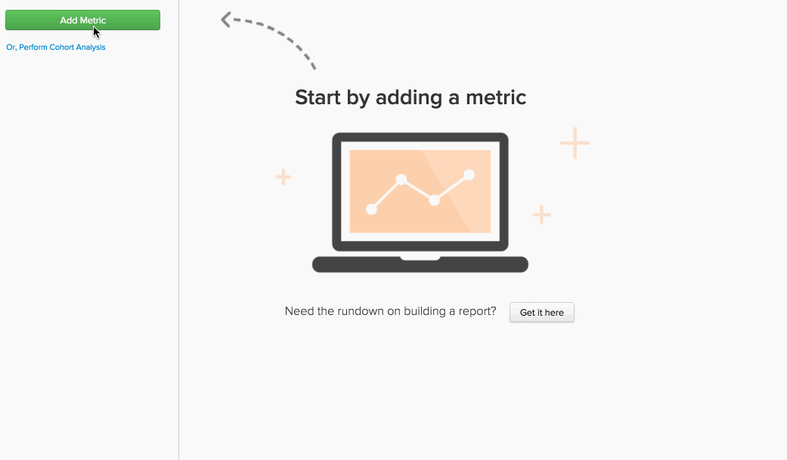

# Fórmulas en `Report Builder`

En [`Report Builder`](../../tutorials/using-visual-report-builder.md), puede crear visualizaciones útiles usando las [métricas definidas](../../data-user/reports/ess-manage-data-metrics.md) de su cuenta. La combinación de estas métricas en una fórmula le permite obtener información adicional de los datos. Este tema explora cómo se pueden utilizar las fórmulas en `Report Builder`: ¡vamos a saltar!

## ¿Qué es un `formula`? {#what}

En `Report Builder`, un `formula` es solo una combinación de una o más métricas basadas en alguna lógica matemática. Un ejemplo típico tiene este aspecto:

En este ejemplo, utilizas un `Number of orders metric (A)` y un `Distinct buyers metric (B)`, y el objetivo es responder a la pregunta: ¿cuál es el número promedio de pedidos que mis compradores realizan cada mes? Los parámetros de la fórmula son:

* `Definition`: aquí se aplican cálculos matemáticos a las métricas de entrada. En este ejemplo, dividir el número de pedidos por el número de compradores diferentes nos indica el número promedio de pedidos. Por lo tanto, la definición es (A/B).

* `Format`: ¿Su fórmula devuelve un número, un período de tiempo o una cantidad de moneda? Junto a la definición de la fórmula hay una lista desplegable, que puede utilizar para especificar el formato de la devolución. En este caso, es un número.

* `Miscellaneous`: las métricas de entrada heredan la marca de tiempo, las agrupaciones, las perspectivas y los filtros de la fórmula. ¡Aquí no hay nada que hacer!

## ¿Cómo puedo usar `formulas` en mis informes? {#how}

Ahora que ha cubierto los conceptos básicos, vea algunos ejemplos.

### Ejemplo: quiero averiguar qué porcentaje de mis ingresos se puede atribuir a pedidos que se realizaron por primera vez.

En este ejemplo, utilizó las métricas `Revenue` y `Revenue (first time orders)`. Si divide la métrica `Revenue (first time orders)(B)` entre `Revenue metric (A)` y establece el formato de devolución en `Percent`, puede encontrar el porcentaje de ingresos que se pueden atribuir a los pedidos que se realizaron por primera vez.

### Ejemplo: quiero saber cuál es el promedio de ingresos por pedido cuando ofrezco y no ofrezco `promo code`.

En este ejemplo, utilizó las métricas `Revenue` y `Number of orders`. La respuesta a esta pregunta implica dos pasos: dividir `Revenue (A)` por `Number of orders (B)` y establecer el formato devuelto en `Currency`. A continuación, solo permitió que se mostrara el resultado de la fórmula (`Avg. Revenue per order`) y agrupó los resultados por `Promo code`.

### Ejemplo: quiero saber la distribución de las fuentes de UTM de mis nuevos clientes.

Encontrar la respuesta a esta pregunta implica algunos pasos:

1. Primero agregó la métrica `New Customers` y después agrupó por `utm_source - all`. Esta es la métrica `A` o `New Customers (grouped)`.

1. A continuación, duplicó la métrica `New Customers (grouped)` y la configuró para usar una dimensión independiente. La métrica `B` - `New customers (ungrouped)` - muestra la cantidad total de clientes nuevos.

1. Después de ocultar ambas métricas, estableció la definición de la fórmula en `A/B`. Esto divide a `New customers (grouped)` entre `New Customers (ungrouped)`.

1. A continuación, establezca el formato de resultados en `Percent`.

En este ejemplo, utilizó la perspectiva `Stacked Columns` para mostrar los resultados por mes. Esto nos permite comparar la distribución de nuevos clientes mes a mes.

## Ajuste {#wrapup}

¿Ha notado en los ejemplos anteriores que `timestamp`, `groupings`, `perspectives` y `filters` de la fórmula se heredan de sus métricas de entrada? Tenga en cuenta que las fórmulas se pueden usar para usar `perspectives` y [opciones de tiempo independientes](../../tutorials/time-options-visual-rpt-bldr.md){: target=&quot;_blank&quot;}, al igual que las métricas.

Si tiene alguna pregunta adicional acerca del uso de fórmulas en `Report Builder`, [póngase en contacto con el soporte técnico](https://experienceleague.adobe.com/docs/commerce-knowledge-base/kb/troubleshooting/miscellaneous/mbi-service-policies.html).
