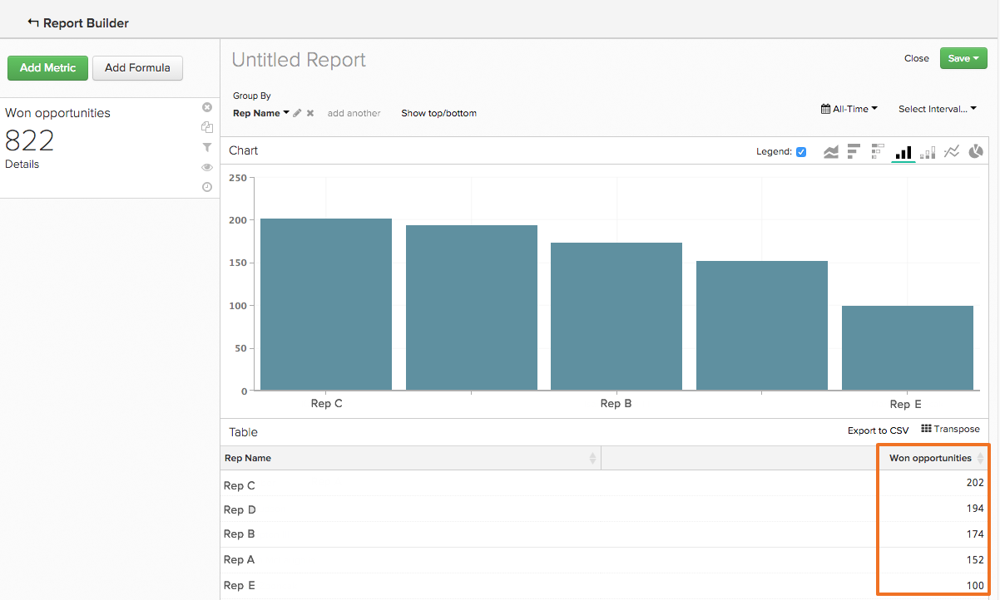

# Ordenando datos con la característica `Show Top/Bottom`

Puede hacer más en `Visual Report Builder` que crear análisis que reflejen la tendencia a lo largo del tiempo. Por ejemplo, puede crear un informe para mostrar el valor de sus canales de adquisición y marketing, pero también puede crear un informe que muestre solo los cinco principales ejecutantes. Del mismo modo, puede reenfocar sus esfuerzos de marketing creando un informe que le muestre qué estados generan la mayor cantidad de ingresos.

Este tipo de ordenación y ordenación de datos se puede realizar en informes que utilizan `Group By` y `Time Interval of None`. Cuando ambos elementos están en un informe, la característica `Show Top/Bottom` se muestra encima de la vista previa del gráfico. Esta función le permite ver los puntos de datos superiores (de mayor a menor) e inferiores (de menor a mayor) en función de los parámetros configurados.

## ¿Cómo se usa esto? {#how}

Haga clic en **[!UICONTROL Show Top/Bottom link]** para establecer los parámetros de visualización y ordenación. El número del cuadro de texto puede ser un número entero (como `5`) o `ALL`. A continuación, puede elegir ordenar el informe por la métrica O por la agrupación.

Por ejemplo, si desea mostrar las cinco fuentes de referencia que generaron la mayor cantidad de ingresos, así es como lo hace:

1. Agregue la métrica `Revenue` al informe.

1. Agregue `Group By` para segmentar la métrica por origen de referencia.

1. Establezca `Time Interval` en `None`.

1. En la configuración de `Show Top/Bottom`, establezca la pantalla en `5` de modo que solo se incluyan en el informe los orígenes de referencia con las cinco principales cantidades totales de ingresos.

>[!NOTE]
>
>Dado que el informe no tiene un `Time Interval`, los valores (en este caso, los cinco orígenes de referencia principales) pueden cambiar con el tiempo. Si un origen de referencia supera a otro en términos de ingresos, cambia el orden en que se muestran los orígenes.

## ¿Qué sucede si se usan varias métricas? {#multiplemetrics}

El uso de esta función se complica cuando hay más de una métrica en un informe, porque cada métrica solo se puede ordenar por sí misma o por una de las agrupaciones.

Supongamos que ha creado un informe con las métricas `Revenue` y `Number of orders`, agrupadas por origen de referencia. `Revenue` solo se puede ordenar por `Revenue` o por el origen de referencia, y `Number of orders` solo se puede ordenar por `Number of orders` o el origen de referencia.

Esto significa que, aunque puede mostrar `Revenue` únicamente a partir de los `5` orígenes de referencia que generan ingresos principales, no puede mostrar el número de pedidos también a partir de los `5` orígenes de referencia que generan ingresos principales. En pocas palabras: cuando hay varias métricas, la mejor opción es ordenar cada métrica por la agrupación.

A continuación se muestra un ejemplo de un gráfico que ordenó la métrica `Revenue` por sí sola en lugar de por la agrupación. Como puede ver, al no ordenar la métrica por la agrupación, se creó un informe extraño (y, en última instancia, poco útil):

Si hubiera ordenado ambas métricas por la agrupación, el gráfico tendría este aspecto:

## ¿Cómo se ordenan los valores de forma predeterminada? {#defaultsorting}

Cuando solo se incluye una métrica en un informe con un `Group by` y un `Time Interval` de `None`, el orden predeterminado en el `Visual Report Builder` es mostrar los valores principales basados en la métrica. En este caso, la característica `Show Top/Bottom` puede no ser necesaria si satisface sus necesidades.

En este ejemplo se muestra cuántas oportunidades han cerrado sus representantes de ventas. Esta tabla se ordena automáticamente de mayor a menor según la métrica, en este caso `Won Opportunities`.

Sin embargo, cuando se agrega una segunda métrica, el valor predeterminado es ordenar la parte superior en función de la agrupación. A medida que se agregan métricas y agrupaciones, la ordenación predeterminada se basa en la primera agrupación, luego la segunda agrupación, etc.

## Ajuste {#wrapup}

Aunque algunas funciones básicas se tratan aquí, esta función tiene muchos usos interesantes.

Piense en el ejemplo anterior del representante de ventas y las oportunidades. Eliminar `Time Interval`, aplicar un `Group By` y ordenar los datos en función de la agrupación nos permitió obtener una imagen detallada del número de oportunidades ganadas de cada representante. Además, el uso de la característica `Show Top/Bottom` nos permite descubrir quiénes tienen el mejor rendimiento.
