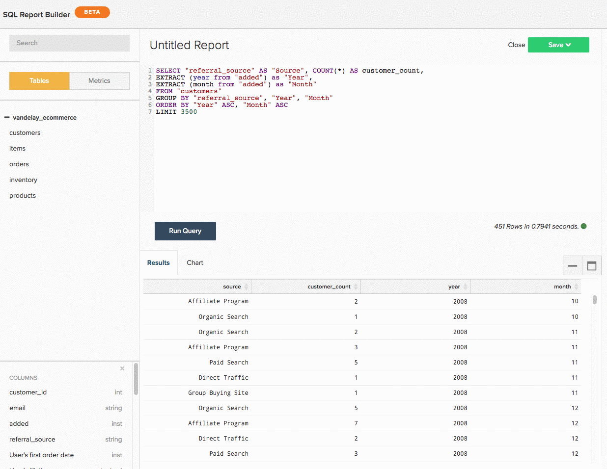

# Uso `SQL Report Builder`

>[!NOTE]
>
>Requiere [Permisos de administrador](../../administrator/user-management/user-management.md) para crear y editar gráficos SQL. `Standard` los usuarios pueden reorganizar estos gráficos en tableros, y `Read-only` los usuarios tendrán la misma experiencia que tienen con los gráficos tradicionales. Además, `Read-only` los usuarios no tienen acceso al texto de la consulta.

Consulte nuestra [vídeo de formación](https://support.magento.com/hc/en-us/articles/360016730131) para obtener más información.

`SQL`, o Lenguaje de consulta estructurado, es un lenguaje de programación utilizado para comunicarse con bases de datos. En [!DNL MBI], SQL se utiliza para consultar o recuperar datos del almacén de datos. Eche un vistazo a los informes de su tablero: entre bastidores, cada uno de ellos cuenta con la tecnología de una consulta SQL.

Puede usar la variable [`SQL Report Builder`](../dev-reports/sql-rpt-bldr.md) para consultar directamente el almacén de datos, vea los resultados y transformarlos en un gráfico. Puede empezar a crear un informe con la variable `SQL Report Builder` navegando a **[!UICONTROL Report Builder** > **SQL Report Builder]**.

Consulte nuestra [vídeo de formación](https://support.magento.com/hc/en-us/articles/360016730131-Training-Video-SQL-Report-Builder) para obtener más información.

La variable `SQL Report Builder` permite consultar directamente el almacén de datos, ver los resultados y transformarlos rápidamente en un gráfico. Lo mejor de usar SQL para generar informes es que [no es necesario esperar en los ciclos de actualización para iterar en las columnas](https://support.magento.com/hc/en-us/articles/360016506212) cree. Si los resultados no parecen correctos, puede editar y volver a ejecutar la consulta rápidamente hasta que las cosas coincidan con sus expectativas.

En este artículo, le explicamos cómo usar la variable `SQL Report Builder`. Una vez que sepa cómo moverse, consulte nuestro tutorial de SQL para visualizaciones o intente optimizar algunas de las consultas que ha escrito.

A continuación se muestra una descripción general de lo que cubrimos en este artículo:

1. [Escritura de una consulta](#writing)

1. [Ejecución de la consulta y visualización de resultados](#runquery)

1. [Creación de una visualización](#createviz)

1. [Guardar el informe](#save)

## Integraciones del Report Builder SQL

En el estado actual del mundo, [[!DNL Google Analytics]](../importing-data/integrations/google-analytics.md) es la única integración no disponible para usar con la variable [`SQL Report Builder`](../dev-reports/sql-rpt-bldr.md). Estamos trabajando para incluir esta funcionalidad en una versión posterior.

Para empezar a crear un nuevo informe SQL, haga clic en **[!UICONTROL Report Builder]** o **[!UICONTROL Add Report]** en la parte superior de cualquier tablero. En el `Report Picker` pantalla, haga clic en **[!UICONTROL SQL Report Builder]** para abrir el editor SQL.

## Introducción

Para editar un informe, haga clic en el engranaje () en la esquina superior derecha de un gráfico basado en SQL y haga clic en **[!UICONTROL Edit]**.

## Escritura de una consulta {#writing}

>[!NOTE]
>
>`SQL Report Builder` las consultas distinguen entre mayúsculas y minúsculas. Asegúrese de que está utilizando las mayúsculas y minúsculas correctas al escribir consultas o podría acabar con resultados o errores inesperados.

A continuación se muestra la [directrices para la optimización de consultas](../../best-practices/optimizing-your-sql-queries.md), escriba una consulta en el editor SQL.

>[!IMPORTANT]
>
>**Métricas en informes SQL** - Cuando inserta una métrica en un informe SQL, la variable `current definition` de la métrica.

Si la métrica se actualiza en el futuro, el informe SQL *will not* reflejan los cambios. Para que los cambios surtan efecto, deberá editar manualmente el informe.

Con los botones de la parte superior de la barra lateral, puede alternar entre listas de tablas y métricas disponibles para usar en la variable `SQL Report Builder`. Si no ve lo que está buscando en la lista, pruebe a buscarlo usando la barra de búsqueda situada en la parte superior de la barra lateral.

También puede utilizar la barra lateral del editor SQL para insertar métricas, tablas y columnas directamente en las consultas pasando el cursor sobre ellas y haciendo clic en **[!UICONTROL Insert]**:

>[!NOTE]
>
>Cualquiera [SELECT, función](https://www.postgresql.org/docs/9.5/sql-select.html#SQL-SELECT-LIST), o cualquier función que no mute datos, que sea compatible con PostgreSQL, se admitirá en el Report Builder SQL. Esto incluye, entre otros, AVG, COUNT, COUNT DISTINCT, MIN/MAX y SUM.

Además, se admite cualquier tipo JOIN, pero recomendamos utilizar INNER JOIN solamente porque es el menos caro de los tipos JOIN.

## Ejecución de la consulta y visualización de resultados {#runquery}

Cuando haya terminado de escribir la consulta, haga clic en **[!UICONTROL Run Query]**. Los resultados se muestran en una tabla debajo del editor SQL:

Si hay algo mal en los resultados, puede editar la consulta y volver a ejecutarla hasta que esté satisfecho.

A veces puede ver [mensajes debajo del editor con EXPLAIN en ellos](../../best-practices/optimizing-your-sql-queries.md). Si ve uno de estos, significa que la consulta no se ha ejecutado y necesita un poco de ajuste.

Cuando haya terminado de editar la consulta, puede pasar a crear una visualización o guardar el trabajo en un tablero.

## Creación de una visualización {#createviz}

Para crear una visualización con los resultados de la consulta, haga clic en el botón **[!UICONTROL Chart]** en la ficha `Results` panel. En esta pestaña, seleccione:

* La variable `Series`o la columna que desee medir, por ejemplo, **Artículos vendidos**.
* La variable `Category`o la columna que desee utilizar para segmentar los datos, como **fuente de adquisición**.
* La variable `Labels`, o valores del eje X.

A continuación se muestra un breve vistazo al aspecto del proceso de visualización:

Para obtener una descripción detallada sobre cómo crear una visualización, consulte nuestra [Tutorial Creación de visualizaciones a partir de consultas SQL](../../tutorials/create-visuals-from-sql.md){: target=&quot;_blank&quot;}.

## Guardar el informe {#save}

Para poder guardar el trabajo, debe dar un nombre al informe. Recuerde seguir el [directrices de prácticas recomendadas para la asignación de nombres](../../best-practices/naming-elements.md){: target=&quot;_blank&quot;} y elija algo que transmita claramente lo que es el informe.

Haga clic en **[!UICONTROL Save]** en la esquina superior derecha del editor SQL y seleccione el informe `Type` (`Chart` o `Table`). Para finalizar, seleccione el tablero en el que desea guardar el informe y haga clic en **[!UICONTROL Save to Dashboard]**.

### Analizar los datos

#### `SQL Report Builder`

[`The SQL Report Builder`](../dev-reports/sql-rpt-bldr.md) le permite consultar directamente el almacén de datos, ver los resultados y transformarlos rápidamente en un informe. El uso de SQL también le permite [para utilizar funciones SQL que no están disponibles](https://docs.aws.amazon.com/redshift/latest/dg/c_SQL_functions.html) en el `Visual` o `Cohort` Report Builder, lo que le proporciona un bueno control sobre sus datos.

Nos gustaría mencionar que las columnas calculadas creadas con SQL no dependen de los ciclos de actualización, lo que significa que puede iterar en ellas a su gusto y ver los resultados inmediatamente.

>[!NOTE]
>
>Esto solo se aplica a la estructura de la columna, no a la actualización de los datos. Los datos nuevos siguen dependiendo de los ciclos de actualización completados correctamente.

| **Esto es perfecto para...** | **Esto no es tan bueno para...** |
|---|---|
| Analistas intermedios/avanzados | Principiantes: necesita conocer SQL. |
| La experiencia SQL | Análisis simples: escribir una consulta puede ser más eficaz que simplemente usar el Report Builder visual. |
| Creación de columnas calculadas de un solo uso | Compartir con otros: considere su audiencia: ¿entienden SQL? Si no es así, pueden confundirse con la forma en que se crea el informe. |
| Datos con `one-to-many` relaciones |  |
| Prueba de una nueva columna o análisis |  |

#### Resultados de base de datos frente a editor SQL

La mayoría de las veces, las diferencias en los resultados pueden atribuirse a los ciclos de actualización. If [!DNL MBI] está en proceso de replicar datos de la base de datos en la Data Warehouse, puede que vea resultados diferentes incluso cuando utilice la misma consulta.

Los problemas de conexión también pueden provocar discrepancias. Vaya a la `Connections` página haciendo clic en **[!DNL Manage Data** > **Connections]**) para comprobarlo: ¿hay algún error para la integración de la base de datos en cuestión? Si es así, es posible que tenga que [volver a autenticar la integración](https://support.magento.com/hc/en-us/articles/360016733151-Reauthenticating-integrations) para que las cosas vuelvan a funcionar.

Si todas las integraciones están conectadas correctamente y no se encuentra en medio de un ciclo de actualización, puede que falte algo más. Intente usar la variable [guías de solución de discrepancias de datos](https://support.magento.com/hc/en-us/sections/360003074492) en nuestro sitio de asistencia para identificar el problema.

#### ¿Al eliminar un informe SQL también se eliminan las columnas subyacentes de mi Data Warehouse?

No, no perderá ninguna columna de la Data Warehouse, independientemente de cómo las haya creado.

Columnas creadas con `Data Warehouse Manager` no se verá afectado si elimina un informe o una consulta que los utilice.

Columnas creadas con `SQL Report Builder` no se guardan en la Data Warehouse.

#### `Report Builder` versus `SQL Report Builder`

La variable `SQL Report Builder` le proporciona más flexibilidad a la hora de crear y estructurar los gráficos. Por ejemplo, puede seleccionar qué valores deben mostrarse en la `X` y `Y` ejes. Para obtener más información sobre la creación de gráficos en la variable `SQL Report Builder`, consulte nuestra [Creación de visualizaciones a partir de consultas SQL](../../tutorials/create-visuals-from-sql.md) tutorial.

#### `Cohort Report Builder` {#cohortrb}

A diferencia de `Visual Report Builder`, el [`Cohort Report Builder`](../dev-reports/cohort-rpt-bldr.md) está diseñado para un único propósito: analizar e identificar las tendencias de comportamiento de grupos de usuarios similares a lo largo del tiempo. El uso del Report Builder de cohorte no requiere ningún conocimiento de SQL, por lo que puede sumergirse directamente sin vacilar si acaba de empezar.

| **Esto es perfecto para...** | **Esto no es tan bueno para...** |
|---|---|
| Analistas intermedios/avanzados | Principiantes : es necesario practicar la definición de cohortes. |
| Identificación de tendencias de comportamiento a lo largo del tiempo | Análisis cualitativo: puede ser [done](../dev-reports/create-qual-cohort-analysis.md), pero requiere nuestra asistencia. |

## Reconstrucción de consultas después del ciclo de actualización

No es necesario reconstruir las consultas. Informes creados con [`SQL Report Builder`](../dev-reports/sql-rpt-bldr.md) se guardan como los creados en la `Report Builder`. El proceso de actualización de los gráficos SQL es exactamente el mismo: una vez actualizados los datos, los valores de los gráficos se vuelven a calcular y volver a mostrar.

>[!NOTE]
>
>Al eliminar un informe/consulta SQL, no se eliminan las columnas subyacentes de la Data Warehouse. No perderá ninguna columna, independientemente de cómo las haya creado.

* Las columnas creadas con el Administrador de Datas Warehouse no se verán afectadas si elimina un informe o consulta que las utilice.

* Las columnas creadas con el Report Builder SQL no se guardan en la Data Warehouse.

## Ajuste {#wrapup}

Si desea probar algo un poco más desafiante, ¿por qué no intentar escribir una consulta optimizada para la visualización? Consulte nuestra [Tutorial Creación de visualizaciones a partir de consultas SQL](../../tutorials/create-visuals-from-sql.md){: target=&quot;_blank&quot;} para empezar.
