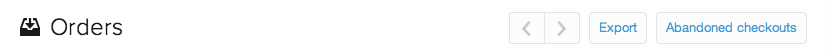

# Importar datos de [!DNL CJ Affiliate]

Para importar datos de [!DNL CJ Affiliate (Commission Junction)] en [!DNL Adobe Commerce Intelligence], simplemente siga los pasos a continuación y adjunte el archivo resultante a un [ticket de asistencia](https://experienceleague.adobe.com/docs/commerce-knowledge-base/kb/troubleshooting/miscellaneous/mbi-service-policies.html?lang=es). Adobe configurará la tabla de datos en su cuenta y le permitirá continuar cargando datos de forma independiente.

## Exportar [!DNL CJ Affiliate] datos

1. En su cuenta de [!DNL CJ Affiliate], vaya a la pestaña `Reports`.

1. En la ficha `Performance`, seleccione `Report Options`.

1. Establezca `Performance By` igual a `Program`, `Trend` igual a `Daily` y `Date Range` igual al intervalo de fechas que se está auditando.

   <!--{:.zoom}-->

1. Seleccione `Run Report`.

1. En el menú desplegable `File Format`, seleccione `CSV`.  Haga clic en **[!UICONTROL Download]**.

   <!--{:.zoom}-->

1. Una vez que hayas descargado el archivo, puedes [cargar el archivo](../connecting-data/using-file-uploader.md) en tu Data Warehouse [!DNL Commerce Intelligence].

   Esto crea una tabla en su Data Warehouse [!DNL Commerce Intelligence] en la cual puede continuar cargando datos nuevos periódicamente. Al cargar el archivo, siga los requisitos de formato enumerados en [Uso del cargador de archivos](../connecting-data/using-file-uploader.md).
