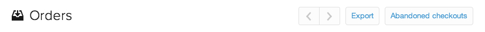

# Importar `CJ Affiliate` data

Para importar `CJ Affiliate` (unión de la Comisión) a [!DNL MBI], simplemente siga los pasos a continuación y adjunte el archivo resultante a un ticket de asistencia. Configuraremos la tabla de datos en su cuenta y le permitiremos seguir cargando datos de forma independiente.

## Exportar `CJ Affiliate` Datos

1. En `CJ Affiliate` , vaya a la `Reports` pestaña .

1. En el `Performance` , seleccione `Report Options`.

1. Establezca `Performance By` igual a `Program`, `Trend` igual a `Daily`y `Date Range` igual al intervalo de fechas que se va a auditar.

   <!--{:.zoom}-->

1. Select `Run Report`.

1. En el `File Format` menú desplegable, seleccione `CSV`.  Haga clic en **[!UICONTROL Download]**.

   <!--{:.zoom}-->

1. Una vez descargado el archivo, puede [cargar el archivo](../connecting-data/using-file-uploader.md) a su [!DNL MBI] almacén de datos.

   Esto crea una nueva tabla en el [!DNL MBI] almacén de datos en el que se pueden seguir cargando datos nuevos periódicamente. Al cargar el archivo, asegúrese de seguir los requisitos de formato enumerados en [Uso del cargador de archivos](../connecting-data/using-file-uploader.md).
