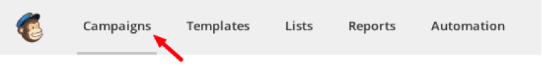
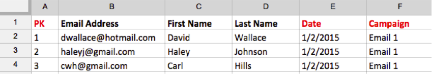

# Importar datos de [!DNL Mailchimp]

Para obtener una imagen completa de sus campañas, puede importar los datos de su campaña de correo electrónico [!DNL Mailchimp] en [!DNL Commerce Intelligence]. Para completar la importación, debe hacer lo siguiente para cada campaña de [!DNL Mailchimp] que tenga:

## Exportar Datos de aperturas {#opens}

1. Después de iniciar sesión en [!DNL Mailchimp], vaya a la ficha `Campaigns`.

   

1. Haga clic en **[!UICONTROL View Report]**, junto al nombre de la campaña.

   

1. Haga clic en el número **[!UICONTROL Opened]**.

   

1. Haga clic en **[!UICONTROL Export]** y guarde el archivo `.csv`.

   Debe agregar `primary key`, `date (mm/dd/yyyy)` y `campaign name` columnas a este archivo. Asegúrese de que `primary keys` sean únicos para cada fila.

   

## Exportar datos de clics {#clicks}

1. Vuelva a la pantalla `View Report` de la campaña.

1. Haga clic en el número que `Clicked`.

   

1. Haga clic en el número de la columna `Total Clicks` O `Unique Clicks`.

   

1. Haga clic en **[!UICONTROL Export]** y guarde el archivo `.csv`.

   Debe agregar `Primary Key`, `date (mm/dd/yyyy)`, `campaign name` y `URL` columnas a este archivo. No es necesario que añada la dirección URL completa, sino que es algo que le permite saber en qué se hizo clic.

   

1. Repita los pasos 3 y 4 para cada URL donde hizo clic en el correo electrónico, combinando todos los datos en el mismo archivo de `.csv` cuando termine.

## Exportar datos enviados {#sent}

1. Vaya a la ficha `Campaigns` de [!DNL Mailchimp].

1. Haga clic en **[!UICONTROL View Report]** junto al nombre de la campaña.

1. Haga clic en el número que aparece junto a `Recipients`.

   

1. Haga clic en **[!UICONTROL Export]** y guarde el archivo `.csv`.

   Debe agregar `Primary Key`, `date (mm/dd/yyyy)` y `campaign name` columnas a este archivo.

   

## Preparar archivos para cargar en [!DNL Commerce Intelligence] {#upload}

Cada archivo - `Opens`, `Clicks` y `Sent` - debe cargarse en [!DNL Commerce Intelligence] como un archivo independiente. Adobe recomienda asignar un nombre a los archivos con esta convención de nombres: `MailChimp\_ACTION\_DATE`. Reemplazar `ACTION` por `Open`, `Click` o `Sent`, y reemplazar `DATE` con la fecha de exportación.

Cuando esté listo para cargar los archivos, use la característica [`File Upload` &#x200B;](../connecting-data/using-file-uploader.md) para llevar los datos a su Data Warehouse.
