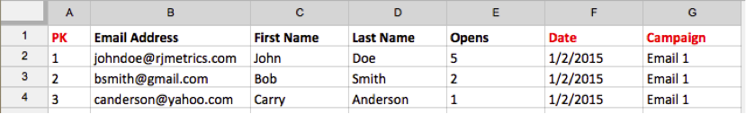

# Importar [!DNL Mailchimp] datos

Para obtener una imagen completa de sus esfuerzos de campaña, puede importar su [!DNL Mailchimp] enviar datos de campaña por correo electrónico a [!DNL Commerce Intelligence]. Para completar la importación, debe hacer lo siguiente para cada [!DNL Mailchimp] campaña que tiene:

## Exportar Datos de aperturas {#opens}

1. Después de iniciar sesión en [!DNL Mailchimp], vaya a la `Campaigns` pestaña.

   

1. Clic **[!UICONTROL View Report]**, junto al nombre de la campaña.

   

1. Haga clic en **[!UICONTROL Opened]** número.

   

1. Clic **[!UICONTROL Export]** y guarde el `.csv` archivo.

   Debe añadir `primary key`, `date (mm/dd/yyyy)`, y `campaign name` columnas a este archivo. Asegúrese de que la `primary keys` son únicos para cada fila.

   

## Exportar datos de clics {#clicks}

1. Vaya de nuevo a `View Report` para la campaña.

1. Haga clic en el número que `Clicked`.

   

1. Haga clic en el número situado debajo de `Total Clicks` O `Unique Clicks` columna.

   

1. Clic **[!UICONTROL Export]** y guarde el `.csv` archivo.

   Debe añadir `Primary Key`, `date (mm/dd/yyyy)`, `campaign name`, y `URL` columnas a este archivo. No es necesario que añada la dirección URL completa, sino que es algo que le permite saber en qué se hizo clic.

   

1. Repita los pasos 3 y 4 para cada URL en la que hizo clic en el correo electrónico, combinando todos los datos en el mismo `.csv` cuando termine.

## Exportar datos enviados {#sent}

1. Vaya a la `Campaigns` pestaña de [!DNL Mailchimp].

1. Clic **[!UICONTROL View Report]** junto al nombre de la campaña.

1. Haga clic en el número situado junto a `Recipients`.

   

1. Clic **[!UICONTROL Export]** y guarde el `.csv` archivo.

   Debe añadir `Primary Key`, `date (mm/dd/yyyy)`, y `campaign name` columnas a este archivo.

   

## Preparar archivos para cargarlos en [!DNL Commerce Intelligence] {#upload}

Cada archivo - `Opens`, `Clicks`, y `Sent` - debe cargarse en [!DNL Commerce Intelligence] como archivo independiente. El Adobe recomienda asignar un nombre a los archivos mediante esta convención de nombres: `MailChimp\_ACTION\_DATE`. Reemplazar `ACTION` con `Open`, `Click`, o `Sent`y reemplace `DATE` con la fecha de exportación.

Cuando esté listo para cargar los archivos, utilice el [`File Upload` característica](../connecting-data/using-file-uploader.md) para introducir los datos en la Data Warehouse.
