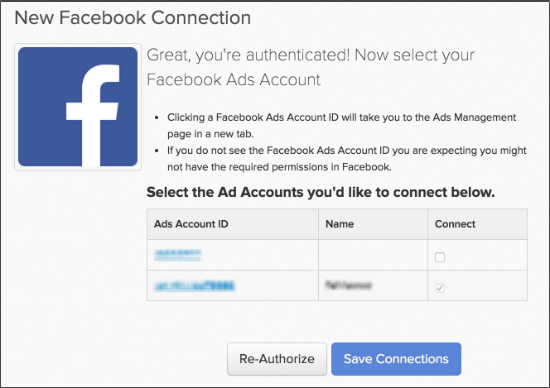

# Conectar [!DNL Facebook Ads]

>[!NOTE]
>
>Requiere [permisos de administrador](../../../administrator/user-management/user-management.md).

Usted hizo su investigación, creó sus anuncios, inició su campaña el [!DNL Facebook]. Ahora es el momento de analizar los datos de gasto en publicidad y ver si el dinero se está gastando de forma eficaz. Con los datos de gasto en publicidad, puede [medir el retorno de la inversión de la campaña combinando el costo de publicidad con el valor de duración del cliente (CLV)](../../../data-analyst/analysis/roi-ad-camp.md) de los usuarios adquiridos de sus campañas.

Conectar los datos de [!DNL Facebook Ad] a [!DNL Commerce Intelligence] es un proceso sencillo de tres pasos:

1. [Agregar  [!DNL Facebook] como origen de datos en [!DNL Commerce Intelligence]](#stepone)
1. [Permitir  [!DNL Commerce Intelligence] acceso a tus [!DNL Facebook Ads] datos](#steptwo)
1. [Seleccionar [!DNL Facebook Ads] cuentas para extraer datos](#stepthree)

## Agregar [!DNL Facebook] como origen de datos en [!DNL Commerce Intelligence] {#stepone}

1. Para agregar la integración de [!DNL Facebook] a su cuenta de [!DNL Commerce Intelligence], vaya a la página de `Connections` en **[!UICONTROL Manage Data** > **Integrations]**.
1. Haga clic en **[!UICONTROL Add Integration]**, ubicado a la derecha.
1. Haga clic en el icono [!DNL Facebook]. Esto muestra la página de autorización [!DNL Facebook].
1. Haga clic en **[!UICONTROL Authorize]**.

## Permitir que [!DNL Commerce Intelligence] acceda a sus datos de [!DNL Facebook Ads] {#steptwo}

Después de hacer clic en **[!DNL Facebook Authorize]**, aparecerá una pequeña ventana emergente:

Sigue una serie de pasos para permitir que [!DNL Commerce Intelligence] tenga acceso a los datos de su perfil público, [!DNL Facebook Ads] y estadísticas relacionadas. Haga clic **[!UICONTROL OK]** en estos pasos para continuar.

## Seleccionar [!DNL Facebook Ads] cuentas para extraer datos {#stepthree}

1. Una vez completada la autenticación, se le pedirá que seleccione las [!DNL Facebook Ads] cuentas de las que desee extraer datos. Seleccione las cuentas que desee haciendo clic en la casilla de verificación de la columna `Connect`.

   

1. Haga clic en **[!UICONTROL Save Connections]**.

   Si la conexión se ha realizado correctamente, se ha realizado correctamente una conexión de *.* mensaje se muestra en la parte superior de la página.

## ¿Cuál es el siguiente paso? {#next}

Asegúrese de realizar el seguimiento de [!DNL Facebook] campañas en [!DNL Google Analytics]. Esto garantiza que el campo `utm\_campaign` de [!DNL Google Analytics] se rellene correctamente para sus campañas [!DNL Facebook].

## Relacionado

* [Reautenticando integraciones](https://experienceleague.adobe.com/docs/commerce-knowledge-base/kb/how-to/mbi-reauthenticating-integrations.html?lang=es)
* [Conecta tu cuenta de  [!DNL Google Adwords] &#x200B;](../integrations/google-ecommerce.md)
* [Rastrear origen de referencia de pedido mediante  [!DNL Google eCommerce]](../integrations/google-ecommerce.md)
* [Rastrear origen de referencia de usuario en la base de datos](../../analysis/google-track-user-acq.md)
* [Seguimiento de los datos de dispositivos de usuario, exploradores y SO en la base de datos](../../analysis/track-usr-dev-browser.md)
* [Descubra sus fuentes y canales de adquisición más valiosos](../../analysis/most-value-source-channel.md)
* [Aumente el retorno de la inversión en sus campañas publicitarias](../../analysis/roi-ad-camp.md)
* [¿Cómo funciona la atribución de  [!DNL Google Analytics] UTM?](../../analysis/utm-attributes.md)
