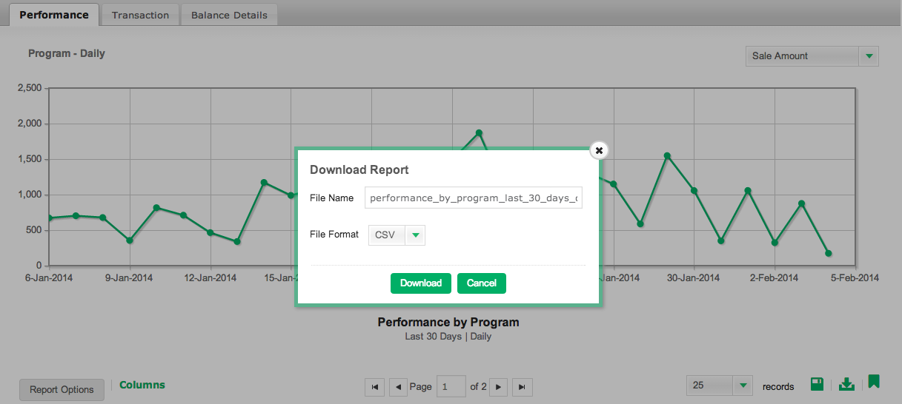

# Validación de datos en [!DNL Mixpanel]

Cuándo [!DNL Adobe Commerce Intelligence] primero se conecta a su [!DNL Mixpanel] datos, su administrador de cuentas o analista puede solicitar que proporcione exportaciones de datos desde [!DNL Mixpanel] para fines de validación. Esto le permite confirmar que ha sincronizado todos los datos que están disponibles directamente en [!DNL Mixpanel].

## Proceso de exportación de datos: `Events`

1. Visite su `Segmentation` sección y vista `Your Top Events`.

   

1. Seleccionar `Past 96 Hours` para el intervalo de tiempo

   

1. Desplácese hasta la parte inferior derecha del informe y exporte un `.csv` archivo:

   

1. Envíe el `.csv` al administrador de cuentas o al analista con el que esté trabajando en este proceso de validación.
