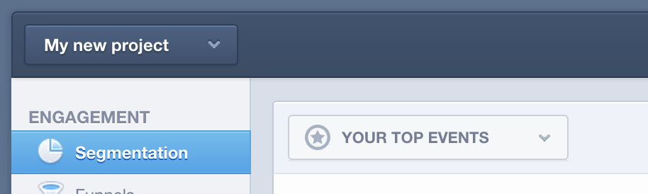

# Validación de datos en [!DNL Mixpanel]

Cuando [!DNL Adobe Commerce Intelligence] se conecte por primera vez a sus datos de [!DNL Mixpanel], su administrador de cuentas o analista puede solicitarle que proporcione exportaciones de datos de [!DNL Mixpanel] con fines de validación. Esto le permite confirmar que ha sincronizado todos los datos que están disponibles directamente en [!DNL Mixpanel].

## Proceso de exportación de datos: `Events`

1. Visite su sección `Segmentation` y vea `Your Top Events`.

   

1. Seleccione `Past 96 Hours` para el intervalo de tiempo

   

1. Desplácese hasta la parte inferior derecha del informe y exporte un archivo de `.csv`:

   

1. Envíe el archivo `.csv` al administrador de cuentas o al analista con el que esté trabajando en este proceso de validación.

