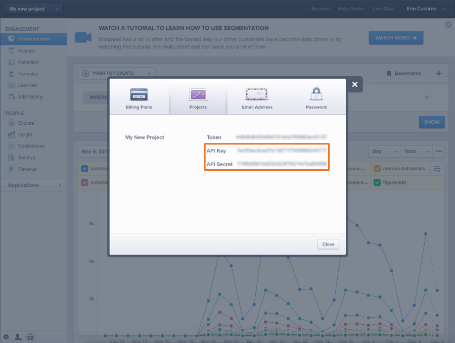

# Conectar [!DNL Mixpanel]

>[!NOTE]
>
>Requiere [permisos de administrador](../../../administrator/user-management/user-management.md).

Con [!DNL Mixpanel], puedes analizar cómo navegan y usan tus sitios web y aplicaciones los usuarios. Echar un vistazo a los datos de comportamiento de los usuarios conduce a decisiones de diseño y desarrollo más inteligentes, lo que significa un mejor producto en general. Conectar [!DNL Mixpanel] a [!DNL Commerce Intelligence] le permite analizar el comportamiento de los usuarios y cómo ese comportamiento se traduce en ingresos.

Conectar los datos de [!DNL Mixpanel] a [!DNL Commerce Intelligence] es un proceso sencillo de tres pasos:

1. [Abrir la página  [!DNL Mixpanel] credenciales en [!DNL Commerce Intelligence]](#stepone)
1. [Recuperar sus  [!DNL Mixpanel] credenciales de API](#steptwo)
1. [Escriba sus [!DNL Mixpanel] credenciales de API en [!DNL Commerce Intelligence]](#stepthree)

Para completar este proceso, debe abrir dos ventanas o fichas del explorador, una para [!DNL Commerce Intelligence] y otra para su cuenta de [!DNL Mixpanel].

## Abriendo la página de credenciales de [!DNL Mixpanel] {#stepone}

Introducción a:

1. Vaya a la página `Connections` en **[!DNL Manage Data** > **Connections]**.

1. Haga clic en **[!UICONTROL Add a New Source]**, ubicado en el lado derecho de la pantalla sobre la tabla `Data Sources`.

1. Haga clic en el icono [!DNL Mixpanel] y abra la página de credenciales.

Deje esta página abierta por ahora y cambie a la ventana del explorador con su cuenta de [!DNL Mixpanel].

## Recuperando sus credenciales de la API [!DNL Mixpanel] {#steptwo}

Si todavía no inició sesión en su cuenta de [!DNL Mixpanel], hágalo y haga lo siguiente:

1. Haga clic en **[!UICONTROL Account]** en la esquina superior derecha.

1. En el cuadro de diálogo que se muestra, haga clic en **[!UICONTROL Projects]**.

1. Se muestran sus credenciales de API:

Mantén esto abierto, lo necesitas para terminar esto.

## Escribiendo sus credenciales de la API [!DNL Mixpanel] en [!DNL Commerce Intelligence] {#stepthree}

1. Copie `API Key` y `Secret` en la página de credenciales de [!DNL Mixpanel] en [!DNL Commerce Intelligence].
1. Haga clic en **[!UICONTROL Connect to Mixpanel]** para completar la instalación.

Si la conexión se ha realizado correctamente, _¡Correcto!_ mensaje se muestra en la parte superior de la página.

### Relacionado

* [Se esperaban  [!DNL Mixpanel] datos](../integrations/mixpanel-data.md)
* [Reautenticando integraciones](https://experienceleague.adobe.com/docs/commerce-knowledge-base/kb/how-to/mbi-reauthenticating-integrations.html?lang=es)
