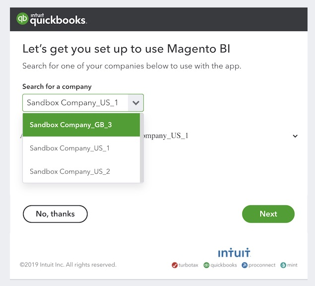

# Conectar [!DNL QuickBooks]

>[!NOTE]
>
>Requiere [permisos de administrador](../../../administrator/user-management/user-management.md).

Con la integración de [!DNL QuickBooks], las finanzas de su empresa ahora pueden estar al lado de los datos de ventas y marketing, lo que le permite supervisar sus gastos de forma rápida y sencilla, identificar gastos excesivos y mucho más.

>[!NOTE]
>
>Adobe Commerce Intelligence se integra con QuickBooks Online (no con el escritorio) y requiere un inicio de sesión de cuenta Intuit con una conexión en la nube, que coincide con la estructura SaaS de QuickBooks Online en lugar del modelo de escritorio QuickBooks instalado localmente.

## Agregar [!DNL QuickBooks] como origen de datos en [!DNL Commerce Intelligence]

1. Vaya a la página `Integrations` en **[!UICONTROL Manage Data** > **Data Sources]**.
1. Haga clic en **[!UICONTROL Add Integration]**, ubicado en el lado derecho de la pantalla sobre la tabla `Data Sources`.
1. Haga clic en el icono [!DNL QuickBooks].
1. Haga clic en **[!UICONTROL Connect to Quickbooks]**.

## Conceder acceso de [!DNL Commerce Intelligence] a sus datos de [!DNL QuickBooks]

Después de hacer clic en **[!UICONTROL Connect to Quickbooks]**, inicie sesión en su cuenta de [!DNL Intuit] y autorice la conexión:

1. En el menú desplegable `Search for a company`, seleccione su empresa.
1. Haga clic en **[!UICONTROL Next]**. ¡Se le redirige a [!DNL Commerce Intelligence] y la conexión a *se ha realizado correctamente!* mensaje se muestra en la parte superior de la pantalla.

## Relacionado

* [Se esperaban  [!DNL QuickBooks] datos](../integrations/quickbooks-data.md)
* [Reautenticando integraciones](https://experienceleague.adobe.com/docs/commerce-knowledge-base/kb/how-to/mbi-reauthenticating-integrations.html)
