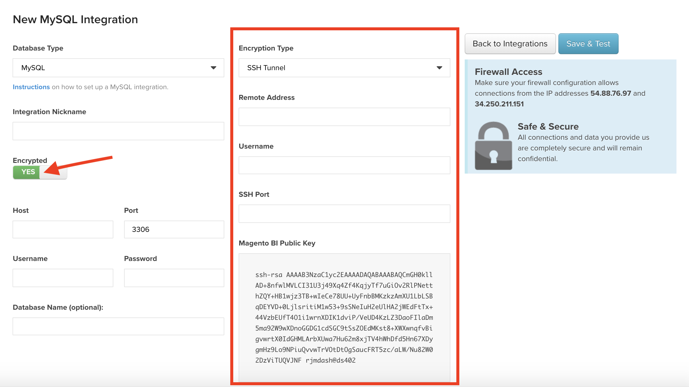

# Agregar gráficos a los paneles

Los gráficos existentes se pueden agregar a los paneles mediante la variable [!UICONTROL Add Report] función, situada en el área superior derecha de la pantalla. El mismo gráfico se puede agregar a varios paneles, lo que significa que si se edita el gráfico, todos los paneles con este gráfico reflejarán el cambio.

>[!NOTE]
>
>Clic **[!UICONTROL Add Report]** no es lo mismo que hacer clic **[!UICONTROL Save As]** en el editor de gráficos. `Add Report` simplemente agrega el gráfico al panel, mientras que, `Save As` crea una versión de un gráfico existente.

## Agregar un gráfico

1. Haga clic **[!UICONTROL Add Report]**. Se muestra una lista de los gráficos existentes.

1. Busque o haga clic en el nombre del gráfico que desee agregar.

1. El gráfico se agrega al panel.

Ejemplo:

