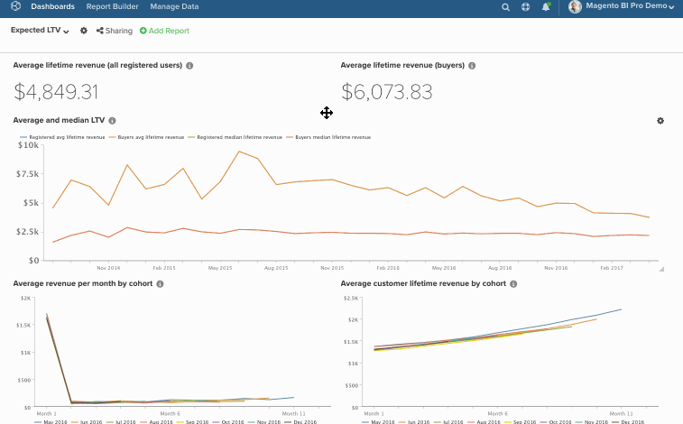

# Edición masiva de gráficos en tableros

La función de edición masiva facilita el cambio de nombres y fechas de gráficos en los tableros. Por ejemplo, desea que todos los gráficos de un tablero específico hagan referencia a un único almacén e informen mensualmente en lugar de trimestralmente. En lugar de cambiar todo manualmente, deje que la variable `bulk-editing` para realizar el trabajo. En este artículo, aprenderá a utilizar:

* [La variable ](#findreplace)

* [La variable ](#prepend)

* [La variable ](#dates)

Dicho esto, consideremos esto: *¿Es necesario que estos cambios sean permanentes?* Si no es así, considere la posibilidad de clonar el tablero y luego cambiar las fechas en el nuevo tablero. Esto le permitirá conservar su tablero original mientras sigue realizando los cambios que necesita.

>[!NOTE]
>
>Si está realizando cambios en muchos informes, el proceso de actualización podría tardar un poco.

## Uso `Find/Replace` {#findreplace}

1. Haga clic en el engranaje () junto al nombre del tablero y luego el [!UICONTROL Bulk Edit Reports] ventana.

1. Haga clic en **[!UICONTROL Chart Title Find and Replace]** en la ventana emergente.

1. En el `Chart Title Find` , escriba las palabras o los caracteres que desee buscar.

1. En el `Replace With` , escriba las palabras o los caracteres que deben reemplazar a lo que hay en la variable `Find` campo .

1. Haga clic en **[!UICONTROL Update Reports]**.

Ejemplo:

## Anteponer `Chart Names` {#prepend}

1. Haga clic en el engranaje () junto al nombre del tablero y luego el [!UICONTROL Bulk Edit Reports] ventana.

1. Haga clic en **[!UICONTROL Prepend Report Names]** en la ventana emergente.

1. Escriba las palabras o los caracteres con los que desee anteponer los gráficos.

1. Haga clic en **[!UICONTROL Update Reports]**.

Ejemplo:

## Cambio `Dates` {#dates}

1. Haga clic en el engranaje () junto al nombre del tablero y, a continuación, seleccione el `!UICONTROL Bulk Edit Reports` ventana.

1. Haga clic en **[!UICONTROL Change Dates]** en la ventana emergente.

1. Configure el nuevo `Start/End Date` y `Time Interval`. También puede dejar estos campos sin cambios.

1. Haga clic en **[!UICONTROL Update Reports]**.

Ejemplo:

