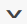
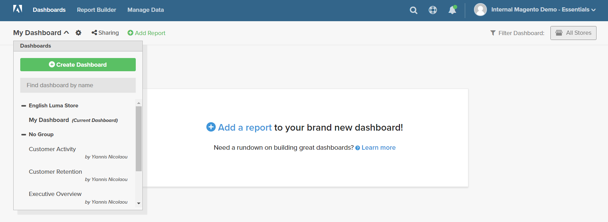
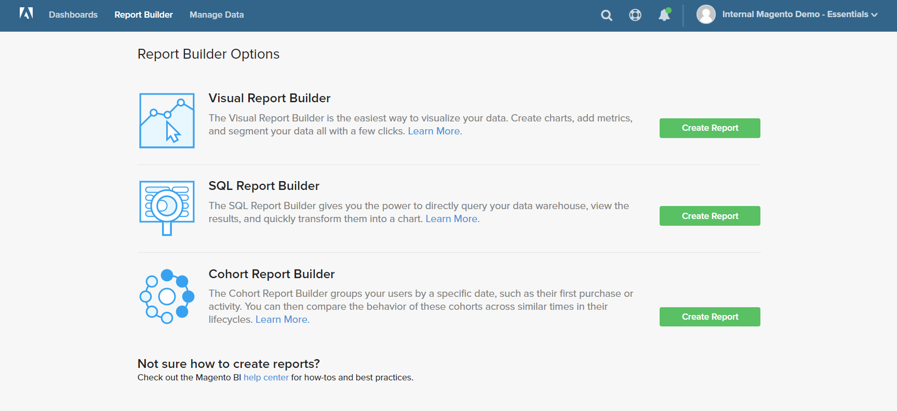

# Paneles

[!DNL Adobe Commerce Intelligence] Los paneles le ofrecen una visión rápida del rendimiento y la actividad de ventas de su tienda de un vistazo. Los paneles individuales se pueden compartir con otros usuarios y organizar en grupos lógicos. También puede establecer diferentes niveles de permisos para otros usuarios.

Es fácil crear un informe, agregarlo a un panel y exportar los datos a Excel. Se puede cambiar el tamaño de los gráficos e informes y arrastrarlos a su posición en el panel.

## Creación de paneles {#createdash}

Los paneles se pueden compartir, son bloques temáticos para los análisis que cree en los Report Builder. Así puede animar a su equipo a colaborar y mantener una única fuente fiable en toda la organización.

*Si es administrador o un usuario estándar*, puede crear un tablero haciendo clic en `Dashboard Options` menú desplegable y selección `Create New dashboard`.

El aspecto que tengan los paneles que cree depende totalmente de usted. Puede organizar y cambiar el tamaño de los elementos del panel del modo que desee según sus necesidades y flujo de trabajo.

### Crear un tablero

1. En el menú, haga clic en **[!UICONTROL Dashboards]**.

1. El nombre del tablero predeterminado aparece en la esquina superior izquierda del encabezado del tablero. Haga clic en la flecha abajo () para mostrar las opciones disponibles.

   

1. Clic **[!UICONTROL Create Dashboard]**. A continuación, haga lo siguiente:

   * Introduzca una `Name` para el tablero.

   * Para crear un `Group` en el tablero, introduzca el nombre del grupo.

     Por ejemplo, si la instalación de Commerce tiene varias vistas de tienda, puede crear un grupo para cada vista de tienda.

   * Clic **[!UICONTROL Create]**.

   

   * El nombre del nuevo tablero aparecerá en la esquina superior izquierda. Haga clic en la flecha abajo () para mostrar las opciones. Si ha creado un grupo, el nuevo tablero aparece debajo del grupo en la lista.

### Añadir un informe

1. Para agregar un informe, siga uno de estos procedimientos:

   * Haga clic en **[!UICONTROL Add a report]** en la página.

   * En el encabezado del panel, haga clic en **[!UICONTROL Add Report]**.

     

1. Clic **[!UICONTROL Create Report]** para mostrar el **[!UICONTROL Report Builder Options]**.

   

## Organizar elementos en un tablero

* Para cambiar el tamaño de un gráfico o informe, arrastre la esquina inferior derecha al nuevo tamaño.

* Para mover un gráfico o informe, pase el ratón sobre el título o el encabezado hasta que el cursor cambie a una cruz. A continuación, arrástrela a su posición.

## Administración de paneles {#managedash}

Entrada **[!DNL Manage Data** > **Dashboards]**, puede administrar los permisos de usuario para los tableros que posee, eliminar los tableros que ya no necesita y establecer un tablero predeterminado.

### Uso compartido de paneles {#sharingdash}

Para escalar realmente [!DNL Commerce Intelligence] en toda la organización y para proporcionar perspectivas valiosas, Adobe le anima a compartir los paneles que cree con otros integrantes del equipo. *Puede compartir los tableros que posee* haciendo clic en `Share Dashboard` en la parte superior de la página.

Al compartir un tablero, puede asignar permisos en toda la organización O de forma individual, lo que significa que puede decidir quién puede ver y editar los informes.

>[!NOTE]
>
>`Read-Only` los usuarios solo tienen acceso a los paneles que se comparten directamente con ellos; no pueden buscar y agregar paneles por su cuenta. ¡No se olvide de mantenerlos en el bucle!

### Acceso a paneles compartidos {#accessshared}

*Si es administrador o usuario estándar* y desea agregar un tablero compartido a su cuenta, puede hacerlo haciendo clic en **[!UICONTROL Dashboard Options]** y luego haciendo clic en **[!UICONTROL Find]** en el menú desplegable.

<!--{: width="1000" height="535"}-->

### Administrar configuración de tablero

1. En el menú, haga clic en **[!DNL Manage Data** > **Dashboards]**.

1. Si procede, introduzca un nuevo `Dashboard Name`.

1. Para asignar el tablero a un `Dashboard Group`, elija en la lista de grupos.

   **`Permissions`**

   Para otorgar a todos los usuarios el mismo nivel de acceso al panel, haga lo siguiente:

   1. En **`Shared with`**, elija una de las siguientes opciones:

      * `View`
      * `Edit`
      * `None`

   1. Cuando se le pida confirmación, haga clic en **[!UICONTROL OK]** para actualizar el nivel de permisos de cada usuario.

   1. Para cambiar el nivel de permisos de un individuo, busque el usuario en la lista y cambie el nivel de permisos. El cambio se guarda automáticamente.

   **`Default`**

   1. Para hacer que este tablero sea el predeterminado para su [!DNL Commerce Intelligence] cuenta, haga clic en **[!UICONTROL Make Default]**.

   **`Remove`**

   1. Para quitar el tablero, haga clic en **[!UICONTROL Delete Dashboard]**.
