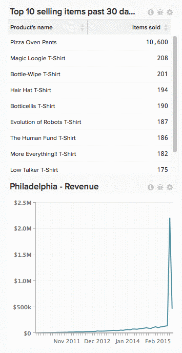

# Quitar un gráfico de un panel

Para quitar un gráfico de un panel, haga clic en el icono de engranaje () en la esquina superior derecha del gráfico y haga clic en **[!UICONTROL Remove from Dashboard]**.

>[!NOTE]
>
>Eliminar un gráfico no es lo mismo que [eliminándolo](../../data-user/dashboards/delete-chart.md). Además, [se puede leer un gráfico en un panel](../../data-user/dashboards/add-charts-dashboard.md) en cualquier momento.

