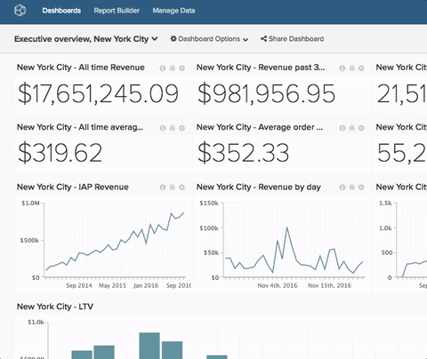

# Quitar un gráfico de un panel

>[!NOTE]
>
>Requiere permisos de [Admin](../../administrator/user-management/user-management.md) o `Standard` para realizar estas funciones. Si es un usuario de `Standard`, también necesita permisos de `Edit` en el tablero.

A veces los nombres ya no caben. Cambiar el nombre de un tablero es rápido y sencillo.

1. En el panel, haga clic en el menú **[!UICONTROL Dashboard Options]** en la parte superior de la pantalla, que se encuentra junto al menú `Global Search`.

1. Haga clic en **[!UICONTROL Rename]** en la lista desplegable.

1. Cuando se le solicite, escriba el nuevo nombre para el tablero.

1. Haga clic en **[!UICONTROL Save Changes]**.

Ejemplo:

