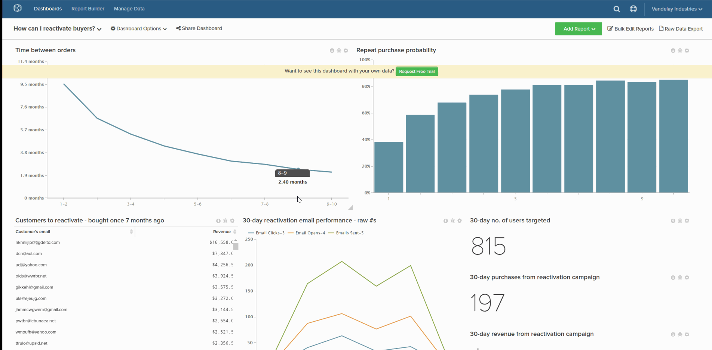

# Establecer un tablero predeterminado

El tablero predeterminado es el primer tablero que se ve al abrir [!DNL MBI].

1. Mientras está en el tablero, haga clic en **[!UICONTROL Dashboard Options]** situado en la parte superior de la pantalla.

1. Haga clic en **[!UICONTROL Make Default]** en la lista desplegable .

1. Cuando aparezca el mensaje de confirmación, haga clic en **[!UICONTROL Yes]** para cambiar el tablero predeterminado.

Este es su nuevo panel predeterminado.

Ejemplo:

