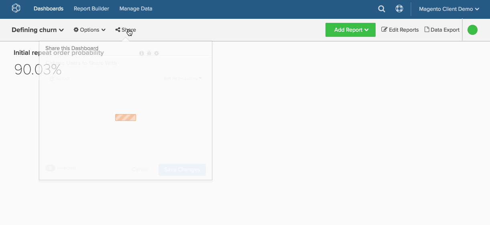

# Compartir tableros en toda la organización

Es fácil asegurarse de que todos los usuarios tengan acceso a los paneles empresariales esenciales de [!DNL Adobe Commerce Intelligence]. El uso compartido universal de tableros facilita una mayor colaboración y transparencia en toda la organización al proporcionar una única &quot;fuente de verdad&quot;.

1. Para mostrar sus conocimientos a sus colegas, haga clic en **[!UICONTROL Share this Dashboard]** en la parte superior de la pantalla.

1. Se mostrará la lista de usuarios. El primer usuario de la lista será su organización. Haga clic en la casilla de verificación situada junto a su nombre.

1. Defina el nivel de `Permissions` que desea que tengan otros usuarios: `View`, `Edit` o `None`.

1. Haga clic en **[!UICONTROL Save Changes]**.

   Si `Permissions` se estableció en `View` o `Edit` y los usuarios buscan su panel, este aparecerá en los resultados de búsqueda.

Ejemplo:

<!--{: width="675" height="311"}-->
